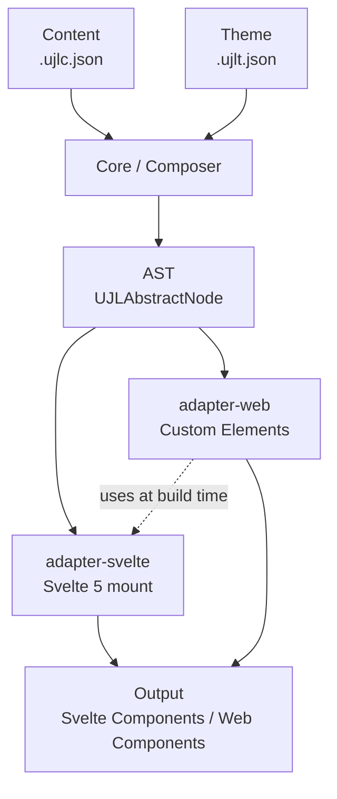

# UJL Framework — High‑Level Overview for Agents

This file provides a compact, stable, high‑level context. For details, always consult the linked READMEs, which may evolve faster than this overview.

## Core Idea

UJL separates content and design into distinct JSON files. For a complete explanation of core concepts, see the [UJL Framework README](./README.md#core-concepts).

**Core Promise:** Create and maintain brand-compliant and accessible websites with AI. UJL enforces brand compliance and accessibility architecturally, not just through guidelines.

Quick summary for agents:

- Content in `.ujlc.json`, design/themes in `.ujlt.json`
- `core` composes documents into an AST
- Adapters transform AST to output (Svelte, Web Components, etc.)
- UI provides base components
- **AI-native**: JSON structure optimized for LLMs, schema validation ensures compliance
- **Brand-Compliance by Design**: Design rules are technically enforced, not optional
- **Accessibility guaranteed**: WCAG compliance built into the architecture

## Data Flow (simplified)

## Packages and Responsibilities

For the complete project structure, see the [UJL Framework README](./README.md#project-structure).

Quick reference for agents:

| Package          | Purpose                                      | README                                      |
| ---------------- | -------------------------------------------- | ------------------------------------------- |
| `types`          | Type definitions, Zod schemas, CLI validator | [README](packages/types/README.md)          |
| `core`           | Composer, module/field system, registry      | [README](packages/core/README.md)           |
| `adapter-svelte` | AST → Svelte 5 components                    | [README](packages/adapter-svelte/README.md) |
| `adapter-web`    | AST → Web Components (uses adapter-svelte)   | [README](packages/adapter-web/README.md)    |
| `ui`             | shadcn-svelte base components                | [README](packages/ui/README.md)             |
| `crafter`        | Visual editor (SvelteKit)                    | [README](packages/crafter/README.md)        |
| `examples`       | Example documents and themes                 | [README](packages/examples/README.md)       |

**Services**: `media` (Payload CMS for asset management)

**Apps**: `docs` (VitePress), `demo` (showcase), `landing` (marketing)

## Navigation Tips for Agents

- Start with `packages/core/README.md` (core concepts, Composer/AST) and `packages/examples/` (sample data).
- Choose the target front‑end:
  - `packages/adapter-svelte/` — for Svelte/SvelteKit applications
  - `packages/adapter-web/` — for framework-agnostic Web Components (uses `adapter-svelte` internally)
- For UI building blocks: `packages/ui/`.
- For authoring/editorial workflows: `packages/crafter/`.
- For media: `services/media/`.

## Developer Guidelines

For detailed development guidelines, see the [docs/](./docs/) directory:

- [Testing Guidelines](./docs/testing.md)
- [Code Review Playbook](./docs/code-review.md)

## Currency & Notes

- This document is intentionally high‑level. For specifics, read the corresponding READMEs.
- The package landscape may grow (new adapters, tools, services). Explore `packages/` and `services/`.
- **Temporary files**: The `_support/` directory (ignored by git) can be used for temporary files like code reviews, analysis documents, or personal notes that should not be versioned.
