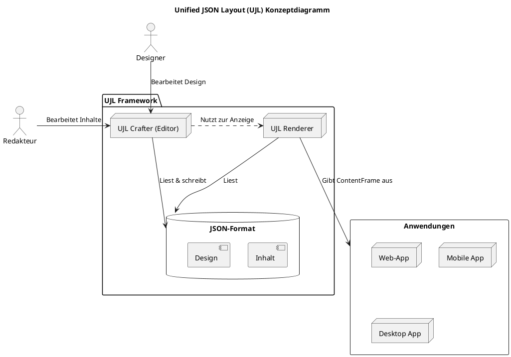
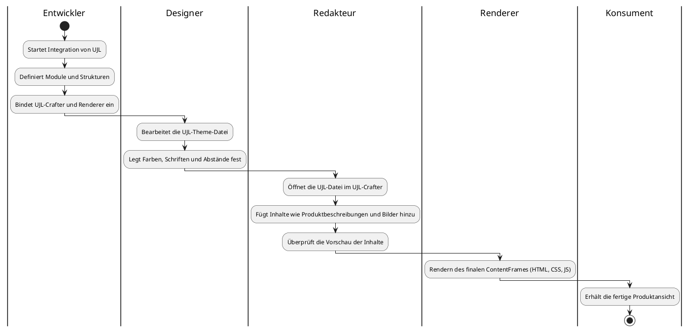

# Einführung und Ziele

## 1.1 Requirements Overview

Moderne Website-Builder wie Wix oder Divi ermöglichen einfache Webseiten ohne Programmierkenntnisse – doch sie sind proprietär, schwer erweiterbar und kaum in bestehende Systeme integrierbar.

**Unified JSON Layout (UJL)** geht einen anderen Weg; Als Open-Source-Framework soll UJL ein flexibles, strukturiertes Baukastensystem bereitstellen, das sich nahtlos in vorhandene Webanwendungen integriert.

Im Kern verfolgt UJL die **konsequente Trennung von Inhalt und Design**, realisiert durch ein standardisiertes JSON-Format. Das ermöglicht maximale Markenkonformität bei gleichzeitiger Flexibilität in der Pflege der Inhalte.

Zudem verfolgen wir mit UJL das Ziel, ein System zu schaffen, das nicht nur für Menschen, sondern auch für KI verständlich ist. Durch die Verwendung von strukturierten JSON-Datenformaten und klar definierten APIs wird UJL so konzipiert, dass es optimal mit Sprachmodellen (LLMs) zusammenarbeitet. Dies ermöglicht eine automatisierte Generierung und Bearbeitung von Layouts und Inhalten.

## 1.2 Quality Goals

> **Verwandte Kapitel**: Detaillierte Qualitätsanforderungen finden Sie in [Kapitel 10 - Qualitätsanforderungen](./10-quality-requirements.md).

### 1.2.1 Qualitätsanforderungen

- **Modularität**: Jedes Modul des Systems ist als eigenständige Einheit konzipiert, das isoliert getestet und bei Bedarf erweitert oder ausgetauscht werden kann.
- **Erweiterbarkeit**: UJL ist offen für Erweiterungen, sodass neue Funktionalitäten, Module und Designs nahtlos eingebunden werden können. Die Architektur umfasst eine Plugin-API, mit der Entwickler eigene Module erstellen und registrieren können.
- **Benutzerfreundlichkeit**: Das System soll eine intuitive Benutzererfahrung sowohl für Redakteure als auch für Entwickler bieten, sodass Anwender Inhalte sicher und einfach bearbeiten können, ohne technische Kenntnisse zu benötigen.
- **Auf- und Abwärtskompatibilität**: UJL-Dateien sind so konzipiert, dass sie sich zwischen verschiedenen Versionen des Systems kompatibel verwenden lassen und auch zukünftige Anpassungen möglich sind.

### 1.2.2 Stakeholder

Die Architektur von UJL ist so gestaltet, dass sie den unterschiedlichen Anforderungen der verschiedenen Zielgruppen gerecht wird:

- **Entwickler**: Sie sollen die Möglichkeit haben, UJL in bestehende Webanwendungen zu integrieren, eigene Module und Plugins zu entwickeln und die Flexibilität der Architektur für spezifische Anforderungen zu nutzen.
- **Designer**: Durch die UJL-Theme-Datei können Designer das Corporate Design eines Projekts zentral festlegen, ohne direkten Eingriff in die Struktur- oder Inhaltsdateien. Dies stellt sicher, dass alle Layouts konsistent das festgelegte Design umsetzen.
- **Redakteure**: Die intuitive Bedienoberfläche ermöglicht Redakteuren, Inhalte zu bearbeiten und neue Layouts modular zusammenzustellen, ohne technische Details oder Design-Aspekte anzupassen.
- **Konsumenten**: Die finale, gerenderte Ansicht – der ContentFrame – gewährleistet eine einheitliche und responsive Darstellung auf allen Endgeräten, sodass das Ergebnis für den Konsumenten ansprechend und zuverlässig ist.

## 1.3 Stakeholders

### 1.3.1 Die Rollen im UJL-Ökosystem

Damit du die Projektidee und die Einsatzmöglichkeiten von UJL leichter erfassen kannst, haben wir die wichtigsten Rollen definiert, die UJL nutzen und weiterentwickeln können.

1. **Contributors**: Entwickler, die aktiv an der Weiterentwicklung von UJL mitwirken und neue Module, Plugins oder Erweiterungen erstellen möchten. Durch ihre Arbeit bereichern sie das Projekt, steigern ihre eigene Reputation und tragen dazu bei, UJL als flexibles und innovatives Framework zu etablieren.

2. **Anwender**: Unternehmen und Teams, die UJL in ihre Projekte einbinden und so individuelle Anforderungen abdecken können. Dies umfasst:
   - **Entwickler**, die UJL über npm in ihre Web-Anwendungen integrieren, Plugins implementieren und spezifische Anpassungen vornehmen können.
   - **Designer**, die über die Design-Konfigurationsdatei das Corporate Design pflegen, ohne direkt in Layout oder Inhalte eingreifen zu müssen.
   - **Redakteure**, die Inhalte strukturiert und unkompliziert im UJL-Editor verwalten und einpflegen, ohne sich um Designanpassungen sorgen zu müssen.
   - **Konsumenten**, die das Endprodukt nutzen und durch UJLs modulare Struktur ein flexibles, auf allen Endgeräten optimales Design erleben.

3. **Partner**: Industriepartner und Investoren, die durch Kooperationen und Sponsoring die Zukunft von UJL aktiv mitgestalten möchten. Die Open-Source-Philosophie gibt ihnen die Möglichkeit, frühzeitig auf innovative Entwicklungen zuzugreifen und das Projekt mit ihren Ideen und Anforderungen zu beeinflussen.

### 1.3.2 Stakeholder-Übersicht

Diese Rollen beschreiben die zentralen Aufgaben und Bedürfnisse der Stakeholder im UJL-Ökosystem.

1. **Entwickler**:
   - Entwickeln und erweitern Module.
   - Integrieren UJL in bestehende Systeme, legen Zugriffsrechte fest und steuern die Verarbeitung der Outputs.

2. **Designer**:
   - Definieren das Corporate Design in der `.ujlt.json`.
   - Nutzen den Theme-Editor im UJL Crafter, um Farben, Schriften und Abstände zentral festzulegen.

3. **Redakteure**:
   - Bearbeiten Inhalte und Layouts im Inhalts-Editor des UJL Crafters, ohne das Design zu verändern.
   - Nutzen vordefinierte, responsive Module für eine konsistente Darstellung.

4. **Konsumenten**:
   - Erleben eine einheitliche, ästhetische und responsive Darstellung der Inhalte.

5. **Contributors**:
   - Entwickeln neue Features und Module für UJL.
   - Geben Feedback und Vorschläge für die Weiterentwicklung des Projekts.

6. **Partner**:
   - Gestalten die Zukunft von UJL aktiv mit und unterstützen das Projekt durch Kooperationen und Sponsoring.

## 1.4 Was UJL besonders macht

UJL ist nicht einfach nur ein weiterer Baukasten, sondern ein Framework, das Inhalt und Design technisch trennt – strukturiert, modulbasiert und promptfähig. Es integriert sich in bestehende Systeme, bleibt Open Source, erweiterbar und verständlich für Mensch und KI.

1. **UJL trennt Inhalt und Design konsequent – für Flexibilität und Markenkonformität**: UJL bringt eine konsequente Strukturierung mit:
   - Inhalte in `.ujlc.json`-Dateien
   - Designsysteme in `.ujlt.json`-Theme-Dateien
   - Layout-Bausteine werden definiert durch vorgegebene und erweiterbare UJL-Module mit Fields (Daten) und Slots (Inhaltsbereiche)

   Die Trennung von Inhalt und Design ist also nicht nur „gute Praxis" - sie ist in UJL technisch erzwungen, was ein enormer Vorteil gegenüber etablierten Tools ist, die Inhalte, Stile und Strukturen oft wild vermischen. Unser Konzept verspricht dagegen eine professionell pflegbare und gleichzeitig CI-konforme Inhaltsverwaltung.

2. **UJL passt sich deinem System an – nicht umgekehrt**: UJL ist kein System, das alles neu erfindet, sondern lässt sich modular in bestehende Infrastrukturen einfügen (z. B. Sanity, PayloadCMS, Laravel Filament, Strapi). Das ist für viele Teams entscheidend, die ihre Infrastruktur behalten, aber um visuelle Layoutbearbeitung erweitern wollen.

3. **KI kann mitdenken – weil UJL promptbar, strukturiert und verständlich ist**: UJL wird von Grund auf so konzipiert, dass es optimal mit Sprachmodellen (LLMs) zusammenarbeitet – nicht als nachträgliches Add-on, sondern als Teil der Architektur:
   - Inhalte und Layouts werden in einer strukturierten, promptbaren JSON-Sprache beschrieben
   - Das Schema wird so gestaltet, dass Sprachmodelle direkt neue Layouts generieren oder bestehende bearbeiten können
   - Module, Fields, Slots und Dokumentation werden für Menschen und Maschinen verständlich gestaltet – also auch durch LLMs erklär- und bedienbar
   - Kein Lock-in: Jedes Sprachmodell, das gängige API-Standards erfüllt (z. B. OpenAI, Mistral, Claude, lokale Modelle), wird mit UJL arbeiten können

4. **Open Source heißt bei uns: volle Kontrolle – über Code, Daten und Erweiterungen**: Der UJL-Core wird als vollständig quelloffene Bibliothek entwickelt und lässt sich unabhängig von Cloud-Plattformen oder Drittanbietern in eigene Systeme integrieren.  
   Durch die modulare Architektur können Entwickler eigene Erweiterungen und Integrationen flexibel realisieren – ganz nach ihren individuellen Anforderungen.

5. **Entwickler, Designer, Redakteure – endlich entflochten, aber koordiniert**: UJL schafft ein System, in dem:
   - Entwickler Module & Integrationen bauen
   - Designer die Corporate Identität pflegen
   - Redakteure im Crafter visuell arbeiten

   Jeder arbeitet unabhängig, aber synchron und kann das tun, was er am besten kann.
