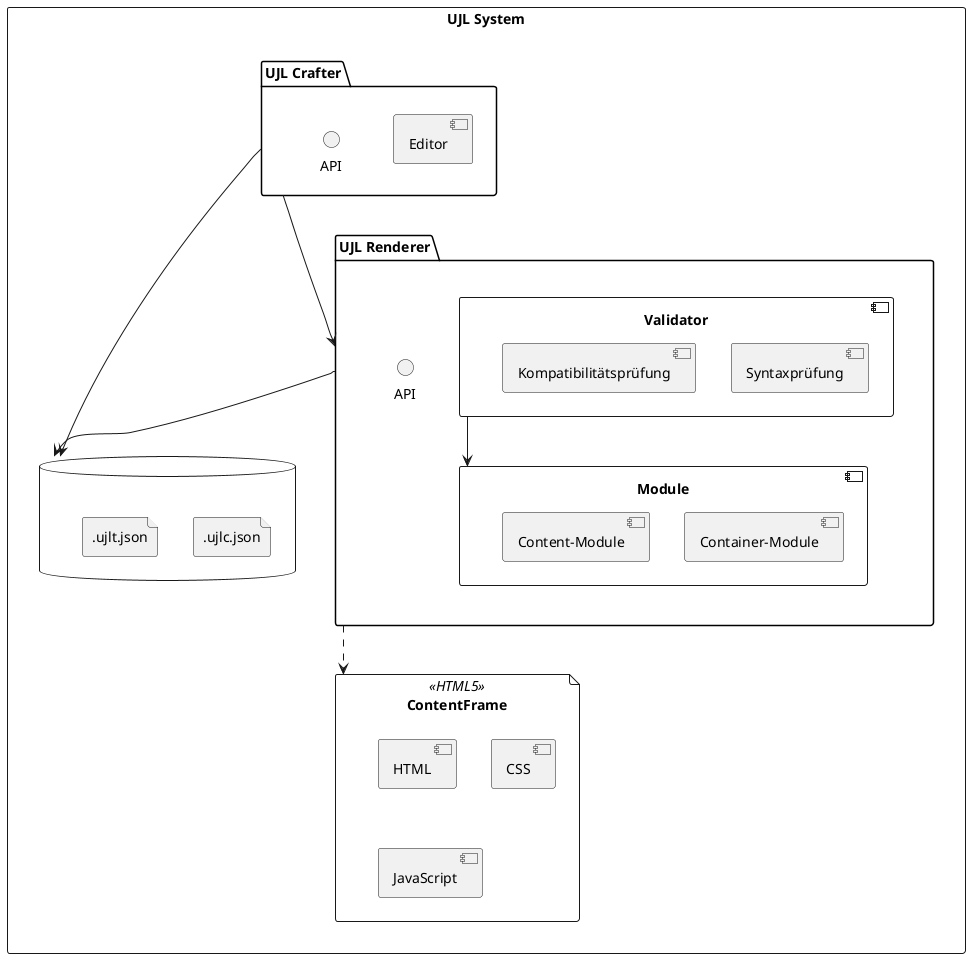

# Bausteinsicht

## 5.1 Level 1 - Whitebox View

Die Architektur von Unified JSON Layout (UJL) basiert auf einer klaren Trennung von Inhalt, Struktur und Design, um eine flexible und modular aufgebaute Webgestaltung zu ermöglichen. Inhalte werden in einer UJL-Datei definiert, in der bestimmte **Module** referenziert werden. Diese Module verkörpern die Struktur und bestimmen, welche **Fields** (Daten) und **Slots** (Inhaltsbereiche) unterstützt werden. Module können verschachtelt organisiert und kombiniert werden.

Die gestalterische Ebene wird über eine Design-Konfigurationsdatei, die **UJL-Theme-Datei**, definiert, welche Designvorgaben für Farben, Schriftarten und Layout-Stile enthält. Zusammengenommen – UJL-Datei, Module und UJL-Theme-Datei – werden diese Strukturen im **Renderer** verarbeitet, der das Ergebnis als **ContentFrame** ausgibt. Der ContentFrame stellt eine eigenständige Ansicht dar, in der alle Elemente konsistent und strukturiert dargestellt werden.

Das Moduldiagramm zeigt die Architektur des **UJL Renderer**- und **UJL Crafter**-Systems. Der **UJL Renderer** bildet die Grundlage für die Verarbeitung und Darstellung von Layouts und Inhalten, während der **UJL Crafter** als umfassendes Gestaltungstool auf den Renderer aufsetzt. Der Crafter kann jedoch auch alternative Renderer nutzen, sofern diese eine kompatible API bieten.



### 5.1.1 Beschreibung des Moduldiagramms

1. **UJL Renderer**:
   - Der **UJL Renderer** ist die zentrale Einheit für das Rendering von UJL-Dateien und erzeugt die endgültige Darstellung eines Layouts.
   - Er besteht aus folgenden Hauptkomponenten:
     - **Validator**: Verifiziert die Struktur und Kompatibilität von UJL-Dateien. Der Validator enthält zwei Subkomponenten:
       - **Syntaxprüfung**: Prüft die syntaktische Korrektheit der UJL-Dateien.
       - **Kompatibilitätsprüfung**: Überprüft, ob die Version der UJL-Datei mit der aktuellen Systemversion kompatibel ist.
     - **Module**: Enthält die Bausteine, die zur Darstellung des Layouts verwendet werden. Die Module gliedern sich in:
       - **Container-Module**: Diese Module repräsentieren strukturelle Bausteine, wie z.B. Container oder Spalten-Layouts, die die Grundstruktur eines Layouts bestimmen.
       - **Content-Module**: Dies sind die inhaltstragenden Module, wie Textfelder, Bilder oder Buttons, die innerhalb der Container-Module organisiert werden.
   - Der **UJL Renderer** erzeugt aus den UJL-Dateien den **ContentFrame**, der als das gerenderte Endprodukt aus **HTML**, **CSS** und **JavaScript** besteht und auf verschiedenen Plattformen und Endgeräten verwendet werden kann.

2. **ContentFrame**:
   - Der **ContentFrame** ist das Ausgabeformat des **UJL Renderers** und enthält die vollständig gerenderte Ansicht, bestehend aus **HTML**, **CSS** und **JavaScript**.
   - Sollte ein Entwickler eine alternative Rendering-Einheit verwenden, muss diese ebenfalls in der Lage sein, einen ContentFrame zu erzeugen, der die in den UJL-Dateien definierte Struktur und das Design widerspiegelt.

3. **Speicher**:
   - Die Daten für die UJL-Layouts und die Design-Konfiguration werden in **.ujlc.json**- und **.ujlt.json**-Dateien im **Speicher** verwaltet.
     - **UJL-Datei (.ujlc.json)**: Enthält die Struktur und die Inhalte eines Layouts.
     - **Design-Konfigurationsdatei (.ujlt.json)**: Speichert Designvorgaben, wie z.B. Farben, Schriften und Abstände.
   - Der **UJL Crafter** und der **Renderer** greifen auf diese Dateien zu, um Daten zu laden, zu speichern und zu validieren.

4. **UJL Crafter**:
   - Der **UJL Crafter** dient als umfassendes Gestaltungstool für Redakteure, Designer und Entwickler und bietet eine zentrale Schnittstelle zur Erstellung und Bearbeitung von Layouts und Inhalten.
   - Der **Editor** im Crafter ist die Hauptschnittstelle für Anwender, die Layouts gestalten und Inhalte hinzufügen möchten.
   - Der **Crafter** nutzt die **API** des **UJL Renderers** und kann diese bei Bedarf erweitern, um Entwicklern zusätzliche Funktionen bereitzustellen. Die API des Crafters fungiert als erweiterte Schnittstelle, die Entwicklern auch die Möglichkeit bietet, neue Module und Funktionen zu integrieren.

5. **Editor**:
   - Der Editor ist die interaktive Einheit des **UJL Crafter**, die Anwendern eine visuelle Schnittstelle bietet, um Layouts zu gestalten und Inhalte einzufügen.
   - Durch die Verbindung zur API des Renderers kann der Editor Änderungen in Echtzeit anzeigen, sodass Redakteure und Designer sofortiges Feedback zu ihren Anpassungen erhalten.

## 5.2 Level 2 - Whitebox View

### 5.2.1 Beispielcodes

In diesem Abschnitt werden einige grundlegende Beispielcodes vorgestellt, um die Funktionalitäten des UJL-Systems zu veranschaulichen. Die Beispiele decken verschiedene Bereiche ab, wie das Definieren von Layouts und Inhalten, die Nutzung der Design-Konfigurationsdatei sowie die Integration des Editors und Renderers in eine Webanwendung. Auch die API für erweiterbare Module wird kurz dargestellt.

#### .ujlc.json-Datei: Struktur und Inhalt

Die .ujlc.json-Datei ist die zentrale Datei im UJL-System und beschreibt das Layout und den Inhalt der Seite in einem strukturierten JSON-Format. Die Datei referenziert Module mit ihren Fields (Daten) und Slots (Inhaltsbereiche) und definiert die Inhalte innerhalb der vordefinierten Struktur.

```json
{
	"ujlc": {
		"meta": {
			"title": "Produktkatalog",
			"description": "Unser Staubsauger-Sortiment",
			"updated_at": "2024-01-15T10:30:00Z",
			"_version": "0.0.1"
		},
		"root": [
			{
				"type": "container",
				"meta": {
					"id": "main-container",
					"updated_at": "2024-01-15T10:30:00Z"
				},
				"fields": {},
				"slots": {
					"body": [
						{
							"type": "text",
							"meta": {
								"id": "header-text",
								"updated_at": "2024-01-15T10:30:00Z"
							},
							"fields": {
								"content": "Willkommen zu unserem Produktkatalog"
							},
							"slots": {}
						},
						{
							"type": "grid",
							"meta": {
								"id": "product-grid",
								"updated_at": "2024-01-15T10:30:00Z"
							},
							"fields": {},
							"slots": {
								"items": [
									{
										"type": "card",
										"meta": {
											"id": "product-card-1",
											"updated_at": "2024-01-15T10:30:00Z"
										},
										"fields": {
											"title": "Staubsauger Model X200",
											"description": "Der leistungsstarke und effiziente Haushaltshelfer.",
											"image": "img/vacuum1.jpg"
										},
										"slots": {}
									},
									{
										"type": "card",
										"meta": {
											"id": "product-card-2",
											"updated_at": "2024-01-15T10:30:00Z"
										},
										"fields": {
											"title": "Staubsauger Model X300",
											"description": "Unser leises Topmodell mit innovativer Filtertechnologie.",
											"image": "img/vacuum2.jpg"
										},
										"slots": {}
									}
								]
							}
						}
					]
				}
			}
		]
	}
}
```

In diesem Beispiel wird ein einfacher Produktkatalog definiert, der aus einem Haupt-Container-Modul mit einem Text-Modul und einem Grid-Modul mit zwei Card-Modulen besteht. Jedes Modul hat Fields für Daten und Slots für verschachtelte Inhalte.

#### .ujlt.json: Design-Theme (Tokens)

Die .ujlt.json-Datei definiert das Theme über Design‑Tokens. Ein vollständiges Theme benötigt alle Flavors: `ambient`, `primary`, `secondary`, `accent`, `success`, `warning`, `destructive` und `info`. Jeder Flavor benötigt die Properties `light`, `lightForeground`, `dark`, `darkForeground` und eine vollständige `shades` mit Shades von 50 bis 950. Die Version wird unter `meta._version` geführt.

```json
{
	"ujlt": {
		"meta": {
			"_version": "0.0.1"
		},
		"tokens": {
			"color": {
				"ambient": {
					"light": { "l": 0.985, "c": 0, "h": 0 },
					"lightForeground": { "l": 0.274, "c": 0.006, "h": 286.033 },
					"dark": { "l": 0.141, "c": 0.005, "h": 285.823 },
					"darkForeground": { "l": 0.967, "c": 0.001, "h": 286.375 },
					"shades": {
						"50": { "l": 0.985, "c": 0, "h": 0 },
						"100": { "l": 0.967, "c": 0.001, "h": 286.375 },
						"200": { "l": 0.92, "c": 0.004, "h": 286.32 },
						"300": { "l": 0.871, "c": 0.006, "h": 286.286 },
						"400": { "l": 0.705, "c": 0.015, "h": 286.067 },
						"500": { "l": 0.552, "c": 0.016, "h": 285.938 },
						"600": { "l": 0.442, "c": 0.017, "h": 285.786 },
						"700": { "l": 0.37, "c": 0.013, "h": 285.805 },
						"800": { "l": 0.274, "c": 0.006, "h": 286.033 },
						"900": { "l": 0.21, "c": 0.006, "h": 285.885 },
						"950": { "l": 0.141, "c": 0.005, "h": 285.823 }
					}
				},
				"primary": {
					"light": { "l": 0.546, "c": 0.245, "h": 262.881 },
					"lightForeground": { "l": 0.985, "c": 0, "h": 0 },
					"dark": { "l": 0.623, "c": 0.214, "h": 259.815 },
					"darkForeground": { "l": 0.985, "c": 0, "h": 0 },
					"shades": {
						"50": { "l": 0.97, "c": 0.014, "h": 254.604 },
						"100": { "l": 0.932, "c": 0.032, "h": 255.585 },
						"200": { "l": 0.882, "c": 0.059, "h": 254.128 },
						"300": { "l": 0.809, "c": 0.105, "h": 251.813 },
						"400": { "l": 0.707, "c": 0.165, "h": 254.624 },
						"500": { "l": 0.623, "c": 0.214, "h": 259.815 },
						"600": { "l": 0.546, "c": 0.245, "h": 262.881 },
						"700": { "l": 0.488, "c": 0.243, "h": 264.376 },
						"800": { "l": 0.424, "c": 0.199, "h": 265.638 },
						"900": { "l": 0.379, "c": 0.146, "h": 265.522 },
						"950": { "l": 0.282, "c": 0.091, "h": 267.935 }
					}
				},
				"secondary": {
					/* ... gleiche Struktur wie primary ... */
				},
				"accent": {
					/* ... gleiche Struktur wie primary ... */
				},
				"success": {
					/* ... gleiche Struktur wie primary ... */
				},
				"warning": {
					/* ... gleiche Struktur wie primary ... */
				},
				"destructive": {
					/* ... gleiche Struktur wie primary ... */
				},
				"info": {
					/* ... gleiche Struktur wie primary ... */
				}
			},
			"radius": "0.75rem"
		}
	}
}
```

**Hinweis:** Dieses Beispiel zeigt die Struktur für `ambient` und `primary` vollständig. Die weiteren Flavors (`secondary`, `accent`, `success`, `warning`, `destructive`, `info`) folgen exakt der gleichen Struktur mit `light`, `lightForeground`, `dark`, `darkForeground` und einer vollständigen `shades` mit allen Shades von 50 bis 950. Alle Flavors sind erforderlich für ein vollständiges Theme.

#### Integration des Editors (UJL Crafter) in eine Web-Anwendung

Der UJL Crafter (Editor) kann über npm in eine Web-Anwendung integriert werden, sodass Redakteure Inhalte direkt auf der Seite bearbeiten können. Hier ist ein Beispielcode zur Integration:

```javascript
// Installation via npm:
// npm install ujlcrafter

import UJLCrafter from "ujlcrafter";

// Initialisieren des Editors
const crafter = new UJLCrafter({
	target: document.getElementById("editor-container"),
	data: {
		layoutFile: "path/to/layout.ujlc.json",
		config: "path/to/design.ujlt.json",
	},
});

// Funktion zur Speicherung
crafter.on("save", updatedData => {
	fetch("/api/save", {
		method: "POST",
		headers: { "Content-Type": "application/json" },
		body: JSON.stringify(updatedData),
	}).then(response => console.log("Änderungen gespeichert."));
});
```

Dieser Code integriert den UJL Crafter in eine Web-Anwendung. Der Editor wird im editor-container-Element der HTML-Seite angezeigt und bietet eine Speichermethode, um die aktualisierten .ujlc.json-Daten über eine API zu speichern.

#### Verwendung des Renderers zur Ausgabe als HTML/CSS/JS

Der Renderer wird benötigt, um die .ujlc.json- und .ujlt.json-Dateien in HTML/CSS/JS zu konvertieren und die Webansicht anzuzeigen. Hier ist ein Beispiel für die Verwendung des Renderers:

```javascript
// Installation via npm:
// npm install ujlcrafter-renderer

import UJLRenderer from "ujlcrafter-renderer";

const renderer = new UJLRenderer({
	layoutFile: "path/to/layout.ujlc.json",
	config: "path/to/design.ujlt.json",
	target: document.getElementById("view-container"),
});

// Rendern der Ansicht
renderer.render().then(() => console.log("ContentFrame erfolgreich gerendert."));
```

Dieser Code zeigt, wie der UJL Renderer in einer Web-Anwendung verwendet wird, um die Layout- und Design-Dateien in ein fertiges HTML/CSS/JS-Bundle zu konvertieren und in der view-container-Ansicht zu rendern.

#### Erweiterung über die API

Die API des UJL Crafter ermöglicht Entwicklern, eigene Module hinzuzufügen und den Funktionsumfang von UJL zu erweitern. Hier ist ein Beispiel, wie ein neues carousel-Modul registriert wird:

```javascript
// Registrierung eines benutzerdefinierten Moduls über die API des Editors
crafter.registerComponent("carousel", {
	render: ({ images }) => {
		const container = document.createElement("div");
		container.classList.add("carousel");
		images.forEach(imgSrc => {
			const img = document.createElement("img");
			img.src = imgSrc;
			container.appendChild(img);
		});
		return container;
	},
	schema: {
		images: { type: "array", items: { type: "string" } },
	},
});
```

Mit diesem Code wird ein neues carousel-Modul registriert, das Bilder in einem Karussell anzeigt. Entwickler können die Struktur und das Verhalten des Moduls selbst definieren und das Modul in der .ujlc.json-Datei referenzieren.
