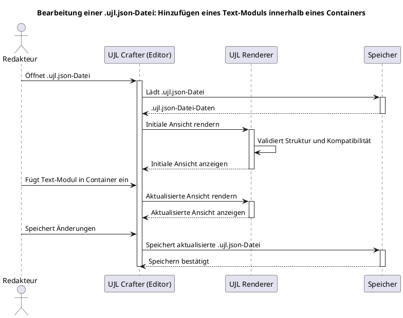
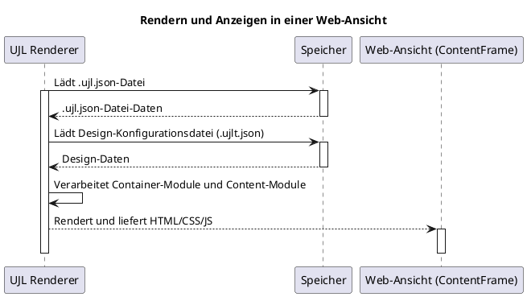

# Laufzeitsicht

## 6.1 Runtime Scenarios

In der Laufzeitsicht betrachten wir die Abläufe innerhalb des **UJL-Systems** bei typischen Anwendungsfällen. Zwei zentrale Szenarien stehen dabei im Fokus: das **Bearbeiten einer `.ujl.json`-Datei** sowie das **Rendern und Anzeigen der `.ujl.json`-Datei in einer Web-Ansicht**. Diese Szenarien verdeutlichen, wie die verschiedenen Systemeinheiten miteinander interagieren, um die gewünschten Funktionen bereitzustellen.

> **Hinweis**: Detaillierte Sequenzdiagramme und Workflow-Beschreibungen finden Sie in [Kapitel 4 - Lösungsstrategie](./04-solution-strategy.md).

### 6.1.1 Szenario 1: Bearbeitung einer `.ujl.json`-Datei

**Beschreibung des Szenarios:**

In diesem Szenario fügt der Redakteur ein Text-Modul innerhalb eines Containers hinzu. Der Ablauf zeigt, wie der **UJL Crafter (Editor)**, der **Renderer** und der **Speicher** zusammenarbeiten, um die Änderungen vorzunehmen und eine aktualisierte Ansicht anzuzeigen:

1. Der **Redakteur** öffnet eine `.ujl.json`-Datei im **UJL Crafter (Editor)**. Der Editor lädt die Datei aus dem **Speicher**.
2. Der **Editor** leitet die geladene Datei an den **Renderer** weiter, der sie validiert und eine initiale Ansicht erzeugt.
3. Der **Redakteur** fügt ein neues Text-Modul innerhalb eines Containers hinzu. Der **Editor** sorgt intern dafür, dass alle Änderungen valides UJL bleiben.
4. Der **Editor** übergibt die Änderungen an den **Renderer**, der die aktualisierte Ansicht generiert und an den Editor zur Anzeige zurückgibt.
5. Abschließend speichert der **Editor** die aktualisierte `.ujl.json`-Datei im **Speicher**.

Dieses Diagramm zeigt die Zusammenarbeit zwischen dem Redakteur, dem Editor und dem Renderer zur Bearbeitung einer Datei und zum Speichern der Änderungen.

### 6.1.2 Szenario 2: Rendern und Anzeigen einer `.ujl.json`-Datei in einer Web-Ansicht

**Beschreibung des Szenarios:**

Das zweite Beispiel veranschaulicht den Ablauf, wenn eine `.ujl.json`-Datei für die Anzeige in einer Web-Ansicht gerendert wird. Dieser Ablauf zeigt, wie der **Renderer** die Datei verarbeitet und als ContentFrame (HTML/CSS/JS) bereitstellt:

1. Der **UJL Renderer** lädt die `.ujl.json`-Datei mit Layout- und Inhaltsdaten aus dem **Speicher**.
2. Zusätzlich lädt der **Renderer** die **Design-Konfigurationsdatei (.ujlt.json)**, um die erforderlichen Styles anzuwenden.
3. Der **Renderer** verarbeitet die referenzierten Container-Module und Content-Module, kombiniert sie mit den Designeinstellungen und erzeugt den finalen **ContentFrame**.
4. Der **ContentFrame** wird dann an die Web-Ansicht weitergeleitet und dort zur Anzeige gebracht.

## 6.2 Quality Scenarios

### 6.2.1 Performance-Szenarien

Das UJL-System ist darauf ausgelegt, auch bei komplexen Layouts und großen Inhaltsmengen performant zu bleiben:

- **Lazy Loading**: Module werden nur dann geladen, wenn sie tatsächlich benötigt werden
- **Caching**: Häufig verwendete Module und Design-Konfigurationen werden gecacht
- **Optimierte Rendering-Pipeline**: Der Renderer nutzt effiziente Algorithmen für die Verarbeitung von UJL-Dateien

### 6.2.2 Sicherheits-Szenarien

- **Validierung**: Alle UJL-Dateien werden vor der Verarbeitung auf Syntax und Kompatibilität geprüft
- **Sandboxing**: Module werden in einer isolierten Umgebung ausgeführt
- **Content Security Policy**: Der generierte ContentFrame respektiert moderne Sicherheitsstandards

### 6.2.3 Skalierbarkeits-Szenarien

- **Modulare Architektur**: Neue Module können ohne Änderungen am Core-System hinzugefügt werden
- **API-basierte Erweiterung**: Entwickler können über definierte APIs eigene Funktionalitäten hinzufügen
- **Plattformunabhängigkeit**: UJL kann in verschiedenen Umgebungen und mit verschiedenen Backend-Systemen eingesetzt werden
