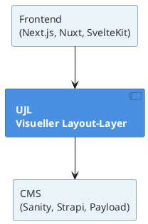

# Vision & Wertversprechen

## Was ist UJL?

**Unified JSON Layout (UJL)** ist der neue Standard für strukturierte Web-Layouts. Das Kernversprechen:

> **Erstelle und pflege garantiert markenkonforme und barrierefreie Websites mit KI.**

Dafür entwickeln wir den ersten Drag & Drop-Editor, in dem Redakteur:innen KI-gestützt arbeiten, ohne das Corporate Design brechen zu können. Barrierefreiheit ist dabei kein Add-on, sondern architektonisch garantiert. Das nennen wir _Brand-Compliance by Design_.

## Das Problem

### Brand-Compliance-Dilemma

Jedes Web-Team kennt das Problem: Redakteur:innen wollen schnell Inhalte ändern, während Designer:innen die Marke schützen möchten. Klassische Lösungen versagen.

- **Strenge Freigabeprozesse** → 3 Wochen für eine Landingpage, frustrierte Teams
- **Drag & Drop-Builder** → Design bricht nach 3 Monaten, inkonsistente Markenwahrnehmung
- **Entwickler:innen als Flaschenhals** → Jede Änderung wird zum Ticket, Marketing ist blockiert

Das Ergebnis: Entweder langsam und teuer, oder schnell und chaotisch. Unternehmen müssen sich zwischen Autonomie und Markenkonsistenz entscheiden.

### KI-Chaos

Noch schlimmer wird es, wenn KI-Tools Websites bearbeiten.
KI-Modelle werden immer intelligenter, aber sie bleiben dennoch vergesslich und eigenwillig. Sie haben keinen dauerhaften Speicher, nur den aktuellen Kontext. Das bedeutet:

- **In jedem Prompt** müssten Design-Richtlinien mitgegeben werden
- **Bei jedem Request** hofft man, dass die KI sie korrekt interpretiert
- **Alternative:** Eigene Modelle trainieren → teuer, energieintensiv, wartungsaufwändig, selbst diese können keine Markenkonformität garantieren

Das Ergebnis: KI-generierter Content ist optisch oft okay, aber viel zu selten wirklich markenkonform. Die Konsistenz der Corporate Identity wird nicht gewährleistet.

### Barriere-Monster

Barrierefreiheit wird oft nachträglich "aufgesetzt", mit vorhersehbaren Problemen:

- **Accessibility-Audits** → Teure externe Prüfungen nach dem Launch
- **Freie Gestaltung** → Redakteur:innen können Kontraste brechen
- **Keine Durchsetzung** → WCAG-Richtlinien sind "Best Practices", keine technische Garantie

Das Ergebnis: Rechtliche Risiken, schlechte Nutzererfahrung für Menschen mit Beeinträchtigungen, teure Nachbesserungen. Besonders kritisch für öffentliche Einrichtungen und Bildungssektor seit 2025 (BFSG).

## Die UJL-Lösung: _Brand-Compliance by Design_

UJL löst das Problem nicht durch größere Modelle oder KI-Training, sondern durch **Rollenspezifische Tools**.

**Was UJL anders macht:**

1. **Module sind vordefiniert** – UJL liefert die wichtigsten Bausteine mit (Hero, Feature-Grid, Call-to-Action, etc.)
2. **Designer:innen definieren das Theme** – Farben, Schriften, Abstände, alle Design-Regeln
3. **Redakteur:innen kombinieren Module** – Sie wählen aus verfügbaren Bausteinen, Design ist geschützt
4. **KI generiert Strukturierte Daten** – Nicht direkt HTML/CSS, sondern JSON oder TOON, das gegen ein Schema validiert wird

**Das Ergebnis:**

- **Redakteur:innen arbeiten autonom** – Keine Tickets, keine Wartezeiten
- **Design ist geschützt** – Technisch unmöglich zu brechen
- **Barrierefreiheit garantiert** – WCAG-Kontraste und semantisches HTML erzwungen
- **KI ist kontrollierbar** – Das Schema erzwingt Gültigkeit
- **Keine Freigabeschleifen** – Alles ist automatisch CI-konform UND barrierefrei

**Die technische Umsetzung:**

UJL trennt strikt zwischen Inhalt (`.ujlc.json`), Design (`.ujlt.json`) und Modulstruktur. Redakteur:innen haben nur Zugriff auf Inhalt, das Design ist für sie nicht erreichbar.

## Unsere Kernprinzipien

### 1. Garantierte Markenkonformität & Barrierefreiheit

Das zentrale Versprechen: **Redakteur:innen können weder Design noch Accessibility brechen.**

So funktioniert es:

- **Strikte Trennung** – Inhalt und Design sind technisch getrennt, nicht nur organisatorisch
- **Theme-Definition** – Designer:innen legen Farben, Schriften, Abstände zentral fest (inklusive WCAG-konformer Kontraste)
- **Modulare Bausteine** – Redakteur:innen kombinieren vordefinierte Module, jede Kombination ist valide
- **Semantisches HTML** – Die UI-Library erzwingt ARIA-Labels, Alt-Texte und strukturierte Daten

**Der Unterschied zu klassischen Buildern:** Wenn Redakteur:innen Buttons beliebig einfärben können, sind garantierte Kontraste unmöglich. UJL erzwingt sie per Architektur. Keine Freigabeschleifen, keine nachträglichen Accessibility-Audits, keine Design-Polizei.

### 2. AI-native

Statt KI zu trainieren oder komplexe Prompts zu schreiben, setzt UJL auf strukturelle Kontrolle:

- **100% garantierte Markenkonformität** – KI generiert simple JSON-Daten/TOON, die gegen ein Schema validiert werden, bevor sie in die Website eingefügt werden.
- **Effiziente Bearbeitung** – Kein Prompt-Engineering für Design-Regeln nötig
- **Kleine Modelle, große Wirkung** – Die JSON-Abstraktion in Verbindung mit TOON zur Tokenverringerung ermöglicht es, mit deutlich kleineren Modellen zu arbeiten. Das spart Kosten und Energie, wichtig für nachhaltige KI-Nutzung und niedrige Betriebskosten.
- **Digitale Souveränität** – Modelle können frei gewählt werden. Beispielsweise OpenAI, Claude, Mistral oder lokale Modelle.

Die KI generiert strukturierte Daten, das Schema erzwingt Konformität. Ein architektonischer Vorteil, der auch bei größeren Modellen Kosten und Energie spart.

### 3. Rollenbasiertes Arbeiten

Alle machen das, was sie am besten können, ohne einander in die Quere zu kommen:

| Rolle                | Verantwortung          | Tool               |
| -------------------- | ---------------------- | ------------------ |
| **Entwickler:innen** | Module & Integrationen | Code, API          |
| **Designer:innen**   | Corporate Identity     | Crafter (Designer) |
| **Redakteur:innen**  | Inhalte                | Crafter (Editor)   |

Klare Grenzen, klare Verantwortung, keine Konflikte.

### 4. Plug-in statt Neubeginn

- Integration in bestehende Systeme (Sanity, PayloadCMS, Strapi, etc.)
- Kein Systemwechsel notwendig, CMS und Frontend bleiben bestehen
- Adapter-Architektur für jedes Framework

### 5. Open Source & Unabhängigkeit

UJL ist quelloffen aus Überzeugung:

- Volle Kontrolle über Code und Daten
- Keine Abhängigkeit von Drittanbietern
- Community kann beitragen und erweitern
- **Lizenz:** MIT (permissive Open-Source-Lizenz, maximal kompatibel für Integrationen)

## UJL in deinem Stack

UJL ist **keine Plattform**, sondern ein **Layer**. Es ersetzt keine Systeme, sondern verbindet sie:

**Die Idee:** Dein CMS bleibt dein CMS. Dein Frontend bleibt dein Frontend. UJL gibt Redakteur:innen die visuelle Ebene, die bisher gefehlt hat, ohne Systemwechsel, ohne Vendor-Lock-in.

## Gesellschaftliche Relevanz

Wir adressieren mehrere folgende zentrale gesellschaftliche Herausforderungen im digitalen Raum:

### Digitale Barrierefreiheit

UJL erzwingt WCAG-konforme und semantisch korrekte Inhalte technisch — nicht optional. Damit können auch Personen ohne Web-Expertise barrierefreie Websites erstellen. Dies reduziert strukturelle Hürden für Menschen mit Behinderungen und fördert Inklusion im öffentlichen und privaten Sektor.

### Nachhaltige und verantwortungsvolle KI-Nutzung

Unser Framework ist AI-native: Module, Layouts und Interaktionen sind so gut für KI-Systeme aufbereitet, dass kleine Modelle ohne wesentlichen Qualitätsverlust eingesetzt werden können. Das reduziert Energiebedarf und KI-gestützte Content-Erstellung wird ökologisch verträglicher.

### Digitale Souveränität & Datenschutz

Durch die offene Architektur (Open Source, MIT-Lizenz) können Organisationen UJL vollständig selbst betreiben. Das stärkt die Kontrolle über Daten, reduziert Abhängigkeiten von proprietären Plattformen und ermöglicht transparente Sicherheitsprüfungen.

### Zugang zu digitaler Gestaltung für Nicht-Techniker:innen

UJL vereinfacht die Erstellung qualitativ hochwertiger, barrierefreier Inhalte für Menschen ohne technische Kenntnisse. Damit senken wir Hürden für digitale Teilhabe und ermöglichen mehr Menschen, sichtbare, professionelle Inhalte zu publizieren.

### Gemeinwohlorientierte Verbreitung

Mittelfristig planen wir Community-Programme und vergünstigte Modelle für Gemeinden, Schulen, Hochschulen und gemeinnützige Organisationen. Damit unterstützen wir digitale Bildung, Medienkompetenz und den Zugang zu professionellen Web-Werkzeugen im Bildungs- und Non-Profit-Sektor.
