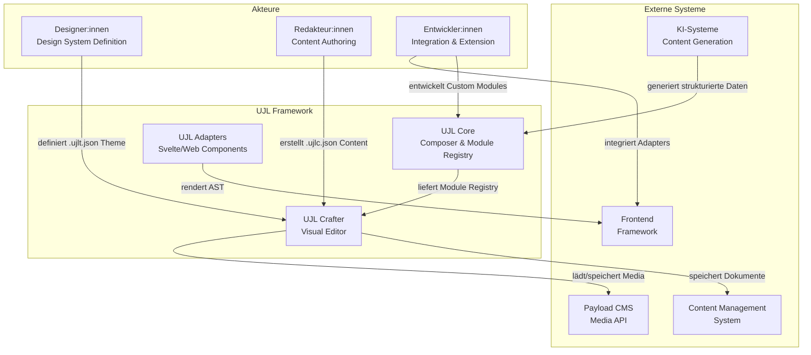
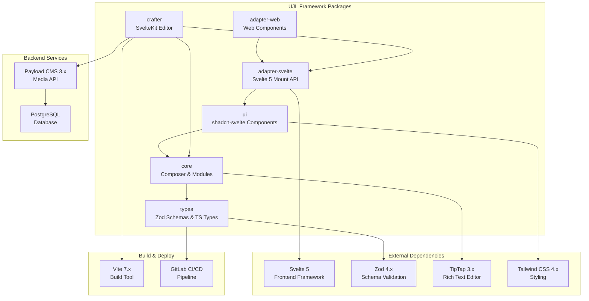
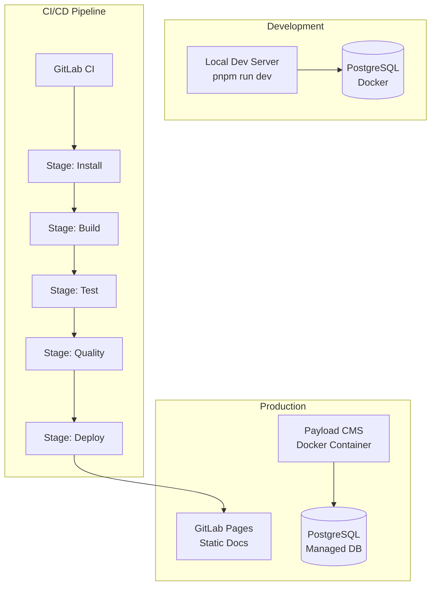
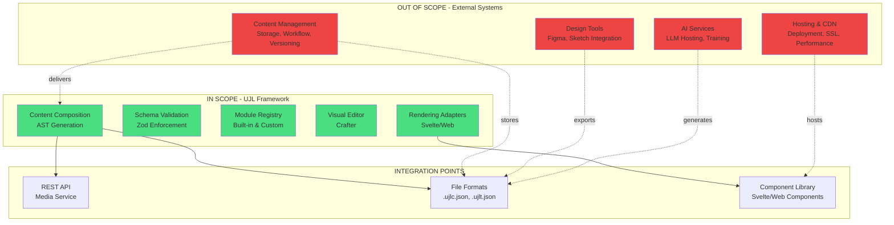

# Kontext und Abgrenzung

Dieses Kapitel beschreibt die Einbettung von UJL in sein Umfeld. Es zeigt auf, welche externen Systeme und Akteure mit UJL interagieren, welche technischen Schnittstellen existieren und wo die Grenzen des Systems liegen.

## 3.1 Business Context

Der Business Context beschreibt die fachlichen Kommunikationsbeziehungen zwischen UJL und externen Akteuren. Er zeigt, welche Rollen mit UJL arbeiten und welche Schnittstellen zu externen Geschäftsprozessen bestehen.

### 3.1.1 Business Context Diagramm



### 3.1.2 Akteure und Kommunikationsbeziehungen

#### **Designer:innen**

**Rolle:** Definition und Pflege des zentralen Design Systems

**Kommunikation mit UJL:**

- Erstellen `.ujlt.json` Theme-Dateien im UJL Crafter (Designer Mode)
- Definieren Farbpaletten, Typografie, Spacing, Radius
- Legen Modul-Varianten und zulässige Kombinationen fest

**Fachlicher Input:**

- Corporate Design Guidelines
- Accessibility-Anforderungen (WCAG)
- Brand-Compliance-Regeln

**Fachlicher Output:**

- Validiertes Theme-Dokument (`.ujlt.json`)
- Design-Token-Set für konsistente Anwendung

**Nutzen:**
Zentrale, technisch durchsetzbare Design-Governance ohne manuelle Review-Prozesse.

---

#### **Redakteur:innen**

**Rolle:** Content-Erstellung und -Pflege innerhalb definierter Leitplanken

**Kommunikation mit UJL:**

- Erstellen `.ujlc.json` Content-Dateien im UJL Crafter (Editor Mode)
- Kombinieren Module per Drag & Drop
- Befüllen Felder (Text, Bilder, Rich Text)
- Nutzen Media Library für Asset-Management

**Fachlicher Input:**

- Inhalte (Text, Bilder, Videos)
- Content-Struktur und -Hierarchie
- Marken-Kontext

**Fachlicher Output:**

- Validiertes Content-Dokument (`.ujlc.json`)
- Brand-konforme, barrierefreie Inhalte

**Nutzen:**
Autonomes Arbeiten ohne Gefahr von Design-Drift oder Accessibility-Verstößen.

---

#### **Entwickler:innen**

**Rolle:** Integration, Erweiterung und technische Anbindung von UJL

**Kommunikation mit UJL:**

- Entwickeln Custom Modules und Fields (TypeScript)
- Integrieren UJL Adapters in Frontend-Frameworks
- Binden Media API an Payload CMS oder andere Backends an
- Implementieren Custom Adapters für spezielle Output-Formate

**Fachlicher Input:**

- Technische Requirements
- Bestehende System-Architektur
- Custom Business Logic

**Fachlicher Output:**

- Erweiterte Module und Fields
- Integrierte UJL-Instanzen in Produktivsystemen
- Custom Adapter-Implementierungen

**Nutzen:**
Klare Extension Points, Framework-Agnostic Architecture, keine Vendor Lock-ins.

---

#### **Externe Systeme**

##### **Content Management System (CMS)**

**Beziehung:** UJL ist **kein Ersatz** für ein CMS, sondern ein **visueller Layout-Layer**

**Kommunikation:**

- CMS speichert `.ujlc.json` und `.ujlt.json` Dateien als JSON-Felder
- CMS liefert Dokumente an Frontend für Rendering
- CMS verwaltet Metadaten, Workflows, Publishing

**Beispiel-Integration:**

```typescript
// CMS liefert UJL-Dokumente
const ujlcDocument = cms.getField("content").json;
const ujltDocument = cms.getField("theme").json;

// Frontend rendert mit UJL
const ast = composer.compose(ujlcDocument);
webAdapter(ast, ujltDocument.ujlt.tokens, { target: "#app" });
```

---

##### **Media API (Payload CMS)**

**Beziehung:** Zentralisierte Asset-Verwaltung mit Metadaten

**Kommunikation:**

- UJL Crafter lädt Media-Bibliothek via REST API
- Upload neuer Medien (multipart/form-data)
- Abruf von Metadaten und Bildvarianten
- Unterstützt Inline Storage (Base64) als Alternative

**API-Endpunkte:**

- `GET /api/media` - Media-Liste mit Filtering
- `POST /api/media` - Upload mit Metadata
- `PATCH /api/media/:id` - Metadata-Update
- `DELETE /api/media/:id` - Löschung

**Authentifizierung:** API-Key via `Authorization: users API-Key <key>`

---

##### **Frontend Framework**

**Beziehung:** UJL Adapters integrieren sich in bestehende Frontend-Stacks

**Kommunikation:**

- Svelte Adapter: Native Svelte 5 Components
- Web Adapter: Framework-agnostic Custom Elements
- Beide konsumieren AST und Token Set

**Unterstützte Szenarien:**

- SvelteKit Applications
- React/Vue/Angular via Web Components
- Static Site Generation (SSG)
- Server-Side Rendering (SSR)

---

##### **KI-Systeme (Future Work, nicht implementiert für den MVP)**

**Beziehung:** AI als Assistent für strukturierte Content-Generierung

**Kommunikation:**

- KI generiert strukturierte JSON statt freies HTML
- Output wird gegen Zod-Schemas validiert
- Ungültige Strukturen werden abgelehnt

**Vorteile:**

- Deterministisches Output-Format
- Keine Prompt-Reeducation bei jedem Request
- Möglichkeit kleinerer/lokaler Modelle
- Technische Brand-Compliance Enforcement

---

### 3.1.3 Abgrenzung zu ähnlichen Systemen

| System-Typ              | Beispiele           | Unterschied zu UJL                                                              |
| ----------------------- | ------------------- | ------------------------------------------------------------------------------- |
| **Page Builder**        | Elementor, Webflow  | UJL trennt Content und Design technisch; Redakteure können Design nicht brechen |
| **Headless CMS**        | Strapi, Contentful  | UJL ist kein CMS, sondern ein Layout-Layer; ergänzt bestehende CMS              |
| **Design Systems**      | Storybook, Figma    | UJL enforces Design-Regeln architektonisch, nicht nur dokumentarisch            |
| **Component Libraries** | shadcn, Material UI | UJL abstrahiert höher (Modul-Ebene), nutzt Component Libraries intern           |
| **AI Content Tools**    | Copy.ai, Jasper     | UJL strukturiert AI-Output und validiert gegen Schemas                          |

---

## 3.2 Technical Context

Der Technical Context beschreibt die technischen Schnittstellen und Abhängigkeiten zwischen UJL und seiner Umgebung.

### 3.2.1 Technical Context Diagramm



### 3.2.2 Technische Schnittstellen

#### **REST API - Payload CMS Media Service**

**Protokoll:** HTTP/HTTPS
**Format:** JSON (Metadata), multipart/form-data (Upload)
**Authentication:** API-Key via Header

**Wichtigste Endpunkte:**

| Methode | Endpoint         | Funktion          | Request                                 | Response             |
| ------- | ---------------- | ----------------- | --------------------------------------- | -------------------- |
| GET     | `/api/media`     | Liste alle Medien | Query-Params (limit, page, where, sort) | Paginated Media List |
| GET     | `/api/media/:id` | Einzelnes Medium  | Path-Param (id)                         | Media Document       |
| POST    | `/api/media`     | Upload            | FormData (file, title, alt, ...)        | Created Media        |
| PATCH   | `/api/media/:id` | Metadata Update   | JSON Body                               | Updated Media        |
| DELETE  | `/api/media/:id` | Löschung          | Path-Param (id)                         | Success Message      |

**Beispiel Request (Upload):**

```typescript
const formData = new FormData();
formData.append("file", fileBlob);
formData.append("title", "My Image");
formData.append("alt", "Description");

const response = await fetch("http://localhost:3000/api/media", {
	method: "POST",
	headers: {
		Authorization: "users API-Key abc123...",
	},
	body: formData,
});
```

**Beispiel Response:**

```json
{
  "id": "67890abcdef12345",
  "title": "My Image",
  "filename": "image.jpg",
  "mimeType": "image/jpeg",
  "width": 3000,
  "height": 2000,
  "sizes": {
    "thumbnail": { "url": "/media/image-400x300.webp", ... },
    "small": { "url": "/media/image-500x333.webp", ... }
  },
  "url": "/media/image.jpg"
}
```

---

#### **CLI Tool - UJL Validator**

**Binary:** `ujl-validate`
**Package:** `@ujl-framework/types`

**Funktion:** Validiert `.ujlc.json` und `.ujlt.json` Dateien gegen Zod-Schemas

**Usage:**

```bash
# Auto-detect file type
ujl-validate ./my-content.ujlc.json

# Validate theme
ujl-validate ./my-theme.ujlt.json
```

**Output:**

- Validation success/failure
- Detailed error messages mit Zod error paths
- Statistics (module count, media count, etc.)
- Warnings (e.g., contrast issues)

---

#### **NPM Package Exports**

##### **@ujl-framework/core**

```typescript
// Hauptexporte
import { Composer } from "@ujl-framework/core";
import { ModuleRegistry } from "@ujl-framework/core";

// Module & Fields
import { TextField, RichTextField, ImageField } from "@ujl-framework/core";

// Rich Text Extensions
import { ujlRichTextExtensions } from "@ujl-framework/core";

// Media Library
import { MediaLibrary } from "@ujl-framework/core";
```

##### **@ujl-framework/adapter-svelte**

```typescript
// Components
import { AdapterRoot } from "@ujl-framework/adapter-svelte";

// Imperative API
import { svelteAdapter } from "@ujl-framework/adapter-svelte";

// Utilities
import { prosemirrorToHtml, RichText } from "@ujl-framework/adapter-svelte";

// Styles (must be imported explicitly)
import "@ujl-framework/adapter-svelte/styles";
```

##### **@ujl-framework/adapter-web**

```typescript
// Adapter Function
import { webAdapter } from "@ujl-framework/adapter-web";

// Custom Element registriert sich automatisch als <ujl-content>
```

##### **@ujl-framework/types**

```typescript
// TypeScript Types
import type {
	UJLCDocument,
	UJLTDocument,
	UJLAbstractNode,
	UJLTTokenSet,
} from "@ujl-framework/types";

// Validation Functions
import { validateUJLCDocumentSafe, validateUJLTDocumentSafe } from "@ujl-framework/types";
```

---

#### **File Format Interfaces**

##### **UJLC Document Format (.ujlc.json)**

**Purpose:** Content-Beschreibung in strukturierten Modulen

**Structure:**

```json
{
  "ujlc": {
    "meta": {
      "title": "Document Title",
      "description": "...",
      "_version": "0.0.1",
      "media_library": {
        "storage": "inline" | "backend",
        "endpoint": "http://localhost:3000/api"
      }
    },
    "media": {
      "media-001": {
        "id": "media-001",
        "storage": "inline",
        "data": "data:image/jpeg;base64,..."
      }
    },
    "root": [
      {
        "type": "text",
        "meta": { "id": "text-001", "updated_at": "..." },
        "fields": { "content": "Hello World" },
        "slots": {}
      }
    ]
  }
}
```

##### **UJLT Theme Format (.ujlt.json)**

**Purpose:** Design-System-Definition (Farben, Typografie, Spacing)

**Structure:**

```json
{
	"ujlt": {
		"meta": {
			"title": "Default Theme",
			"_version": "0.0.1"
		},
		"tokens": {
			"color": {
				"primary": {
					"oklch": { "l": 0.5, "c": 0.15, "h": 260 }
				}
			},
			"typography": {
				"base": {
					"family": "Inter",
					"size": { "sm": 14, "md": 16, "lg": 18 }
				}
			},
			"spacing": { "xs": 4, "sm": 8, "md": 16, "lg": 24 },
			"radius": { "sm": 4, "md": 8, "lg": 12 }
		}
	}
}
```

---

### 3.2.3 Externe Abhängigkeiten

#### **Runtime Dependencies**

| Dependency            | Version | Verwendung                | Criticality |
| --------------------- | ------- | ------------------------- | ----------- |
| `svelte`              | 5.46.1  | Frontend Framework (peer) | Critical    |
| `zod`                 | 4.2.1   | Schema Validation         | Critical    |
| `@tiptap/starter-kit` | 3.14.0  | Rich Text Editor          | High        |
| `tailwindcss`         | 4.1.18  | Styling System            | High        |
| `nanoid`              | 5.1.6   | ID Generation             | Medium      |

#### **DevDependencies**

| Dependency         | Version | Verwendung      |
| ------------------ | ------- | --------------- |
| `vite`             | 7.3.0   | Build Tool      |
| `vitest`           | 4.0.16  | Unit Testing    |
| `@playwright/test` | 1.57.0  | E2E Testing     |
| `typescript`       | 5.9.3   | Type Checking   |
| `prettier`         | 3.7.4   | Code Formatting |

#### **Backend Dependencies (Media Service)**

| Dependency | Version | Verwendung        |
| ---------- | ------- | ----------------- |
| `payload`  | 3.x     | Headless CMS      |
| `postgres` | latest  | Database          |
| `docker`   | 20.x+   | Container Runtime |

---

### 3.2.4 Deployment Context



**CI/CD Stages:**

1. **install** - Dependency installation mit Cache
2. **build** - Monorepo-Build (types → core → adapters → demo → docs)
3. **test** - Vitest Unit Tests für alle Packages
4. **quality** - ESLint + TypeScript Checks
5. **deploy** - GitLab Pages (nur main/develop Branch)

**Deployment Artifacts:**

- Static Documentation Site (VitePress) → GitLab Pages
- NPM Packages (publishable, nicht automatisch deployed)
- Docker Images für Payload CMS Media Service

---

## 3.3 Scope

Dieser Abschnitt definiert die Systemgrenzen von UJL: Was gehört zum System, was explizit nicht?

### 3.3.1 In Scope

**UJL Framework ist verantwortlich für:**

#### **Kern-Funktionalität**

- **Content-Komposition:** AST-Generierung aus `.ujlc.json` Dokumenten
- **Theme-System:** Token-Management und -Anwendung aus `.ujlt.json`
- **Module Registry:** Verwaltung verfügbarer Module und Fields
- **Validation:** Schema-basierte Validierung (Zod) für Dokumente
- **Media Library:** Abstraktion für Inline- und Backend-Storage
- **Adapters:** Rendering zu Svelte Components und Web Components
- **Visual Editor (Crafter):** Drag & Drop Content Authoring

#### **Qualitäts-Garantien**

- **Brand-Compliance Enforcement:** Technische Durchsetzung von Design-Regeln
- **Accessibility by Default:** WCAG-konforme Modul-Implementierungen
- **Schema Validation:** Strukturelle Korrektheit durch Zod-Schemas
- **ID Propagation:** Eindeutige Modul-IDs für Editor-Integration

#### **Developer Experience**

- **Extension APIs:** Custom Modules, Fields, Adapters
- **TypeScript Support:** Vollständige Type Definitions
- **CLI Tools:** Validation Command (`ujl-validate`)
- **Documentation:** Arc42-Architekturdokumentation

---

### 3.3.2 Out of Scope

**UJL Framework ist explizit NICHT verantwortlich für:**

#### **Content Management**

- ❌ **Content-Speicherung:** Kein eingebautes Datenbank-Backend
- ❌ **Workflow-Management:** Keine Freigabeprozesse, Versionierung
- ❌ **User Management:** Keine Benutzerverwaltung, Rollen, Rechte
- ❌ **Publishing:** Kein Deployment-Mechanismus
- ❌ **Content-Suche:** Keine Volltextsuche, Taxonomien

**Begründung:** UJL ist ein Layout-Layer, kein CMS. Bestehende CMS-Systeme können UJL-Dokumente als JSON-Felder speichern.

---

#### **Design Tooling**

- ❌ **Design-zu-Code:** Kein Import aus Figma/Sketch
- ❌ **Visual Design Editor:** Kein Farbpicker für Redakteure
- ❌ **Asset-Optimierung:** Keine automatische Bildkompression (außer in Media Service)

**Begründung:** Design wird von Designer:innen im Theme definiert, nicht von Redakteur:innen.

---

#### **Hosting & Infrastructure**

- ❌ **Web Hosting:** Keine eingebaute Hosting-Plattform
- ❌ **CDN:** Keine Content Delivery
- ❌ **SSL/TLS:** Keine Zertifikats-Verwaltung
- ❌ **Monitoring:** Kein APM, Logging, Alerting

**Begründung:** UJL ist framework-agnostic und kann in beliebigen Hosting-Umgebungen deployed werden.

---

#### **AI Integration**

- ❌ **LLM Hosting:** Keine eigenen AI-Modelle
- ❌ **Prompt Engineering:** Keine vordefinierten Prompts
- ❌ **AI Training:** Keine Model-Finetuning-Funktionalität

**Begründung:** UJL bietet strukturierte Daten für AI, hostet aber keine AI-Services selbst.

---

### 3.3.3 Systemgrenzen Diagramm



---

### 3.3.4 Integrations-Szenarien

#### **Szenario 1: UJL + Headless CMS**

```
[CMS Backend] ←→ [JSON Storage] ←→ [UJL Composer] → [Adapter] → [Frontend]
```

**In Scope:**

- Composition & Rendering

**Out of Scope:**

- CMS-Speicherung, API-Layer des CMS

---

#### **Szenario 2: UJL + Static Site Generator**

```
[.ujlc.json Files] → [Build Process] → [UJL Composer] → [Adapter] → [Static HTML]
```

**In Scope:**

- Build-time Composition

**Out of Scope:**

- SSG Framework, Build Orchestration

---

#### **Szenario 3: UJL + SaaS White-Label**

```
[SaaS App] → [Embedded Crafter] → [UJL Adapter] → [Preview] → [Customer Frontend]
```

**In Scope:**

- Embedded Editor, Validation

**Out of Scope:**

- SaaS User Management, Billing, Deployment
