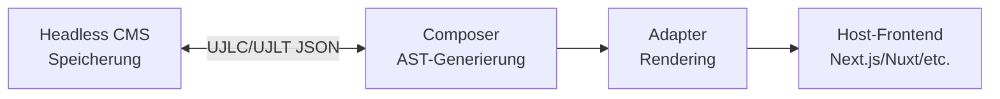
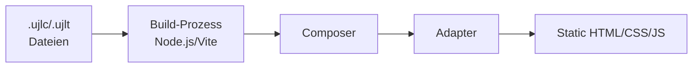
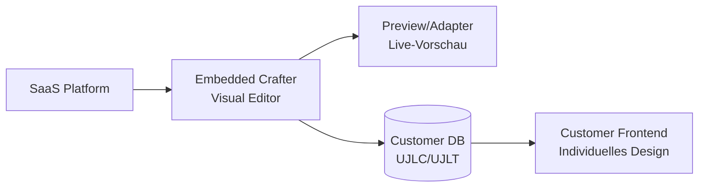

# Kontext und Abgrenzung

UJL sitzt zwischen Autorenwerkzeugen und Auslieferung: Designer:innen und Redakteur:innen erstellen Themes (UJLT) und Inhalte (UJLC), der Core komponiert daraus einen AST, und Adapter rendern den Output in eine Host-Anwendung. Ein CMS dient als Speicher und Workflow-System für die Dokumente; für Bilder kann bei Bedarf ein Library Service dazukommen. KI-Systeme sind in diesem Bild externe Produzenten strukturierter Daten, nicht ein integrierter Bestandteil des Frameworks.

## 3.1 Business Context

UJL tauscht mit externen Akteuren und Systemen Inhalte, Themes, Assets und gerenderte Outputs aus. Die fachlichen Kommunikationsbeziehungen stehen im Vordergrund, nicht die technische Implementierung.

### 3.1.1 Business Context Diagramm


### 3.1.2 Akteure und Kommunikationsbeziehungen

#### Designer:innen

**Ziel/Verantwortung:** Definition und Pflege des Design-Systems (Theme)

**Interaktionen:**

Designer:innen erstellen und pflegen Theme-Dokumente (`.ujlt.json`) im Crafter (Designer Mode). Dabei definieren sie Markenrelevante Parameter wie Farben, Typografie, Spacing und Radius. Die Wirkung ihrer Änderungen prüfen sie direkt in der Vorschau.

**Artefakte:**

- Valides Theme-Dokument (`.ujlt.json`)
- Design-Token-Set für die konsistente Anwendung im gesamten System

**Mehrwert:** Design-Governance wird technisch durchsetzbar, nicht nur dokumentiert.

#### Redakteur:innen

**Ziel/Verantwortung:** Content-Erstellung und -Pflege innerhalb definierter Leitplanken

**Interaktionen:**

Redakteur:innen erstellen Content-Dokumente (`.ujlc.json`) im Crafter (Editor Mode). Sie kombinieren Module per Drag & Drop und befüllen Felder mit Texten, Bildern und Rich Text.

**Artefakte:**

- Valides Content-Dokument (`.ujlc.json`)
- Inhalte, die durch Theme und Module konsistent gerendert werden
- ggf. Assets (Bilder, Videos, Audio), die im Library Service oder inline Storage gespeichert werden

**Mehrwert:** Autonomes Arbeiten ohne „Design Drift" und mit direkter Vorschau.

#### Entwickler:innen

**Ziel/Verantwortung:** Integration, Erweiterung und technische Anbindung

**Interaktionen:**

Entwickler:innen entwickeln Custom Modules und Fields in TypeScript und integrieren UJL-Adapter in Host-Anwendungen. Sie binden den Library Service (Payload CMS) oder alternative Backends über definierte Schnittstellen an und implementieren bei Bedarf zusätzliche Adapter für weitere Render-Targets.

**Artefakte:**

- Erweiterte Module, Fields und Adapter
- Integrierte UJL-Nutzung in Produktivsystemen

**Mehrwert:** Definierte Extension-Points und keine proprietären Lock-ins.

#### Externe Systeme

##### Content Management System (CMS)

**Ziel/Verantwortung:** Speicherung, Workflow und Publishing von Inhalten (außerhalb von UJL)

**Interaktionen:**

Das CMS speichert `.ujlc.json` und `.ujlt.json` als strukturierte Felder oder Assets und liefert diese Dokumente an die Host-Anwendung, die UJL für das Rendering nutzt. Das CMS bleibt zuständig für Metadaten, Workflows, Publishing und Rollenmodelle.

**Artefakte:**

- Persistierte UJL-Dokumente (`.ujlc.json`, `.ujlt.json`)
- Metadaten/Workflow-Status (CMS-intern)

**Mehrwert:** UJL ergänzt das CMS um visuelles Layouting und Governance, ohne CMS-Funktionen zu ersetzen.

**Beispiel-Integration:**

```typescript
// CMS liefert UJL-Dokumente
const ujlcDocument = cms.getField("content").json;
const ujltDocument = cms.getField("theme").json;

// Rendering in der Host-Anwendung
const ast = await composer.compose(ujlcDocument); // compose ist async
webAdapter(ast, ujltDocument.ujlt.tokens, { target: "#app" });
```

##### Library Service (Payload CMS): Images API

**Ziel/Verantwortung:** Bildverwaltung inkl. Metadaten (bei Bedarf; alternativ inline Storage)

**Interaktionen:**

Der Crafter listet und löst Images über HTTP auf, ermöglicht den Upload von Bildern und die Pflege von Metadaten (z. B. Alt-Text). Als Alternative bleibt inline Storage (z. B. Data-URLs) möglich.

**Artefakte:**

- Bild-Assets und Metadaten (Library Service)
- Referenzen/Einträge im UJLC-Dokument (Images)

**Mehrwert:** Asset-Verwaltung statt rein lokaler/inline Ablage; erleichtert Wiederverwendung und Pflege.

**API-Endpunkte:**

Der Service bietet `GET /api/images` für öffentliche Bildabfragen, `POST /api/images` für Uploads, `PATCH /api/images/:id` für Metadaten-Updates und `DELETE /api/images/:id` zum Löschen. Write-Operationen erfordern einen API-Key im Header (`Authorization: users API-Key YOUR_API_KEY`), Read-Operationen sind öffentlich zugänglich.

##### Frontend / Host-Anwendung

**Ziel/Verantwortung:** Auslieferung der Website/App und Einbettung der UJL-Ausgabe

**Interaktionen:**

Der Svelte Adapter liefert native Svelte-Komponenten für Svelte-Host-Anwendungen, während der Web Adapter ein framework-agnostisches Custom Element (Web Components) bereitstellt. Beide Adapter konsumieren AST und Token-Set und erzeugen den gleichen fachlichen Output.

**Artefakte:**

- Gerenderte Inhalte (ContentFrame) als Teil der Host-Anwendung
- Einbindungskonfiguration (Adapter/Custom Element)

**Mehrwert:** UJL kann in unterschiedliche Frontend-Stacks integriert werden, ohne dass die Host-Anwendung das Dokumentmodell selbst rendern muss.

**Unterstützte Szenarien:**

UJL unterstützt alle JS-basierten Frontend-Stacks.

##### KI-Systeme

**Ziel/Verantwortung:** Assistenz bei der Erzeugung strukturierter Inhalte (außerhalb von UJL)

**Interaktionen:**

KI-Systeme generieren strukturierte JSON-Daten (UJLC/UJLT) statt freies HTML. Der Output wird gegen Schemas validiert; ungültige Strukturen werden abgelehnt.

UJL selbst enthält derzeit keine integrierten KI-Services. Die Rolle der KI liegt außerhalb des Systems (z.B. als Redaktionsassistenz oder Import-Pipeline) und interagiert über die dokumentierten Datenformate und Schnittstellen.

**Artefakte:**

- Vorschläge/Generierungen als UJLC/UJLT (oder Teilstrukturen davon)

**Mehrwert:** Strukturierter, validierbarer Output statt unzuverlässiger HTML-Snippets; bessere Anschlussfähigkeit an Governance und Rendering.

### 3.1.3 Abgrenzung zu ähnlichen Systemen

| System-Typ                          | Beispiele                   | Unterschied zu UJL                                                                                        |
| ----------------------------------- | --------------------------- | --------------------------------------------------------------------------------------------------------- |
| **Page Builder**                    | Webflow, Wix                | UJL trennt Content und Design technisch; Redakteur:innen können Design nicht „frei" brechen.              |
| **CMS-gebundene Page Builder**      | Elementor, Divi, Gutenberg  | UJL ist CMS-unabhängig und setzt Governance architektonisch durch, nicht nur prozessual.                  |
| **Headless CMS**                    | Strapi, Contentful          | UJL ist kein CMS, sondern ergänzt CMS um einen Layout-/Governance-Layer.                                  |
| **Editor-Frameworks**               | GrapesJS, Editor.js, TipTap | UJL bietet integrierte Governance-Logik und Design-System-Durchsetzung, nicht nur technische Bausteine.   |
| **Proprietäre Visual-Editing-SaaS** | Builder.io                  | UJL ist Open Source, self-hosted und bietet tiefere Governance-Tiefe durch architektonische Durchsetzung. |
| **Design Systems**                  | Storybook, Figma            | UJL setzt Designregeln im Rendering/Modell technisch durch, statt sie nur zu dokumentieren.               |
| **Component Libraries**             | shadcn, Material UI         | UJL abstrahiert höher (Modul-/Dokument-Ebene) und kann Component Libraries intern nutzen.                 |
| **AI Content Tools**                | Copy.ai, Jasper             | UJL strukturiert AI-Output als validierbares Dokumentformat statt als HTML/Text-Schnipsel.                |

## 3.2 Technical Context

UJL kommuniziert über `HTTP` mit `REST` APIs und nutzt `JSON` sowie `multipart/form-data` als Formate.

### 3.2.1 Technical Context Diagramm


### 3.2.2 Technische Schnittstellen

#### Integration: UJL Crafter (Visual Editor)

**Installation:**

```bash
pnpm add @ujl-framework/crafter
```

**Grundlegende Integration:**

```typescript
import { UJLCrafter } from "@ujl-framework/crafter";

const crafter = new UJLCrafter({
	target: "#editor-container",
	document: myContentDocument, // Initial UJLC (falls gesetzt)
	theme: myPreviewTheme, // Theme für Preview (falls gesetzt)
	library: { storage: "inline" }, // oder 'backend' mit url + apiKey
});

// Event-Handling
crafter.onDocumentChange((doc) => console.log("Changed:", doc));
crafter.onThemeChange((theme) => console.log("Theme:", theme));

// Cleanup
crafter.destroy();
```

**Besonderheiten:**

Der Crafter ist vollständig gebündelt mit Shadow DOM, sodass keine CSS-Imports erforderlich sind. Fonts müssen separat bereitgestellt werden (z. B. via Fontsource). Der Crafter unterstützt zwei Modi: Editor für Content-Bearbeitung und Designer für Theme-Anpassungen.

#### Integration: Svelte Adapter (Rendering)

**Installation:**

```bash
pnpm add @ujl-framework/adapter-svelte @ujl-framework/core svelte
```

**Svelte Component Integration:**

```svelte
<script lang="ts">
	import { Composer } from "@ujl-framework/core";
	import { AdapterRoot } from "@ujl-framework/adapter-svelte";
	import "@ujl-framework/adapter-svelte/styles";

	const composer = new Composer();
	const ast = $derived.by(async () => await composer.compose(ujlcDocument));
	const tokenSet = $derived(ujltDocument.ujlt.tokens);
</script>

<AdapterRoot node={ast} {tokenSet} mode="system" />
```

**Imperative API:**

```typescript
import { svelteAdapter } from "@ujl-framework/adapter-svelte";

const mounted = svelteAdapter(ast, tokenSet, {
	target: "#container",
	showMetadata: true, // für Editor-Features
});

await mounted.unmount();
```

#### Integration: Web Adapter (Framework-Agnostic)

**Installation:**

```bash
pnpm add @ujl-framework/adapter-web @ujl-framework/core
```

**Integration:**

```typescript
import { webAdapter } from "@ujl-framework/adapter-web";
import { Composer } from "@ujl-framework/core";

const composer = new Composer();
const ast = await composer.compose(ujlcDocument);

const mounted = webAdapter(ast, tokenSet, {
	target: "#container",
	showMetadata: true,
});

mounted.unmount();
```

**Besonderheiten:**

Der Web Adapter registriert automatisch das Custom Element `<ujl-content>` und benötigt keine Svelte-Runtime-Dependency. Shadow DOM sorgt für Style-Isolation. Props müssen als Properties gesetzt werden, nicht als HTML-Attributes.

#### REST API: Library Service

Nur relevant, wenn der Crafter mit `library: { storage: 'backend' }` konfiguriert wird.

**Base-URL:** Konfigurierbar (Default: `http://localhost:3000` in Development)  
**Authentifizierung:** `Authorization: users API-Key YOUR_API_KEY`

| Methode | Endpoint          | Auth | Zweck                    |
| ------- | ----------------- | ---- | ------------------------ |
| GET     | `/api/images`     | Nein | Bilder auflisten/filtern |
| POST    | `/api/images`     | Ja   | Upload                   |
| PATCH   | `/api/images/:id` | Ja   | Metadaten ändern         |
| DELETE  | `/api/images/:id` | Ja   | Bild löschen             |

## 3.3 Scope (Systemgrenze)

### 3.3.1 In Scope

UJL ist verantwortlich für **Dokumentmodell & Authoring** (Erstellung/Pflege von UJLC/UJLT im Crafter), **Validierung & Komposition** (Schema-Validierung und AST-Generierung aus UJLC mit Theme-Bezug) sowie **Rendering** über Adapter für Svelte und Web Components (Custom Element) zur Ausgabe in Host-Anwendungen. Die **Erweiterbarkeit** durch Custom Modules, Fields und Adapter ist ebenso Teil des Scopes wie die Anbindung eines Library Service für Bilder bei Bedarf (zusätzlich zu inline Storage).

### 3.3.2 Out of Scope

UJL ist explizit nicht verantwortlich für **CMS-Kernfunktionen** (Speicherung, Workflows, Rollen/Rechte, Publishing-Prozesse), **Hosting/Plattformbetrieb** (CDN, TLS, Monitoring/Alerting, Betriebs- und Skalierungsverantwortung), **Design-Tool-Integrationen** (Figma/Sketch-Import, „Design-to-Code"-Pipelines) oder **KI-Betrieb** (Hosting/Training von Modellen, Prompt-/Agent-Frameworks).

### 3.3.3 Beispielhafte Integrations-Szenarien

**Szenario 1: UJL + Headless CMS**

Das CMS speichert UJLC und UJLT als JSON-Felder und liefert diese an die Host-Anwendung. Der Composer erzeugt daraus den AST, der Adapter rendert den Output.



**Szenario 2: UJL + Static Site Generation**

UJLC und UJLT Dateien werden zur Build-Zeit eingelesen, komponiert und als statisches HTML ausgegeben.



**Szenario 3: UJL als White-Label Editor**

Eine SaaS-Plattform bettet den Crafter ein. Kunden nutzen ihn zur Content-Erstellung, der Output wird in deren Frontend gerendert.


