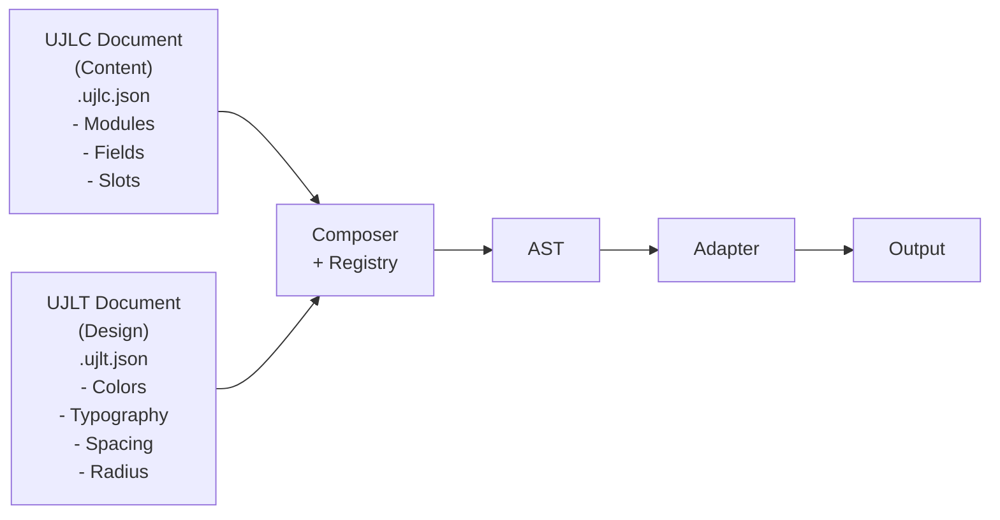

# Lösungsstrategie

UJL erzwingt Brand-Compliance und Barrierefreiheit über Datenverträge und Rendering, nicht über Disziplin im Prozess. Dafür trennt das System Content (UJLC) und Theme (UJLT), validiert beide zur Laufzeit gegen Schemas, komponiert Inhalte in einen framework-agnostischen AST und rendert diesen über Adapter. Erweiterbarkeit entsteht über registrierbare Module/Fields; Bild-Workflows lassen sich je nach Einsatz als Inline- oder Backend-Storage abbilden.

## 4.1 Kernstrategien zur Zielerreichung

### Strategie 1: Strikte Content-Design-Trennung

**Qualitätsziel:** Brand-Compliance by Design (Priorität 1)

**Problem:** Traditionelle Web-Technologien (HTML/CSS) ermöglichen es Redakteur:innen, Design-Regeln durch inline-Styles oder falsche CSS-Klassen zu brechen.

**Lösung:** Architektonische Trennung auf Datenebene



Die Trennung erfolgt auf zwei Ebenen: **UJLC-Dokumente** enthalten ausschließlich strukturierte Content-Daten in Form von Modulen mit typisierten Fields und Slots. **UJLT-Dokumente** enthalten Design-Tokens wie Farben (im OKLCH-Farbraum), Typografie, Spacing und Radius, die im Theme gepflegt werden. Der **Composer** kombiniert beide zur Laufzeit zu einem Abstract Syntax Tree (AST), während **Zod-Schemas** beide Dokumenttypen validieren.

Diese Architektur führt dazu, dass Redakteur:innen Design-Regeln technisch nicht brechen können und Theme-Updates sofort global auf alle Dokumente wirken. Das ermöglicht Governance ohne manuelle Reviews, bedeutet aber auch weniger Flexibilität für individuelle Design-Anpassungen pro Dokument.

**Referenz:** Siehe [ADR-001](./09-architecture-decisions#_9-1-adr-001-strikte-trennung-von-content-ujlc-und-design-ujlt)

### Strategie 2: Schema-First mit Runtime-Validierung

**Qualitätsziel:** Validierbarkeit & Robustheit (Priorität 3), Type Safety

**Problem:** Externe Daten (CMS-Import, Datei-Upload, zukünftig KI-generierte Inhalte) können ungültige Strukturen enthalten. Reine TypeScript-Typen bieten nur Compile-Time-Sicherheit.

**Lösung:** Zod als Single Source of Truth

```typescript
// Schema Definition (Zod)
export const UJLCModuleObjectSchema = z.object({
	type: z.string(),
	meta: UJLCModuleMetaSchema,
	fields: z.record(z.string(), UJLCFieldObjectSchema),
	slots: z.record(z.string(), z.array(z.lazy(() => UJLCModuleObjectSchema))),
});

// Type Inference (automatisch)
export type UJLCModuleObject = z.infer<typeof UJLCModuleObjectSchema>;

// Runtime Validation
export function validateUJLCDocument(data: unknown): UJLCDocument {
	return UJLCDocumentSchema.parse(data); // Throws on invalid
}
```

Zod ist die Single Source of Truth: Aus den Schemas werden TypeScript-Typen abgeleitet, und beim Laden eines Dokuments wird gegen die Schemas validiert. Fehler enthalten einen JSON-Pfad, und `z.lazy()` ermöglicht rekursive Strukturen wie verschachtelte Module. Das macht Imports, Uploads und KI-Output prüfbar und hält Editor, Composer und Adapter auf demselben Datenvertrag.

Der Trade-off ist ein kleiner Runtime-Overhead durch Validierung (etwa 5 bis 10 ms pro Dokument) sowie zusätzliche Bundle-Größe durch Zod (etwa 12 KB gzip).

**Referenz:** Siehe [ADR-005](./09-architecture-decisions#_9-5-adr-005-zod-basierte-runtime-validation-mit-typescript-type-inference)

### Strategie 3: Abstract Syntax Tree (AST) als Zwischen-Repräsentation

**Qualitätsziel:** Integrationsfähigkeit (Priorität 4), Erweiterbarkeit ohne Core-Brüche (Priorität 5)

**Problem:** Direktes Rendering von UJL-Dokumenten bindet an spezifisches Framework (z.B. Svelte). Andere Frameworks (React, Vue) erfordern vollständige Neuimplementierung.

**Lösung:** Adapter Pattern mit AST als Zwischenschicht

```
UJL Document (.ujlc.json)
    ↓
Composer (with Module Registry)
    ↓
AST (Framework-Agnostic)
    ↓
    ├─→ Svelte Adapter → Svelte Components
    ├─→ Web Adapter → Custom Elements (<ujl-content>)
    ├─→ HTML Adapter (future) → Static HTML
    └─→ PDF Adapter (future) → PDF Documents
```

**AST-Node-Struktur:**

```typescript
type UJLAbstractNode =
	| { type: "text"; id: string; props: { content: ProseMirrorDoc } }
	| { type: "button"; id: string; props: { label: string; href: string } }
	| { type: "container"; id: string; props: { children: UJLAbstractNode[] } }
	| { type: "image"; id: string; props: { image: UJLImageData } };
// ... weitere Node-Typen
```

**Adapter-Schnittstelle:**

```typescript
type UJLAdapter<OutputType = string, OptionsType = undefined> = (
	node: UJLAbstractNode,
	tokenSet: UJLTTokenSet,
	options: OptionsType,
) => OutputType;
```

**Konzept: Module-zu-Node-Transformation (1:N)**

Ein UJLC-Modul ist die editierbare Einheit, der AST beschreibt das, was Adapter rendern. Deshalb ist die Beziehung 1:N: Ein Modul kann mehrere AST-Nodes erzeugen, etwa strukturelle Wrapper für Layouts. Damit Editor und Rendering trotzdem zusammenfinden, tragen AST-Nodes Metadaten: `meta.moduleId` verweist auf die ursprüngliche Modul-ID aus dem Dokument, und `meta.isModuleRoot` markiert den Node, der das Modul selbst repräsentiert (und damit editierbar ist).

```typescript
{
	type: "grid-item",
	id: generateUid(),
	meta: { moduleId: "grid-001", isModuleRoot: false },
	props: { children: [...] },
}
```

Für die Integration bedeutet das: Adapter rendern alle Nodes, während der Crafter beim Bearbeiten an der Modulwurzel ansetzt und über `moduleId` zuverlässig tracken kann, welches Dokument-Element ein Node repräsentiert. Der Preis ist, dass Adapter Node-Typen konsequent abbilden müssen; dafür bleibt die Composition-Logik unabhängig von Rendering-Targets und kann isoliert getestet werden.

**Referenz:** Siehe [ADR-003](./09-architecture-decisions#_9-3-adr-003-adapter-pattern-für-framework-agnostisches-rendering) und [Bausteinsicht 5.3.1.4](./05-building-block-view#_5-3-1-4-konzept-module-zu-node-transformation-1n)

### Strategie 4: Plugin-Architektur mit Module Registry

**Qualitätsziel:** Erweiterbarkeit ohne Core-Brüche (Priorität 5)

UJL behandelt Module als Plugins, die zur Laufzeit registriert werden. Der Composer löst in der Composition den Modultyp aus dem Dokument über eine Registry auf und delegiert die Transformation an das jeweilige Modul. Dadurch können Teams eigene Module hinzufügen oder Built-ins ersetzen, ohne den Core zu verändern, und trotzdem bleibt der Datenvertrag stabil.

Damit Module nicht nur rendern, sondern auch sicher bearbeitbar sind, kapselt das Field-System Validierung und Normalisierung. Ein Modul beschreibt, welche Fields und Slots es besitzt; die konkrete Datenprüfung und das Anwenden von Constraints passieren im Field-Code. Das reduziert Speziallogik im Editor und sorgt dafür, dass Dokumente auch nach Importen oder nach manuellen Änderungen in einem erwartbaren Zustand bleiben.

```typescript
registry.registerModule(new CustomModule());
const node = await composer.composeModule(moduleData);
```

**Referenz:** Siehe [ADR-002](./09-architecture-decisions#_9-2-adr-002-modulares-plugin-system-mit-registry-pattern)

### Strategie 5: OKLCH-Farbraum für Accessibility

**Qualitätsziel:** Accessibility als Standard (Priorität 2)

**Problem:** In klassischen Farbräumen (RGB, HSL) ist es schwer, konsistente Paletten zu erzeugen und Kontraste verlässlich zu berechnen. Das führt dazu, dass Themes im Alltag manuell nachjustiert werden müssen, obwohl das Ziel eine robuste Accessibility-Basis ist.

**Lösung:** UJL beschreibt Farb-Tokens in OKLCH. Ein Theme enthält dabei nicht nur Shades, sondern auch Referenzen für Light/Dark und Foreground-Zuordnungen (als Shade-Referenzen). Der Crafter unterstützt beim Pflegen dieser Paletten mit Farb- und Kontrast-Utilities; beim Rendering werden die Tokens als CSS-Variablen in den DOM injiziert.

```typescript
// OKLCH Color Definition
type UJLTColor = {
	l: number; // Lightness (0..1)
	c: number; // Chroma (0+), Farbsättigung
	h: number; // Hue (0-360), Farbton
};

// Color Palette mit 11 Shades
type UJLTColorSet = {
	"50": UJLTColor;
	"100": UJLTColor;
	"200": UJLTColor;
	// ...
	"900": UJLTColor;
	"950": UJLTColor;
};
```

Die Tokens werden anschließend als CSS Custom Properties in den Output übertragen. Die `UJLTheme`-Komponente erzeugt dabei eine Theme-Instanz-ID und injiziert die Variablen scoping-sicher unter `[data-ujl-theme="..."]`. Dark Mode wird über eine `dark`-Class auf derselben Theme-Root umgesetzt.

**CSS-Output:**

```css
[data-ujl-theme="..."] {
	--radius: 0.75rem;
	--spacing: 0.25rem;

	/* OKLCH triplets (usage: oklch(var(--primary-500))) */
	--primary-500: 54.6% 0.245 262.881;
	--primary-950: 12.9% 0.042 264.695;
}
```

OKLCH erhöht die Komplexität der Berechnungen und ist weniger verbreitet als RGB oder HSL. Dafür wird Accessibility nicht als nachgelagerte Prüfung behandelt, sondern als Eigenschaft des Themes.

**Referenz:** Siehe [ADR-009](./09-architecture-decisions#_9-9-adr-009-oklch-farbraum-für-design-tokens)

### Strategie 6: Strukturierte Daten statt HTML

**Qualitätsziel:** Validierbarkeit & Robustheit (Priorität 3), Security

**Problem:** HTML-Strings sind schwer zu validieren und neigen dazu, dass Regeln über Konventionen statt über Datenverträge abgesichert werden. Außerdem steigt das Risiko für XSS, wenn Inhalte als Strings zusammengesetzt und später wieder interpretiert werden. Für den Crafter kommt hinzu, dass WYSIWYG nur funktioniert, wenn Editor und Renderer auf derselben strukturellen Basis arbeiten.

**Lösung:** UJL speichert Rich Text als strukturierte ProseMirror-Dokumente (JSON) und nutzt TipTap als Editor-Integration. Das Schema wird sowohl im Editor als auch im Serializer verwendet. So kann UJL Inhalte prüfen, normalisieren und serverseitig rendern, ohne Browser-APIs zu benötigen.

```typescript
// ProseMirror Document (JSON)
type ProseMirrorDocument = {
	type: "doc";
	content: ProseMirrorNode[];
};

type ProseMirrorNode = {
	type: string; // 'paragraph', 'heading', 'text', etc.
	attrs?: Record<string, unknown>;
	content?: ProseMirrorNode[];
	marks?: ProseMirrorMark[]; // 'bold', 'italic', 'code'
	text?: string;
};
```

Das verschiebt Komplexität von "HTML-Handling" in ein explizites Schema und einen Serializer. Dafür gewinnt UJL eine stabile Grundlage für WYSIWYG, SSR und Sicherheitsprüfungen.

**Referenz:** Siehe [ADR-008](./09-architecture-decisions#_9-8-adr-008-tiptap-prosemirror-für-rich-text-editing)

### Strategie 7: Dual Storage Strategy für Bilder

**Qualitätsziel:** Integrationsfähigkeit (Priorität 4) und Portabilität

UJL unterstützt zwei Storage-Modi, weil sich Entwicklungs- und Integrationskontexte unterscheiden: Manche Dokumente sollen ohne Backend funktionieren, andere sollen Bild-Workflows mit Verwaltung und Verarbeitung im Library Service nutzen. Der Wechsel wird nicht als Sonderfall modelliert, sondern über eine Image-Library-Abstraktion umgesetzt: Inline wird direkt aus dem Dokument aufgelöst, Backend über einen Provider.

```typescript
// Image Library mit Provider
class ImageLibrary {
	constructor(
		initialImages: Record<string, ImageEntry>,
		provider?: ImageProvider, // Externe Image-Quelle (falls vorhanden)
	);

	async resolve(id: string): Promise<UJLImageData | null> {
		// 1. Check local cache
		const local = this.images[id];
		if (local) {
			return { imageId: id, src: local.src };
		}

		// 2. Use provider for backend storage
		if (this.provider) {
			const imageSource = await this.provider.resolve(id);
			if (imageSource) {
				return { imageId: id, src: imageSource.src };
			}
		}

		return null;
	}
}

// Provider Interface
interface ImageProvider {
	resolve(id: string | number): Promise<ImageSource | null>; // Returns image source
}
```

**Inline Storage**

```json
{
	"ujlc": {
		"meta": {
			"_library": { "storage": "inline" }
		},
		"images": {
			"img-001": {
				"src": "data:image/jpeg;base64,/9j/4AAQSkZJRg...",
				"metadata": {
					"filename": "example.jpg",
					"mimeType": "image/jpeg",
					"filesize": 45678,
					"width": 1920,
					"height": 1080
				}
			}
		}
	}
}
```

**Backend Storage**

```json
{
	"ujlc": {
		"meta": {
			"_library": {
				"storage": "backend",
				"url": "http://localhost:3000"
			}
		},
		"images": {
			"img-001": {
				"src": "http://localhost:3000/api/images/67890abcdef12345",
				"metadata": {
					"filename": "example.jpg",
					"mimeType": "image/jpeg",
					"filesize": 45678,
					"width": 1920,
					"height": 1080
				}
			}
		}
	}
}
```

Die konkreten Backend-Features (Upload, Metadaten, responsive Varianten) liegen im Library Service. Die Arc42-Doku beschreibt die API und die Laufzeitflüsse; die Service-Details stehen in `services/library`. Im aktuellen Crafter wird der Storage-Modus über die Crafter-Konfiguration gewählt; dokumentseitige `_library`-Metadaten werden dabei nicht als Quelle genutzt.

| Modus   | Charakteristik                                                                             |
| ------- | ------------------------------------------------------------------------------------------ |
| Inline  | Portabel und offline-tauglich, aber größere Dokumente und ohne Backend-Features            |
| Backend | Schlanke Dokumente und Bildverwaltung über den Library Service, dafür zusätzlicher Betrieb |

**Referenz:** Siehe [ADR-004](./09-architecture-decisions#_9-4-adr-004-dual-image-storage-strategy-inline-vs-backend)

## 4.2 Technologie-Entscheidungen

### Übersicht: Gewählte Technologien

| Schicht                | Technologie                  | Begründung                                                                                  |
| ---------------------- | ---------------------------- | ------------------------------------------------------------------------------------------- |
| **UI Framework**       | Svelte                       | Minimale Bundle-Größe durch Compilation, Fine-grained Reactivity, Custom Elements Support   |
| **UI Components**      | shadcn-svelte + bits-ui      | Wiederverwendbare UI-Bausteine auf Tailwind-Basis, konsistente Patterns, gute Accessibility |
| **Type System**        | TypeScript (Strict)          | Compile-Time Safety, IDE-Support, generierte Declaration Files                              |
| **Runtime Validation** | Zod                          | Schema → Type Inference, detaillierte Fehler, rekursive Schemas                             |
| **Styling**            | Tailwind CSS                 | Utility-First, Tree-Shaking, Design-Token-Integration via CSS Custom Properties             |
| **Rich Text**          | TipTap (ProseMirror)         | Strukturierte JSON-Dokumente, WYSIWYG-Konsistenz, SSR-Safe Serialization                    |
| **Color System**       | OKLCH (colorjs.io)           | Perzeptuell uniforme Paletten, präzise Kontrast-Berechnungen, WCAG-Konformität              |
| **Library Service**    | Payload CMS                  | TypeScript-First, RESTful API, Image Processing (WebP, Focal Point), Self-Hosted            |
| **Database**           | PostgreSQL                   | Relationale DB für Asset-Metadaten im Library Service                                       |
| **Build Tool**         | Vite                         | Schnelles HMR, optimierte Production Builds, ESM-Native, SvelteKit-Integration              |
| **Monorepo**           | pnpm Workspaces + Changesets | Effiziente Disk-Space-Nutzung, koordinierte Versionierung, Semantic Versioning Automation   |
| **Testing**            | Vitest + Playwright          | Unit Tests (Jest-API), E2E Tests (Cross-Browser), Test Attributes ohne Production Overhead  |
| **Documentation**      | VitePress                    | Markdown-basiert, Vue-powered, schnell, integrierbar mit CI/CD                              |
| **CI/CD**              | CI Pipeline                  | Multi-Stage Pipeline, Caching, reproduzierbare Builds                                       |

### Entscheidungstreiber für Technologie-Wahl

Die Technologieauswahl folgt den Quality Goals aus Kapitel 1.2: integrierbare Outputs (Adapter/Web Components), überprüfbare Datenverträge (Schema-first) und ein Backend, das Bild-Workflows im Library Service unterstützt. Deshalb nutzt UJL Svelte für Crafter und den primären Adapter, Zod für Runtime-Validierung und Payload CMS im Library Service für Bildverwaltung bei Bedarf.

Für das Monorepo sind pnpm Workspaces und Changesets gewählt, weil sie strikte Dependency-Grenzen, reproduzierbare Installationen und koordinierte Releases über mehrere Packages unterstützen.

Details zu den Entscheidungen stehen in den ADRs: [ADR-006](./09-architecture-decisions#_9-6-adr-006-svelte-5-als-primäres-ui-framework), [ADR-005](./09-architecture-decisions#_9-5-adr-005-zod-basierte-runtime-validation-mit-typescript-type-inference), [ADR-007](./09-architecture-decisions#_9-7-adr-007-payload-cms-für-den-library-service) und [ADR-010](./09-architecture-decisions#_9-10-adr-010-pnpm-workspaces-changesets-für-monorepo).

## 4.3 Qualitätsziel-Strategie-Mapping

Diese Tabelle zeigt, wie strategische Entscheidungen die definierten Qualitätsziele ([Kapitel 1.2](./01-introduction-and-goals#_1-2-quality-goals)) erreichen und welche zusätzlichen Ziele damit adressiert werden:

| Qualitätsziel                        | Strategie                                         | Technologie                     | Erfolgsmetrik                                                                                   |
| ------------------------------------ | ------------------------------------------------- | ------------------------------- | ----------------------------------------------------------------------------------------------- |
| **Brand-Compliance by Design**       | Content-Design-Trennung                           | UJLC/UJLT, Zod, Module Registry | 0 Design-Drift in User Studies                                                                  |
| **Accessibility als Standard**       | OKLCH-Farbraum, Automatische Kontrast-Checks      | OKLCH, colorjs.io               | 100% WCAG AA (4.5:1 Kontrast)                                                                   |
| **Validierbarkeit & Robustheit**     | Schema-First, Strukturierte Daten                 | Zod, ProseMirror, JSON          | Architektur ermöglicht deterministische Validierung externer Daten (CMS, Import, zukünftig LLM) |
| **Integrationsfähigkeit**            | AST + Adapter Pattern, Web Components             | adapter-web, Shadow DOM         | UJL läuft in Host-Apps ohne CSS/Framework-Konflikte                                             |
| **Erweiterbarkeit ohne Core-Brüche** | Plugin-Architektur, Adapter Pattern               | Module Registry, AST            | <100 LOC für Custom Module, <50 LOC für Adapter                                                 |
| **Performance**                      | Svelte 5 Compilation, Tree-Shaking                | Svelte 5, Vite                  | <100KB Bundle (adapter-web), <200ms Crafter                                                     |
| **Developer Experience**             | TypeScript Strict, Type Inference, Templates      | TypeScript, Zod, pnpm           | <1h Onboarding (Custom Module), 100% Type Coverage                                              |
| **Maintainability**                  | Monorepo, Automated Testing, Coordinated Releases | pnpm, Changesets, Vitest        | 80%+ Test Coverage (wichtige Pfade)                                                             |

## 4.4 Trade-offs und Entscheidungen

### Accepted Trade-offs

**Bundle-Größe durch Validierung und Rich Text**

UJL verarbeitet Inhalte nicht nur aus TypeScript-Code, sondern auch aus Dateien, Importen und später aus KI-Output. In diesen Fällen reicht Compile-Time-Checking nicht aus. Zod-Validierung zur Laufzeit sorgt dafür, dass Fehler dort auftreten, wo sie entstehen, und sie liefert einen präzisen JSON-Pfad statt eines diffusen Folgefehlers im Renderer. ProseMirror-JSON ersetzt HTML-Strings und reduziert dadurch XSS-Risiken und Sonderfälle bei der Serialisierung.

Der Preis ist zusätzliche Bundle-Größe und ein kleiner Laufzeit-Overhead beim Laden von Dokumenten. Das ist akzeptiert, weil es die Robustheit des Gesamtsystems erhöht und Browser Bundles ohnehin cachen.

**Boilerplate durch Module Registry und Field-System**

Ein Plugin-System kostet Code: Jedes Modul braucht Struktur, und Erweiterungen müssen sich an den Datenvertrag halten. Diese Form ist gewollt, weil sie den Core stabil hält. Neue Module können hinzugefügt oder bestehende ersetzt werden, ohne dass sich der Composer ändern muss. Das Field-System bündelt Validierung, Normalisierung und Constraints, damit Editor und Runtime nicht an vielen Stellen Sonderlogik aufbauen.

**Weniger Styling-Flexibilität pro Dokument**

Die Trennung von UJLC (Content) und UJLT (Theme) verhindert freie Styles auf Dokumentebene. Das reduziert Spielraum für Einzelfälle, schützt aber die Marke und hält Barrierefreiheitsregeln im Theme verankert. Wenn Variationen nötig sind, entsteht sie über zusätzliche Themes, nicht über Ausnahmen im Content.

**Betrieb eines Library Service für Bild-Workflows**

Für Metadaten, responsive Varianten und Verwaltung von Bild-Assets braucht es Infrastruktur. Der Library Service bringt diesen Funktionsumfang, verlangt aber Betrieb (z.B. Docker und PostgreSQL). Inline Storage bleibt als portable Variante, und der Crafter kann Dokumente zwischen den Modi migrieren (siehe Laufzeitsicht 6.5 und Querschnitt 8.10.4).

**UI Framework: Svelte 5**

Svelte 5 ist für Crafter und den primären Adapter gewählt, weil Compilation und Custom Elements gut zur Adapter-Architektur passen. Dazu kommt Pragmatik: Adapter-Svelte und Crafter sind bereits auf Svelte ausgelegt, ein Wechsel würde viel Arbeit verschieben, ohne den Kernnutzen der Architektur zu erhöhen.

**REST und GraphQL am Library Service**

Payload CMS stellt REST und GraphQL bereit. Im Frontend nutzen wir derzeit die REST-API, weil sie für den aktuellen Umfang schnell zu integrieren ist und das Debugging über einfache Requests gut funktioniert. Ein späterer Wechsel auf GraphQL bleibt möglich und hängt von konkreten Anforderungen ab (z.B. Bedarf an gezieltem Daten-Slicing, Overfetching, Schema-Governance, Caching-Strategie).

### Rejected Alternatives

**HTML/CSS als Content-Format**

HTML/CSS würde Styling-Regeln pro Dokument wieder öffnen und damit die architektonische Durchsetzung von Brand-Compliance schwächen. UJL setzt stattdessen auf strukturierte JSON-Dokumente (UJLC) und Validierung über Schemas.

**CSS-in-JS**

CSS-in-JS bringt Laufzeitkosten und macht Token-basierte Themes schwerer durchzusetzen. Tailwind in Kombination mit CSS Custom Properties passt besser zum Ansatz, Design-Regeln über Tokens zu definieren und in Adaptern einheitlich auszuleiten.

**Lerna für Versionierung**

Lerna wurde nicht weiter verfolgt; pnpm Workspaces und Changesets unterstützen Releases über mehrere Pakete und halten Abhängigkeiten sauber getrennt.

**React als primäres UI Framework**

React wurde nicht als Basis gesetzt, weil Svelte-Compilation und Custom Elements besser zum Adapter-Fokus passen und im Projekt bereits die Grundlage für Crafter und Adapter-Svelte bilden.

## 4.5 Implementierungsstrategie

### Build-Zeit vs. Laufzeit-Entscheidungen

| Concern                   | Build-Zeit               | Laufzeit                                |
| ------------------------- | ------------------------ | --------------------------------------- |
| **Type Checking**         | TypeScript Compilation   | nicht anwendbar                         |
| **Schema Validation**     | nicht möglich            | Zod Validation bei Dokument-Load        |
| **CSS Generation**        | Tailwind JIT Compilation | CSS Custom Properties für Theme-Tokens  |
| **Component Compilation** | Svelte → JavaScript      | nicht anwendbar                         |
| **Image Optimization**    | Backend Storage: Payload | Inline Storage: Client-Side Compression |
| **Rich Text Rendering**   | nicht anwendbar          | prosemirrorToHtml() Serialization       |
| **Module Composition**    | nicht anwendbar          | Composer.compose() mit Registry         |

### Deployment-Strategie

UJL wird als Monorepo entwickelt und in mehrere Pakete geschnitten. Die Kernpakete sind als NPM-Pakete vorgesehen (`@ujl-framework/types`, `@ujl-framework/core`, `@ujl-framework/ui`, `@ujl-framework/adapter-svelte`, `@ujl-framework/adapter-web`, `@ujl-framework/crafter`), während `@ujl-framework/examples` intern bleibt. Der Library Service (`services/library`) wird als self-hosted Service betrieben, typischerweise mit Docker für die lokale PostgreSQL-DB.

Der Crafter ist im ein NPM-Package, das in Host-Anwendungen eingebettet wird. Es gibt im Repository kein separates Crafter-Deployment als eigenständige App; Betrieb und Auslieferung passieren über die jeweilige Host-Anwendung. Der Library Service ist davon entkoppelt und wird nur dann betrieben, wenn Backend-Storage für Bilder genutzt wird.

**CI Pipeline (Build/Checks):**

```yaml
Stages:
1. install    → pnpm install --frozen-lockfile (cached)
2. build      → pnpm run build (types → core → ui → adapters → crafter → docs)
3. test       → pnpm run test (Vitest Unit Tests)
4. quality    → pnpm run lint + pnpm run check (ESLint + TypeScript)
```

Die Auslieferung der Dokumentation ist bewusst kein Teil der CI Pipeline: Das Build-Artifact `apps/docs/dist/` wird manuell auf den Webserver hochgeladen.

Als Leitlinien ziehen sich ein paar Prinzipien durch die Umsetzung: Content, Design und Rendering bleiben getrennt, und die Datenverträge werden über Zod-Schemas definiert und zur Laufzeit geprüft. Module werden nicht über Vererbung erweitert, sondern über Composition aus Fields und Slots sowie über eine Registry als Plugin-System. Zustandsänderungen werden funktional formuliert, damit Änderungen nachvollziehbar bleiben.

Features sind so gebaut, dass Dokumente ohne Backend funktionieren und sich bei Bedarf über den Library Service erweitern lassen. Für Performance setzt UJL auf Svelte-Compilation, Tree-Shaking und Lazy Loading. Sicherheit kommt aus strukturierten Daten (Rich Text als ProseMirror), konsequenter Validierung und der Auslagerung von Secrets in Environment Variables.
