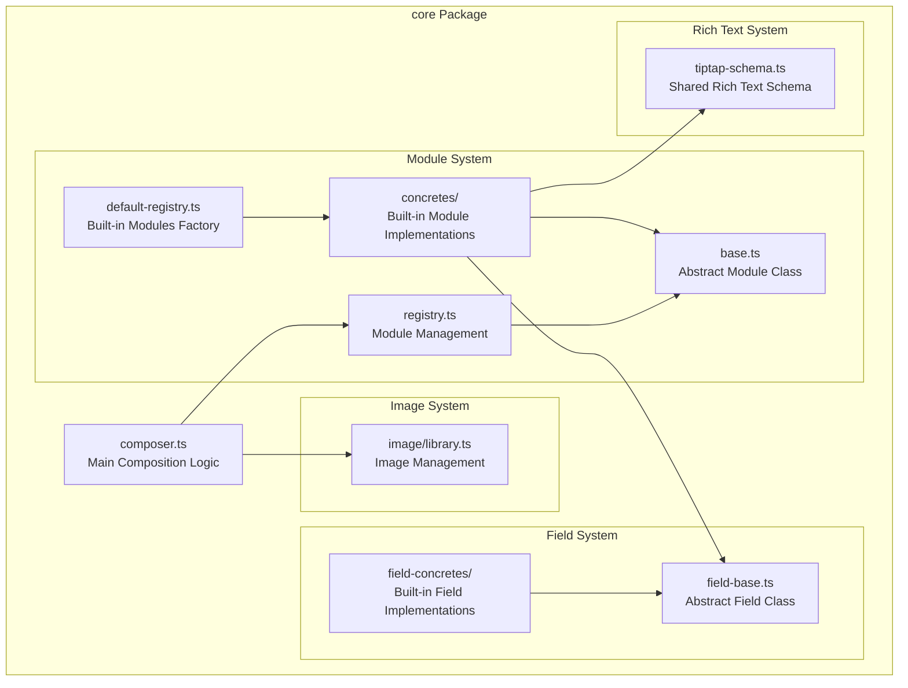
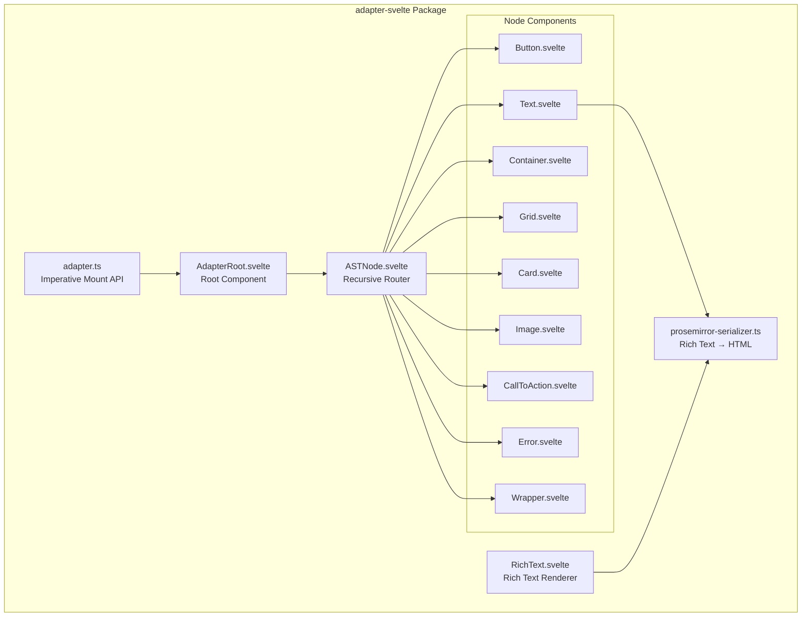
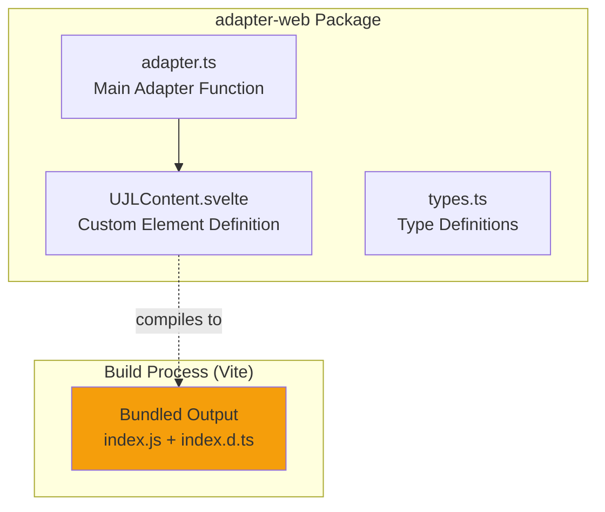
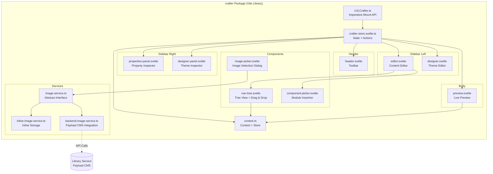
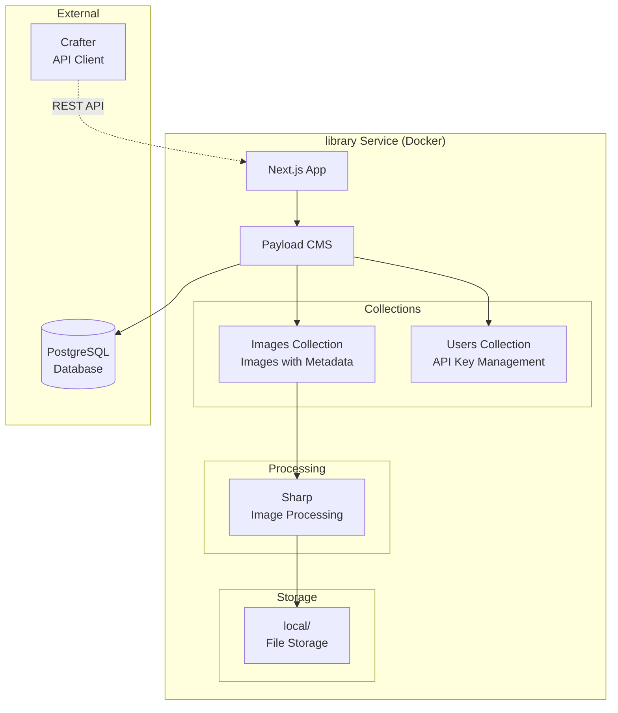
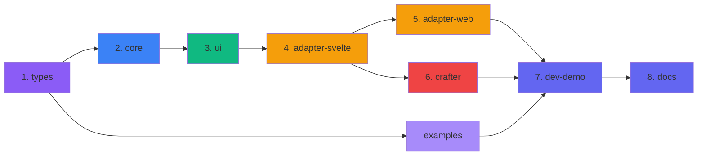

# Bausteinsicht

UJL ist als pnpm-Monorepo organisiert und gliedert sich in wenige, trennscharfe Bausteine: `types` definiert die Dokumentformate und Validierung, `core` komponiert UJLC in einen AST, `ui` liefert wiederverwendbare Svelte-Komponenten, und Adapter übersetzen den AST in konkrete Render-Targets. Der Crafter ist der visuelle Editor, der denselben Datenvertrag nutzt und Editing-Funktionen ergänzt. Für Bilder gibt es neben Inline-Storage einen Library Service (Payload CMS), der Uploads und Metadaten bereitstellt.

## 5.1 Whitebox Gesamtsystem (Level 1)

### Architektur-Übersicht

| Layer                 | Packages                             | Verantwortung                                               | Abhängigkeiten                               |
| --------------------- | ------------------------------------ | ----------------------------------------------------------- | -------------------------------------------- |
| **Application Layer** | crafter · dev-demo · docs · examples | End-User-Anwendungen, orchestrieren unterliegende Schichten | Adapter, UI, Core, Types, (Service optional) |
| **Adapter Layer**     | adapter-svelte · adapter-web         | Framework-spezifische AST-Transformation                    | UI, Core, Types                              |
| **UI Layer**          | ui                                   | Wiederverwendbare shadcn-svelte Komponenten                 | Core, Types                                  |
| **Core Layer**        | core                                 | Composer, Module Registry, Field System, Image Library      | Types                                        |
| **Foundation Layer**  | types                                | TypeScript-Typen, Zod-Schemas, Validator                    | –                                            |
| **Service Layer**     | library                              | Payload CMS Backend für Asset-Management (optional)         | –                                            |

### Begründung der Zerlegung

Die Architektur folgt dem **Layered Architecture Pattern** mit definierten Verantwortlichkeiten und strikter Dependency-Direction. Am Fundament liegt der **Foundation Layer** (`types`), der als Single Source of Truth alle TypeScript-Typen und Zod-Schemas definiert. Darauf baut der **Core Layer** auf (`core`), der die Kernlogik enthält, insbesondere den Composer und die Module Registry, die UJLC-Dokumente in einen Abstract Syntax Tree transformieren.

Der **UI Layer** (`ui`) stellt wiederverwendbare UI-Komponenten bereit, die sowohl im Editor als auch in den Adaptern genutzt werden. Im **Adapter Layer** (`adapter-svelte`, `adapter-web`) erfolgt die framework-spezifische Transformation des AST in konkrete UI-Technologien wie Svelte Components oder Web Components. Diese Trennung ermöglicht es, neue Rendering-Targets hinzuzufügen, ohne die Core-Logik anzufassen.

Der **Application Layer** (`crafter`, `dev-demo`, `docs`) bündelt die End-User-Anwendungen, die die darunterliegenden Schichten orchestrieren. Als separater **Service Layer** existiert `library` (Payload CMS), der bei Bedarf als Backend für Asset-Management dient, aber keine Abhängigkeit für die Core-Funktionalität darstellt.

Diese Schichtung bringt mehrere Vorteile: Dependencies zeigen ausschließlich nach unten (top-down), was zirkuläre Abhängigkeiten verhindert. Jede Schicht ist isoliert testbar, und wichtige Komponenten wie Adapter lassen sich austauschen, ohne höhere Schichten zu beeinflussen. Die Umsetzung als Monorepo mit pnpm Workspaces ermöglicht koordinierte Releases über alle Packages hinweg.

### Enthaltene Bausteine

#### NPM Packages

| Baustein           | Verantwortung                                                 | NPM-Package                     |
| ------------------ | ------------------------------------------------------------- | ------------------------------- |
| **types**          | TypeScript-Typen, Zod-Schemas und Validator für UJL-Dokumente | `@ujl-framework/types`          |
| **core**           | Composer, Module Registry, Field System, Image Library        | `@ujl-framework/core`           |
| **ui**             | shadcn-svelte UI-Komponenten (Button, Card, Dialog, etc.)     | `@ujl-framework/ui`             |
| **adapter-svelte** | Svelte Adapter (AST → Svelte Components)                      | `@ujl-framework/adapter-svelte` |
| **adapter-web**    | Web Components Adapter (AST → Custom Elements)                | `@ujl-framework/adapter-web`    |
| **crafter**        | Visual Editor (WYSIWYG) für Content und Themes                | `@ujl-framework/crafter`        |
| **examples**       | Beispiel-Dokumente und Themes (.ujlc.json, .ujlt.json)        | `@ujl-framework/examples`       |

#### Services

| Baustein    | Verantwortung                        | Pfad               |
| ----------- | ------------------------------------ | ------------------ |
| **library** | Payload CMS Image Management Backend | `services/library` |

#### Apps

| Baustein     | Verantwortung                          | Pfad            |
| ------------ | -------------------------------------- | --------------- |
| **dev-demo** | Demo-Applikation (zeigt UJL in Aktion) | `apps/dev-demo` |
| **docs**     | Dokumentations-Website (VitePress)     | `apps/docs`     |

### Wichtige Schnittstellen

#### Schnittstelle 1: UJL Document Formats

Die primäre Schnittstelle des UJL-Systems sind **JSON-basierte Dokumentformate** (`.ujlc.json` für Content, `.ujlt.json` für Themes). Diese Dokumente werden von verschiedenen Producern erzeugt: Der visuelle **Crafter-Editor** für interaktive Bearbeitung, **KI-Systeme** für automatische Content-Generierung, oder **manuelle Editoren** für direkte JSON-Manipulation. Als Consumer fungieren das `types`-Package (für Validierung) und der **Composer** im `core`-Package, der UJLC-Dokumente in einen Abstract Syntax Tree transformiert.

UJLC-Dokumente enthalten Metadaten (`meta`), eine Image-Bibliothek (`images`) und eine Wurzelstruktur aus Modulen (`root`). UJLT-Dokumente definieren Metadaten und Design-Tokens (`tokens`). Die vollständigen TypeScript-Typen und Zod-Schemas sind im `types`-Package definiert (siehe [Abschnitt 5.2.1](#_5-2-1-baustein-types)).

#### Schnittstelle 2: Abstract Syntax Tree (AST)

Der **Abstract Syntax Tree** ist die Datenstruktur zwischen Core- und Adapter-Layer. Er wird vom **Composer** (im `core`-Package) produziert und von den Adapter-Packages (`adapter-svelte`, `adapter-web`) konsumiert. Der AST abstrahiert die UJLC-Modulstruktur in eine flache, rendering-optimierte Form, die unabhängig vom finalen UI-Framework ist.

Die AST-Node-Struktur garantiert drei wichtige Eigenschaften: Jeder Node besitzt eine **eindeutige Node-ID** für Rendering und Identity. Für Editor-Integration und Modul-Tracking wird die ursprüngliche Modul-ID aus dem UJLC-Dokument in `meta.moduleId` übernommen. Das **`type`-Feld** ermöglicht Dispatch-Logik in Adaptern (z.B. `type: "button"` → `<Button>`-Component). Die **`props` sind node-spezifisch** und folgen keinem generischen Schema, was Flexibilität für unterschiedliche Module ermöglicht.

```typescript
type UJLAbstractNode = {
	type: string; // 'text', 'button', 'container', etc.
	id: string; // Unique Node ID (generated during composition)
	meta?: {
		moduleId?: string; // Original Module ID from UJLC (for tracking)
		isModuleRoot?: boolean; // Whether this node is an editable module root
	};
	props: Record<string, unknown>; // Node-specific properties
};
```

#### Schnittstelle 3: Library Service Image API (Payload CMS)

Die **Image API** des **Library Service** (`services/library`, Payload CMS) ist eine REST-Schnittstelle für backendgestützte Bildverwaltung. Sie kommuniziert über JSON und ist über eine **konfigurierbare Base-URL** erreichbar (typischerweise `http://localhost:3000` in Development, produktionsspezifisch in Production). Die Authentifizierung erfolgt per API-Key im `Authorization`-Header.

| Methode | Endpoint          | Funktion                                  |
| ------- | ----------------- | ----------------------------------------- |
| GET     | `/api/images`     | Liste alle Bilder (Pagination, Filtering) |
| GET     | `/api/images/:id` | Einzelnes Bild                            |
| POST    | `/api/images`     | Upload (multipart/form-data)              |
| PATCH   | `/api/images/:id` | Metadata-Update                           |
| DELETE  | `/api/images/:id` | Löschung                                  |

Die API wird von zwei primären Consumern genutzt: Der **Crafter-Editor** verwendet sie für Write-Operationen (Upload, Image Library Browser, Metadaten-Updates). **ContentFrames** (gerenderte UJL-Dokumente) nutzen die Read-Endpunkte (`GET /api/images/:id`), um Bilder beim Rendering abzurufen, wenn UJLC-Dokumente Backend-Referenzen statt Inline-Base64 enthalten. Die API wird im Backend-Storage-Modus genutzt; alternativ kann **Inline Storage** konfiguriert werden (Base64-kodierte Bilder direkt in `.ujlc.json`), was Portabilität ohne Backend-Abhängigkeit ermöglicht.

#### Schnittstelle 4: Crafter Integration API

Der **Crafter** ist als NPM-Package (`@ujl-framework/crafter`) in Host-Applikationen integrierbar und bietet eine programmatische API für Konfiguration und Steuerung. Host-Anwendungen (z.B. Custom CMSe, Redaktionstools) können den visuellen Editor einbetten und auf Document-Events reagieren.

Die Integration erfolgt über eine **Mount-API**, die den Crafter in ein DOM-Element rendert. Die Host-Anwendung steuert Inhalte und Darstellung, indem sie ein UJLC-Dokument und ein UJLT-Theme übergibt; für Bild-Workflows wird die Library-Integration (Inline vs. Backend) konfiguriert. Der Crafter stellt Event-Handler bereit, um Änderungen aus dem Editor an die Host-Anwendung zurückzumelden.

Die Integration erfolgt über `new UJLCrafter({ ... })`. Die relevanten Parameter sind `target`, `document`, `theme`, `editorTheme`, `library` (Inline vs. Backend inkl. `url` und `apiKey`) sowie `testMode`. Änderungen und Ereignisse werden über Callback-Registrierungen an die Host-Anwendung gemeldet: `onDocumentChange`, `onThemeChange`, `onNotification`.

**Consumer:** Custom CMSe, Redaktionstools, Headless CMS Plugins (z.B. Strapi, Contentful Extensions)

#### Schnittstelle 5: Adapter Integration APIs

Die **Adapter-Packages** (`adapter-svelte`, `adapter-web`) bieten programmatische APIs für die Integration von UJL-Rendering in Host-Applikationen. Beide Adapter folgen dem gleichen `UJLAdapter`-Interface (definiert in `@ujl-framework/types`) und transformieren AST-Nodes in framework-spezifische UI-Komponenten.

- `@ujl-framework/adapter-svelte` konvertiert AST-Nodes in Svelte Components und nutzt die `mount()`-API für imperatives Rendering. Die Host-Anwendung übergibt AST-Node, Token-Set und Konfigurationsoptionen (`target`, `mode`, `showMetadata`). Der Adapter gibt ein `MountedComponent` zurück mit `instance` (Svelte Component) und `unmount()`-Methode für Cleanup.
- `@ujl-framework/adapter-web` erzeugt Custom Elements (`<ujl-content>`) für framework-agnostisches Rendering. Der Adapter kompiliert Svelte-Komponenten zur Build-Zeit in ein standalone Web Component, sodass keine Svelte-Runtime-Dependency benötigt wird. Shadow DOM sorgt für Style-Isolation.

Beide Adapter akzeptieren `target` (DOM-Element oder CSS-Selector), `mode` (Theme-Modus: 'light', 'dark', 'system') und `showMetadata` (für Editor-Integration via `data-ujl-module-id`-Attribute). Editor-Interaktionen (Click-to-Select, Highlighting) werden nicht im Adapter implementiert, sondern in der Editor-Schicht über DOM-Event-Listener auf diesen Attributen.

**Consumer:** Svelte/SvelteKit-Anwendungen (adapter-svelte), Framework-agnostische Web-Apps (adapter-web), Static Site Generators, React/Vue-Apps via Web Components

## 5.2 Foundation Layer (Level 2)

### 5.2.1 Baustein: types

Das `types`-Package bildet das Fundament der gesamten UJL-Architektur. Es definiert nicht nur die TypeScript-Typen für UJLC- und UJLT-Dokumente, sondern enthält auch die **Validierungslogik** über Zod-Schemas und einen eigenständigen **CLI-Validator** (`ujl-validate`). Diese Doppelrolle aus Runtime-Validierung und statischer Typsicherheit macht `types` zur wichtigsten Komponente für Datenintegrität im gesamten System.

#### Enthaltene Elemente

| Datei            | Verantwortung             | Exports                                                                                       |
| ---------------- | ------------------------- | --------------------------------------------------------------------------------------------- |
| `ast.ts`         | AST Node Type Definitions | `UJLAbstractNode`, Node-spezifische Types                                                     |
| `ujl-content.ts` | UJLC Zod Schemas & Types  | `UJLCDocumentSchema`, `UJLCModuleObject` (Type), `validateUJLCDocument()`, `validateModule()` |
| `ujl-theme.ts`   | UJLT Zod Schemas & Types  | `UJLTDocumentSchema`, `UJLTTokenSetSchema`, `validateUJLTDocument()`                          |
| `image.ts`       | Image Library Types       | `ImageEntry`, `ImageMetadata`, `ImageSource`, `ImageProvider`                                 |
| `prosemirror.ts` | ProseMirror Types         | `ProseMirrorDocument`, `ProseMirrorNode`, `ProseMirrorMark`                                   |
| `cli.ts`         | CLI Entry Point           | Binary: `ujl-validate`                                                                        |

#### Schnittstellen und Abhängigkeiten

Das `types`-Package hat wenige externe Abhängigkeiten: Es nutzt ausschließlich **Zod** für Schema-Validierung und Type Inference. Dieser Fokus sorgt dafür, dass die Foundation Layer leichtgewichtig und stabil bleibt.

Als Single Source of Truth wird `types` von nahezu allen anderen Packages konsumiert: `@ujl-framework/core` importiert sämtliche Typen für Composer und Module Registry. Die Adapter-Packages (`adapter-svelte`, `adapter-web`) benötigen die AST-Node-Definitionen für korrektes Rendering. Der `crafter` importiert alle Typen für Editor-Funktionalität, während Demo-Apps die Document-Types für Beispiel-Content verwenden. Diese Rolle macht Änderungen an `types` besonders folgenreich. Jede Breaking Change betrifft die gesamte Architektur.

#### Besondere Merkmale

Das `types`-Package nutzt **Zod Type Inference**, um TypeScript-Typen automatisch aus Schema-Definitionen abzuleiten. Dies folgt dem DRY-Prinzip (Don't Repeat Yourself): Jedes Schema wie `UJLCModuleObjectSchema` generiert automatisch einen korrespondierenden TypeScript-Typ via `z.infer<typeof Schema>`. Dadurch existiert nur eine einzige Definition, die sowohl Runtime-Validierung als auch statische Typsicherheit bereitstellt.

Eine technische Besonderheit ist die Unterstützung **rekursiver Strukturen** über `z.lazy()`. Da UJL-Module unbegrenzt verschachtelt werden können (ein Grid-Modul kann weitere Grid-Module enthalten), müssen die Zod-Schemas zirkuläre Referenzen auflösen. Die `z.lazy()`-Funktion ermöglicht dies, indem sie die Schema-Evaluierung bis zur tatsächlichen Nutzung verzögert.

Das Package exportiert außerdem ein **CLI-Tool** (`ujl-validate`), das UJLC- und UJLT-Dokumente validiert. Das Tool erkennt automatisch den Dokumenttyp anhand der JSON-Struktur und gibt detailliertes Feedback inklusive Statistiken (Anzahl Module, verwendete Types, Fehlerpositionen) aus. Dies ist besonders nützlich für CI/CD-Pipelines oder manuelle Content-Qualitätsprüfungen.

## 5.3 Core Layer (Level 2)

### 5.3.1 Baustein: core

Das `core`-Package ist das Herzstück des UJL-Systems und enthält die Kernlogik: Den **Composer**, der UJLC-Dokumente in Abstract Syntax Trees transformiert, die **Module Registry** für die Verwaltung verfügbarer Module, das **Field System** für typisierte Datenvalidierung und die **Image Library** für flexible Image-Storage-Strategien.

#### Whitebox: core



#### 5.3.1.1 Komponente: Composer

Der **Composer** orchestriert die Transformation von UJLC-Dokumenten in Abstract Syntax Trees. Er koordiniert die rekursive Composition über die Module Registry, löst Image-Referenzen auf und garantiert, dass jedes Modul korrekt in AST-Nodes transformiert wird.

Der Composer wird standardmäßig mit einer **Default-Registry** initialisiert, die alle Built-in-Module enthält (Button, Container, Grid, Card, Text, Call-to-Action, Image). Alternativ kann eine **Custom Registry** übergeben werden, um Built-in-Module zu ersetzen oder zu erweitern. Die Hauptmethode `compose()` transformiert ein vollständiges UJLC-Dokument in einen AST-Root-Node und ist asynchron, da Image-Referenzen aufgelöst werden müssen. Die Hilfsmethode `composeModule()` transformiert einzelne Module und wird rekursiv für verschachtelte Module (Slots) aufgerufen.

Der Composer ermöglicht **dynamische Registry-Verwaltung** über `registerModule()` und `unregisterModule()`, was zur Laufzeit Custom-Module hinzufügen oder entfernen erlaubt.

Der Crafter erstellt intern einen neuen Composer mit Default-Registry (`new Composer()`), exponiert diesen aber nicht über seine API. Entwickler, die `@ujl-framework/crafter` installieren, haben aktuell **keine Möglichkeit**, Custom-Module zu registrieren. Die Crafter-API wird in Zukunft erweitert, z.B. durch eine `modules`-Option in `UJLCrafterOptions` oder eine exponierte `registerModule()`-Methode. Dies ermöglicht Custom-Module-Integration ohne Core-Änderungen.

**Ablauf:**

```
UJLCDocument
    ↓
Composer.compose()
    ↓
Loop: doc.ujlc.root.forEach()
    ↓
Composer.composeModule(moduleData)
    ↓
registry.getModule(moduleData.type)
    ↓
module.compose(moduleData, composer)  ← Recursive Call
    ↓
UJLAbstractNode (with ID preserved)
```

Der Composer garantiert **ID-Propagation** über zwei getrennte Identifier: `node.id` wird für jeden AST-Node neu generiert (`generateUid()`), um eindeutige Rendering-Identity zu garantieren. Die ursprüngliche Modul-ID aus `moduleData.meta.id` wird in `meta.moduleId` übernommen, was durchgängiges Tracking von UJLC-Dokument bis zum gerenderten DOM ermöglicht. Die **rekursive Composition** für verschachtelte Module (Slots) erfolgt über `composeModule()`-Aufrufe innerhalb der Module-Logik selbst, wobei der Composer als Koordinator fungiert. Bei Bedarf integriert der Composer einen **Image Resolver** (ImageLibrary), der Backend-Referenzen in tatsächliche Image-URLs auflöst. Das **Error Handling** ist robust: Unbekannte Modultypen führen nicht zum Absturz, sondern erzeugen Error-Nodes, die im UI als Platzhalter mit Fehlermeldung gerendert werden können.

#### 5.3.1.2 Komponente: Module Registry

Die Module Registry verwaltet alle verfügbaren Module und ermöglicht dem Composer, Module anhand ihres `type`-Strings zu finden. Sie unterstützt dynamische Registrierung und Deregistrierung von Modulen zur Laufzeit, was Custom-Module-Integration ermöglicht.

```typescript
class ModuleRegistry {
	// Registrierung
	registerModule(module: ModuleBase): void;
	unregisterModule(module: AnyModule | string): void;

	// Lookup
	getModule(name: string): AnyModule | undefined;
	getAllModules(): AnyModule[];

	// Factory
	createModuleFromType(type: string, id: string): UJLCModuleObject;
}
```

**Built-in Modules (Default Registry):**

| Modul          | Typ              | Kategorie   | Beschreibung                              |
| -------------- | ---------------- | ----------- | ----------------------------------------- |
| Text           | `text`           | Content     | Text-Darstellung (ProseMirror)            |
| Button         | `button`         | Interactive | Klickbarer Button mit Link                |
| Container      | `container`      | Layout      | Generischer Layout-Container              |
| Grid           | `grid`           | Layout      | Grid-Layout (mit GridItem Children)       |
| Card           | `card`           | Content     | Content-Card (Titel, Beschreibung, Slot)  |
| Image          | `image`          | Content     | Bild-Darstellung mit Alt-Text             |
| Call-to-Action | `call-to-action` | Interactive | CTA-Block (Headline, Description, Button) |

**Erweiterbarkeit:**

```typescript
// Custom Module registrieren
const composer = new Composer();
composer.registerModule(new CustomModule());

// Oder: Custom Registry
const registry = new ModuleRegistry();
registry.registerModule(new CustomModule());
const composer = new Composer(registry);
```

#### 5.3.1.3 Komponente: Module Base Class

Die **Module Base Class** ist eine abstrakte Basisklasse, die den Vertrag für Custom Modules definiert. Sie stellt Identifikations- und UI-Metadaten (`name`, `label`, `category`), Struktur-Definitionen (`fields`, `slots`) und die Transformationsmethode `compose(moduleData, composer)` bereit, die Module-Daten in AST-Nodes umwandelt.

Durch diese Architektur ermöglicht die Module Base Class Custom Module Extensions ohne Core-Änderungen (siehe [Erweiterbarkeit 8.8](./08-crosscutting-concepts#_8-8-erweiterbarkeit)).

#### 5.3.1.4 Konzept: Module-zu-Node-Transformation (1:N)

**Fundamentales Architektur-Prinzip:** Ein Modul in einem UJLC-Dokument entspricht nicht zwingend einem einzelnen AST-Node. Die Beziehung ist **1:N**: Ein Modul kann bei der Composition mehrere AST-Nodes erzeugen.

**Warum ist das wichtig?**

Module sind **logische, editierbare Einheiten** im Content-Dokument. AST-Nodes hingegen sind **Render-Primitive** für Adapter. Um komplexe Layouts zu ermöglichen, generieren manche Module zusätzliche strukturelle Wrapper-Nodes, die nicht eigenständig editierbar sind.

**Beispiel: Grid-Modul**

Ein Grid-Modul mit der ID `"grid-001"` im UJLC-Dokument erstellt bei der Composition:

```typescript
// Input: 1 Grid-Modul im UJLC-Dokument
{
  type: "grid",
  meta: { id: "grid-001" },
  slots: {
    items: [
      { type: "text", meta: { id: "text-001" }, ... },
      { type: "button", meta: { id: "button-001" }, ... }
    ]
  }
}

// Output: 5 AST-Nodes (1 Grid + 2 Grid-Items + 2 Children)
{
  type: "grid",
  id: generateUid(),               // Unique AST Node ID
  meta: {
    moduleId: "grid-001",          // Welchem Modul gehört dieser Node?
    isModuleRoot: true             // Ist dieser Node das Modul selbst? (editierbar)
  },
  props: {
    children: [
      // Grid-Item 1 (struktureller Wrapper, nicht editierbar)
      {
        type: "grid-item",
        id: generateUid(),
        meta: {
          moduleId: "grid-001",    // Gehört zum Grid-Modul
          isModuleRoot: false      // Nicht editierbar (strukturell)
        },
        props: {
          children: [
            // Text-Modul (editierbar)
            {
              type: "text",
              id: generateUid(),
              meta: {
                moduleId: "text-001",
                isModuleRoot: true
              },
              props: { ... }
            }
          ]
        }
      },
      // Grid-Item 2 (struktureller Wrapper, nicht editierbar)
      {
        type: "grid-item",
        id: generateUid(),
        meta: {
          moduleId: "grid-001",
          isModuleRoot: false
        },
        props: {
          children: [
            // Button-Modul (editierbar)
            {
              type: "button",
              id: generateUid(),
              meta: {
                moduleId: "button-001",
                isModuleRoot: true
              },
              props: { ... }
            }
          ]
        }
      }
    ]
  }
}
```

**Semantische Bedeutung der AST-Metadaten:**

Die AST-Metadaten erfüllen drei Funktionen: `node.id` ist der eindeutige Identifier des AST-Nodes selbst (generiert mit `generateUid()`) und garantiert, dass jeder Node im Rendering-Tree unterscheidbar ist. `meta.moduleId` beantwortet die Frage "Zu welchem Modul gehört dieser Node?" und wird für alle Nodes außer dem Root-Wrapper gesetzt. Damit lassen sich strukturelle Wrapper-Nodes ihrem ursprünglichen Modul zuordnen. `meta.isModuleRoot` ist ein Boolean-Flag, das nur für editierbare Module-Nodes `true` ist: Es markiert, welche Nodes die eigentlichen Module repräsentieren und nicht nur Implementierungsdetails (wie `grid-item`-Wrapper).

**Konsequenzen für Adapter und Editor:**

Diese Metadaten-Strategie hat direkte Auswirkungen auf Rendering und Editor-Integration: **Alle Nodes** werden gerendert, einschließlich struktureller Wrapper wie `grid-item`, um korrekte Layouts zu garantieren. In visuellen Editoren sind jedoch **nur Nodes mit `meta.isModuleRoot === true` anklickbar und editierbar**. Wrapper-Nodes werden übersprungen, um die Benutzererfahrung nicht zu verwirren. Adapter setzen bei `showMetadata={true}` DOM-Attribute (`data-ujl-module-id`) auf allen Nodes mit `meta.moduleId`, was Editor-Integration via Click-to-Select ermöglicht. Durch das Modul-Tracking "wissen" selbst strukturelle Nodes wie Grid-Items, dass sie zum Grid-Modul gehören (`moduleId = "grid-001"`).

**Weitere Beispiele:**

Die 1:N-Beziehung zeigt sich in verschiedenen Modultypen unterschiedlich: Ein **Call-to-Action-Modul** erzeugt typischerweise zwei Nodes (1 CTA-Container-Node + 1 Button-Node), die beide zum selben CTA-Modul gehören. Ein **Card-Modul** generiert einen Card-Node plus Header- und Footer-Wrapper-Nodes für strukturelle Trennung, falls benötigt. **Container-Module** hingegen folgen meist einem 1:1-Mapping, da sie keine zusätzlichen strukturellen Wrapper benötigen.

**Fazit:** Die 1:N-Beziehung ermöglicht flexible Layouts ohne die Editierbarkeit zu gefährden. Strukturelle Nodes sind Implementierungsdetails des Adapters, während Module die logische Content-Struktur repräsentieren.

#### 5.3.1.5 Weitere Komponenten

Die folgenden Komponenten sind für die Architektur relevant. Details siehe [Querschnittliche Konzepte (Kapitel 8)](./08-crosscutting-concepts).

**Field Base Class:**

- **Verantwortung:** Abstrakte Basisklasse für Field-Typen mit Validation & Fitting
- **Kernfunktionen:** `validate(raw)` für KI-Feedback (Type Guard), `fit(value)` für Robustheit (Constraints/Fallbacks)
- **Built-in Types:** TextField, RichTextField, NumberField, ImageField
- **Status:** Validator-Registry-Integration fehlt noch ([TD-011](./11-risks-and-technical-debt#_11-2-11-validator-registry-integration-fehlt))

**Image Library:**

- **Verantwortung:** Abstraktion für Bild-Storage (Inline oder Backend)
- **Dual Storage:** Inline (Base64 in `.ujlc.json`) oder Backend (Payload CMS via `ImageProvider`)
- **API:** `async resolve(id: string): Promise<UJLImageData | null>`
- **Referenz:** [ADR-004](./09-architecture-decisions#_9-4-adr-004-dual-image-storage-strategy-inline-vs-backend)

**TipTap Schema:**

- **Verantwortung:** Shared Rich Text Schema für Editor & Serializer
- **Export:** `ujlRichTextExtensions` (StarterKit mit serialisierbaren Extensions)
- **Garantie:** Gleiches Schema → WYSIWYG-Konsistenz
- **Referenz:** [ADR-008](./09-architecture-decisions#_9-8-adr-008-tiptap-prosemirror-für-rich-text-editing)

## 5.4 UI Layer (Level 2)

### 5.4.1 Baustein: ui

Das `ui`-Package stellt wiederverwendbare UI-Komponenten auf Basis von **shadcn-svelte** bereit. Diese Komponenten werden sowohl im Adapter-Layer für das Rendering von UJL-Dokumenten als auch im Crafter für die Editor-Oberfläche verwendet.

#### Enthaltene Komponenten-Kategorien

| Kategorie        | Komponenten                             | Zweck                |
| ---------------- | --------------------------------------- | -------------------- |
| **Layout**       | Container, Grid, GridItem               | Layout-Strukturen    |
| **Typography**   | Text, Heading, Highlight                | Text-Darstellung     |
| **Interactive**  | Button, Link                            | Interaktive Elemente |
| **Overlay**      | Dialog, Drawer, Popover, Sheet, Tooltip | Overlay-Komponenten  |
| **Navigation**   | Breadcrumb, Tabs, Accordion             | Navigations-Elemente |
| **Data Display** | Table, Card, Alert, Badge               | Daten-Darstellung    |

#### Besondere Merkmale

Das `ui`-Package nutzt **tailwind-variants** für type-safe Component-Variants, was konsistentes Styling über alle Komponenten hinweg garantiert. **Dark Mode Support** wird über `mode-watcher` implementiert, das automatisch auf System-Preferences reagiert und manuelle Theme-Umschaltung ermöglicht.

Das Package baut auf bewährten Svelte-Libraries auf: **`bits-ui`** liefert headless UI-Primitives mit eingebauter Accessibility (ARIA-Attributes, Keyboard Navigation). **`svelte-sonner`** steuert Toast-Notifications für User-Feedback. **`paneforge`** ermöglicht Resizable Panels für Layout-Management. Das Styling basiert auf **Tailwind CSS**, was Utility-First-CSS mit modernem Design-System verbindet.

Das `ui`-Package wird von zwei primären Consumern genutzt: `@ujl-framework/adapter-svelte` verwendet alle UI-Komponenten für das Rendering von UJL-Dokumenten im Frontend. `@ujl-framework/crafter` importiert die UI-Komponenten für die Editor-Oberfläche selbst (Toolbars, Dialoge, Sidebars).

## 5.5 Adapter Layer (Level 2)

### 5.5.1 Baustein: adapter-svelte

Das `adapter-svelte`-Package konvertiert UJL Abstract Syntax Trees in Svelte Components. Es ist der primäre Adapter für Svelte- und SvelteKit-Anwendungen und dient als Basis für den Web Adapter.

#### Whitebox: adapter-svelte



#### 5.5.1.1 Komponente: AdapterRoot

Die **AdapterRoot**-Komponente ist der Einstiegspunkt für das Rendering: Sie rendert `UJLTheme` (Token-Injektion und Mode) und darunter den rekursiven AST-Router. Wenn `showMetadata=true`, reichen die Node-Komponenten die Modul-IDs als `data-ujl-module-id` ins DOM durch; Event-Handling findet außerhalb des Adapters statt.

```typescript
interface AdapterRootProps {
	node: UJLAbstractNode; // AST Root Node
	tokenSet?: UJLTTokenSet; // Design Tokens (falls gesetzt)
	mode?: "light" | "dark" | "system"; // Theme Mode
	showMetadata?: boolean; // Add data-ujl-module-id attributes
}
```

#### 5.5.1.2 Komponente: ASTNode (Recursive Router)

Die **ASTNode**-Komponente ist ein rekursiver Router, der jeden AST-Node anhand seines `type`-Feldes an die entsprechende Svelte-Komponente dispatcht. Für Container-Nodes mit verschachtelten Children erfolgt ein rekursiver Aufruf via `<svelte:self>`, was beliebig tiefe Verschachtelungen ermöglicht. Unbekannte Node-Typen werden von einer Error-Komponente aufgefangen.

```svelte
{#if node.type === "button"}
	<Button {node} {showMetadata} />
{:else if node.type === "container"}
	<Container {node} {showMetadata}>
		{#each node.props.children as child}
			<svelte:self node={child} {showMetadata} />
		{/each}
	</Container>
{:else}
	<Error {node} />
{/if}
```

#### 5.5.1.3 Komponente: prosemirror-serializer

Der **ProseMirror-Serializer** konvertiert Rich-Text-Dokumente (ProseMirror-Format) synchron in HTML-Strings. Er ist **SSR-safe** (verwendet keine Browser-APIs), **synchron** (kein async/await), implementiert **XSS-Prevention** durch HTML-Escaping und garantiert **WYSIWYG-Konsistenz**, da er dieselben Extensions wie der TipTap-Editor verwendet.

```typescript
// Einfache API: ProseMirror-Dokument → HTML-String
export function prosemirrorToHtml(doc: ProseMirrorDocument): string;
```

#### 5.5.1.4 Komponente: Imperative Adapter

Der **Imperative Adapter** ermöglicht programmatisches Component-Mounting für Kontexte außerhalb von Svelte-Templates, z.B. in bestehenden JavaScript-Anwendungen oder für dynamisches Rendering.

```typescript
export function svelteAdapter(
	node: UJLAbstractNode,
	tokenSet: UJLTTokenSet,
	options: SvelteAdapterOptions,
): MountedComponent;

type SvelteAdapterOptions = {
	target: string | HTMLElement;
	mode?: "light" | "dark" | "system";
	showMetadata?: boolean;
};

type MountedComponent = {
	instance: Component;
	unmount: () => Promise<void>;
};
```

**Verwendung:**

```typescript
import { svelteAdapter } from "@ujl-framework/adapter-svelte";

const mounted = svelteAdapter(ast, tokenSet, {
	target: "#my-container",
	mode: "system",
	showMetadata: true,
});

// Cleanup
await mounted.unmount();
```

### 5.5.2 Baustein: adapter-web

Das `adapter-web`-Package stellt ein **framework-agnostisches Custom Element** (`<ujl-content>`) bereit, das in React, Vue, Angular oder beliebigen JavaScript-Anwendungen verwendet werden kann. Es kompiliert die Svelte-Komponenten aus `adapter-svelte` zur Build-Zeit in ein standalone Web Component, sodass keine Svelte-Runtime-Dependency benötigt wird.

#### Whitebox: adapter-web



#### Besonderheit: Svelte Compilation zu Web Components

**Vite Config (Auszug):**

```typescript
export default defineConfig({
	build: {
		lib: {
			entry: "src/index.ts",
			formats: ["es"], // Nur ESM
			fileName: "index",
		},
		rollupOptions: {
			external: [], // Keine Externals → Svelte wird gebundelt
		},
	},
});
```

**Custom Element Registration:**

```typescript
// UJLContent.svelte
<svelte:options customElement="ujl-content" />

<script lang="ts">
  import type { UJLAbstractNode, UJLTTokenSet } from '@ujl-framework/types';

  export let node: UJLAbstractNode;
  export let tokenSet: UJLTTokenSet;
  export let mode: 'light' | 'dark' | 'system' = 'system';
  export let showMetadata: boolean = false;
</script>

<!-- Render mit adapter-svelte -->
<AdapterRoot {node} {tokenSet} {mode} {showMetadata} />
```

**Wichtig:** Props müssen als Properties gesetzt werden (nicht als Attribute)

```typescript
// Correct
const el = document.createElement("ujl-content") as UJLContentElement;
el.node = astNode;
el.tokenSet = tokenSet;

// Wrong (Attributes sind Strings)
el.setAttribute("node", JSON.stringify(astNode)); // Funktioniert nicht
```

#### Komponente: webAdapter Function

Die `webAdapter`-Funktion ist der programmatische Einstiegspunkt für die Web Component-Integration.

```typescript
export function webAdapter(
	node: UJLAbstractNode,
	tokenSet: UJLTTokenSet,
	options: WebAdapterOptions,
): MountedElement;

type WebAdapterOptions = {
	target: string | HTMLElement;
	mode?: "light" | "dark" | "system";
	showMetadata?: boolean;
};

type MountedElement = {
	element: HTMLElement;
	unmount: () => void;
};
```

Die Implementierung zeigt den typischen Ablauf: Target-Element ermitteln, Custom Element erstellen, Properties setzen und ins DOM einfügen.

```typescript
export function webAdapter(
	node: UJLAbstractNode,
	tokenSet: UJLTTokenSet,
	options: WebAdapterOptions,
): MountedElement {
	const target =
		typeof options.target === "string" ? document.querySelector(options.target) : options.target;

	if (!target) throw new Error("Target not found");

	const el = document.createElement("ujl-content") as UJLContentElement;
	el.node = node;
	el.tokenSet = tokenSet;
	el.mode = options.mode ?? "system";
	el.showMetadata = options.showMetadata ?? false;

	target.appendChild(el);

	return {
		element: el,
		unmount: () => el.remove(),
	};
}
```

## 5.6 Application Layer (Level 2)

### 5.6.1 Baustein: crafter

Der **Crafter** ist ein visueller Editor für UJLC- und UJLT-Dokumente. Er ermöglicht WYSIWYG-Bearbeitung von Content (Editor-Modus) und Themes (Designer-Modus) und kann als NPM-Package in Host-Applikationen integriert werden.

#### Whitebox: crafter



#### 5.6.1.1 Komponente: crafter-store.svelte.ts (State Management)

Der zentrale State des Crafters liegt in `crafter-store.svelte.ts`. Der Store kapselt Dokumente, UI-State (z.B. Selektion und Tree-Expansion) sowie die abgeleiteten Werte (Root-Slot, Tokens) und stellt Actions bereit.

```typescript
let _ujlcDocument = $state<UJLCDocument>(initialUjlcDocument);
let _ujltDocument = $state<UJLTDocument>(initialUjltDocument);
let _mode = $state<"editor" | "designer">("editor");
let _expandedNodeIds = $state<Set<string>>(new Set());
let _selectedNodeId = $state<string | null>(null);
```

#### 5.6.1.2 Komponente: Context (Context = Store)

Der Context ist absichtlich identisch zum Store (`CrafterContext = CrafterStore`). Komponenten erhalten damit Zugriff auf State, Actions und `operations`, ohne dass ein zweites Interface gepflegt werden muss.

```typescript
export type CrafterContext = CrafterStore;
```

**Functional Updates (Immutable):**

```typescript
// Direkte Mutation (verboten)
ujlcDocument.ujlc.root.push(newModule);

// Functional Update (empfohlen)
store.updateRootSlot((root) => [...root, newModule]);
```

#### 5.6.1.3 Komponente: Editor Mode

Der **Editor-Modus** ermöglicht Content-Bearbeitung mit Navigation Tree (Hierarchie-Ansicht), Drag & Drop für Node-Reordering, Clipboard-Unterstützung (Ctrl+C/X/V), Keyboard Shortcuts, einem durchsuchbaren Component Picker und Click-to-Select-Synchronisation zwischen Preview und Tree.

Das Clipboard nutzt eine **Dual-Storage-Strategie**: Primär die moderne Clipboard API, mit localStorage als Fallback für ältere Browser.

```typescript
interface ClipboardManager {
	copy(nodeId: string): Promise<void>;
	cut(nodeId: string): Promise<void>;
	paste(targetId: string, position: string): Promise<void>;

	// Dual-Storage Strategy
	// 1. Clipboard API (modern browsers)
	// 2. localStorage Fallback (older browsers)
}
```

#### 5.6.1.4 Komponente: Designer Mode

Der **Designer-Modus** ermöglicht Theme-Bearbeitung mit Color Palette Editor (OKLCH-basiert mit automatischer Shade-Generierung von 50-950), Typography Editor (Font Family, Size, Weight), Spacing & Radius Editor und Live Preview für Echtzeit-Updates.

Die **Color Palette Generation** nutzt OKLCH für perzeptuelle Uniformität:

```typescript
function generateColorPalette(baseColor: OklchColor): ColorPalette {
	const shades = [50, 100, 200, 300, 400, 500, 600, 700, 800, 900, 950];

	return shades.reduce((palette, shade) => {
		palette[shade] = {
			l: calculateLightness(shade), // Perzeptuell uniform
			c: baseColor.c * calculateChromaFactor(shade),
			h: baseColor.h,
		};
		return palette;
	}, {});
}
```

#### 5.6.1.5 Komponente: Image Service

Der **Image Service** abstrahiert die Storage-Strategie für Bilder und ermöglicht sowohl Inline-Speicherung (Base64 in UJLC) als auch Backend-Speicherung (Library Service, Payload CMS). Die Implementierung wird über eine Factory basierend auf der Konfiguration gewählt.

```typescript
interface ImageService {
	checkConnection(): Promise<{ connected: boolean; error?: string }>;
	upload(file: File, metadata: ImageMetadata): Promise<{ imageId: string; entry: ImageEntry }>;
	get(imageId: string): Promise<ImageEntry | null>;
	list(): Promise<Array<{ id: string; entry: ImageEntry }>>;
	delete(imageId: string): Promise<boolean>;
	resolve(id: string | number): Promise<ImageSource | null>;
}
```

Es existieren zwei Implementierungen: Der **InlineImageService** speichert Bilder als Base64-Strings direkt im UJLC-Dokument (mit Compression via compressorjs), was keine Backend-Infrastruktur erfordert. Der **BackendImageService** nutzt die Payload CMS API mit multipart/form-data Upload und API-Key Authentication für größere Projekte.

Eine Factory wählt die Implementierung basierend auf der Konfiguration:

```typescript
const createImageService = createImageServiceFactory({
	preferredStorage: "backend",
	backendUrl: "http://localhost:3000",
	backendApiKey: "<api-key>",
});
```

Der Storage-Modus wird im aktuellen Stand ausschließlich über die Crafter-Optionen konfiguriert; dokumentseitige `_library`-Metadaten werden dabei nicht ausgewertet. Eine automatische Migration zwischen Storage-Modi ist als TODO vorgesehen.

### 5.6.2 Baustein: dev-demo

Die **dev-demo** ist eine kleine Vite-Anwendung, die die Einbettung des **UJL Crafters** in eine Host-App zeigt. Sie eignet sich als schlanker Einstieg für Evaluierung und Debugging.

```
apps/dev-demo/
├── src/
│   └── main.ts           # Entry Point (Crafter Integration)
└── vite.config.ts        # Vite Configuration
```

**main.ts (Auszug):**

```typescript
import { UJLCrafter } from "@ujl-framework/crafter";
import { showcaseDocument, defaultTheme } from "@ujl-framework/examples";

new UJLCrafter({
	target: "#app",
	document: showcaseDocument,
	theme: defaultTheme,
	library: { storage: "inline" },
});
```

### 5.6.3 Baustein: docs

Die **Dokumentations-Website** wird mit **VitePress 2.0** (Vue-basierter Static Site Generator) erstellt und enthält die Arc42-Architekturdokumentation sowie User Documentation.

```
apps/docs/
├── src/
│   ├── arc42/            # Architecture Documentation (this file)
│   ├── docs/             # User Documentation
│   └── .vitepress/       # VitePress Configuration
└── package.json
```

**Technologie:** VitePress 2.0 (Vue-based Static Site Generator)

### 5.6.4 Baustein: examples

Das **Examples-Package** stellt Beispiel-Dokumente und Themes bereit, die für Demos, Tests und als Referenz für die Dokumentstruktur dienen.

```
examples/
├── src/
│   ├── documents/
│   │   └── showcase.ujlc.json    # Umfassendes Showcase-Dokument
│   ├── themes/
│   │   └── default.ujlt.json     # Default Theme
│   └── index.ts                   # Re-Exports
└── package.json
```

**Exports:**

```typescript
// Direct Import
import showcaseDocument from "@ujl-framework/examples/documents/showcase";
import defaultTheme from "@ujl-framework/examples/themes/default";

// Named Export
import { showcaseDocument, defaultTheme } from "@ujl-framework/examples";
```

## 5.7 Service Layer (Level 2)

### 5.7.1 Baustein: library (Payload CMS)

Der **Library Service** ist ein Backend für Asset-Management auf Basis von **Payload CMS**. Er wird bei Bedarf genutzt und bietet Upload, Metadaten-Verwaltung, responsive Image-Generierung und eine REST-API für den Crafter und ContentFrames.

#### Whitebox: library Service



#### Komponente: Images Collection

Die Images Collection definiert das Schema für Bilder mit automatischer Generierung von 8 responsiven Größen (xs bis max), WebP-Konvertierung, IPTC-konformen Credit-Informationen und schema.org ImageObject Kompatibilität. Das Datenmodell orientiert sich an Industriestandards für Asset-Management und ermöglicht zukünftige Integrationen mit strukturierten Daten-Ökosystemen.

```typescript
export const Images: CollectionConfig = {
	slug: "images",
	upload: {
		staticDir: "uploads/images", // Upload-Verzeichnis
		mimeTypes: ["image/*"],
		imageSizes: [
			// Responsive Sizes (Tailwind-Breakpoints)
			{ name: "xs", width: 320, position: "center" },
			{ name: "sm", width: 640, position: "center" },
			{ name: "md", width: 768, position: "center" },
			{ name: "lg", width: 1024, position: "center" },
			{ name: "xl", width: 1280, position: "center" },
			{ name: "xxl", width: 1536, position: "center" },
			{ name: "xxxl", width: 1920, position: "center" },
			{ name: "max", width: 2560, position: "center" },
		],
		formatOptions: { format: "webp", options: { quality: 80 } },
		focalPoint: true, // Smart Cropping via Focal Point
	},
	fields: [
		{ name: "title", type: "text" }, // Interner Name
		{ name: "description", type: "textarea", localized: true },
		{ name: "alt", type: "text", localized: true },
		{
			name: "credit",
			type: "group", // IPTC-orientierte Credit-Informationen
			fields: [
				{ name: "creator", type: "text" }, // IPTC: Creator / schema.org: creator
				{ name: "creditLine", type: "text" }, // IPTC: Credit Line
				{ name: "copyrightNotice", type: "text" }, // IPTC: Copyright Notice / schema.org: copyrightNotice
				{ name: "licenseUrl", type: "text" }, // schema.org: license
			],
		},
	],
};
```

**IPTC-Metadaten und schema.org Kompatibilität:**

Die Credit-Felder folgen dem IPTC-Standard für Bildinformationen und sind zugleich kompatibel mit schema.org ImageObject. Dies ermöglicht die standardisierte Abbildung von Urheberrechten und Lizenzen, die sowohl in redaktionellen Workflows (IPTC) als auch in strukturierten Daten für Suchmaschinen (schema.org) verwendet werden können. Die Feldstruktur ist bewusst auf zukünftige Erweiterungen ausgelegt, etwa für JSON-LD Export oder automatisierte Compliance-Prüfungen.

| UJL Field                | IPTC Standard    | schema.org Property | Beschreibung                         |
| ------------------------ | ---------------- | ------------------- | ------------------------------------ |
| `credit.creator`         | Creator          | creator             | Fotograf, Agentur oder Rechteinhaber |
| `credit.creditLine`      | Credit Line      | creditText          | Vollständige Credit-Angabe           |
| `credit.copyrightNotice` | Copyright Notice | copyrightNotice     | Copyright-Statement                  |
| `credit.licenseUrl`      | –                | license             | URL zur Lizenzvereinbarung           |
| `alt`                    | –                | text                | Barrierefreiheit (Accessibility)     |
| `description`            | Description      | description         | Inhaltsbeschreibung (lokalisiert)    |

**Datenschutz-Feature:** Beim Upload werden Dateinamen automatisch durch UUIDs ersetzt, um sensible Informationen aus Original-Dateinamen zu entfernen und Datenschutz-Compliance zu gewährleisten.

**REST API:**

| Methode | Endpoint          | Funktion                                  |
| ------- | ----------------- | ----------------------------------------- |
| GET     | `/api/images`     | List (mit Pagination, Filtering, Sorting) |
| GET     | `/api/images/:id` | Get Single                                |
| POST    | `/api/images`     | Upload (multipart/form-data)              |
| PATCH   | `/api/images/:id` | Update Metadata                           |
| DELETE  | `/api/images/:id` | Delete                                    |

**Authentication:**

```typescript
// API Key in User Document
const response = await fetch("http://localhost:3000/api/images", {
	headers: {
		Authorization: "users API-Key YOUR_API_KEY",
	},
});
```

#### Deployment: Docker Compose

Für lokale Entwicklung wird PostgreSQL per Docker Compose gestartet; der Payload-Server läuft als Node.js-Prozess über `pnpm run dev` (kein Payload-Container im Compose-File).

**docker-compose.yml (Auszug):**

```yaml
services:
  postgres:
    image: postgres:16-alpine
    environment:
      POSTGRES_USER: ${POSTGRES_USER:-postgres}
      POSTGRES_PASSWORD: ${POSTGRES_PASSWORD:?POSTGRES_PASSWORD is required in .env}
      POSTGRES_DB: ${POSTGRES_DB:-library}
    ports:
      - "5432:5432"
    volumes:
      - pgdata:/var/lib/postgresql/data

volumes:
  pgdata:
```

**Startup:**

```bash
cd services/library

# DB + Payload (empfohlen)
pnpm run dev

# Nur DB
pnpm run dev:db

# Nur Payload (setzt laufende DB voraus)
pnpm run dev:payload
```

## 5.8 Deployment- und Build-Struktur

### Build-Reihenfolge (Dependency Order)



**Build-Kommando (Monorepo-Root):**

```bash
pnpm run build
```

**Interne Reihenfolge (package.json):**

```json
{
	"scripts": {
		"build": "pnpm run adapter-svelte:build && pnpm --filter @ujl-framework/crafter build && pnpm run docs:build",
		"adapter-svelte:build": "pnpm run ui:build && pnpm --filter @ujl-framework/adapter-svelte build",
		"ui:build": "pnpm run core:build && pnpm --filter @ujl-framework/ui build",
		"core:build": "pnpm run types:build && pnpm --filter @ujl-framework/core build",
		"types:build": "pnpm --filter @ujl-framework/types build",
		"docs:build": "pnpm --filter @ujl-framework/docs build"
	}
}
```

### Artifact-Typen

| Package        | Build Tool | Output                                              | Distribution                 |
| -------------- | ---------- | --------------------------------------------------- | ---------------------------- |
| types          | TypeScript | `dist/*.js` + `dist/*.d.ts`                         | NPM (geplant)                |
| core           | TypeScript | `dist/*.js` + `dist/*.d.ts`                         | NPM (geplant)                |
| ui             | SvelteKit  | `dist/*.js` + `dist/*.svelte` + `dist/styles/*.css` | NPM (geplant)                |
| adapter-svelte | SvelteKit  | `dist/*.js` + `dist/*.svelte` + `dist/styles/*.css` | NPM (geplant)                |
| adapter-web    | Vite       | `dist/index.js` (bundled) + `dist/index.d.ts`       | NPM (geplant)                |
| crafter        | SvelteKit  | `dist/**/*` (SvelteKit Package)                     | NPM (geplant)                |
| dev-demo       | Vite       | `dist/**/*` (Static Files)                          | Private                      |
| docs           | VitePress  | `.vitepress/dist/**/*` (Static Site)                | Static Hosting (self-hosted) |
| library        | Next.js    | Docker Image                                        | Docker Hub (bei Bedarf)      |

## 5.9 Querschnittliche Aspekte

### 5.9.1 Versionierung (Changesets)

Die Versionierung nutzt **Changesets** mit **Fixed Versioning**: Alle Packages werden synchron versioniert, um Kompatibilitätsprobleme zwischen Framework-Teilen zu vermeiden. Der Workflow sieht vor, dass auf Feature Branches Changesets erstellt werden (mit Changelog-Einträgen) und nach `main` gemerged werden. Für ein Release werden auf `main` die Versionen angewandt (z.B. `pnpm run vc:bump`), wodurch Versions-Updates und CHANGELOG-Einträge erzeugt werden. Das Publishing erfolgt manuell von `main` (z.B. `pnpm run vc:release`). Die Konfiguration verknüpft alle `@ujl-framework/*` Packages als Fixed Group, sodass sie stets die gleiche Versionsnummer tragen.

### 5.9.2 Testing-Strategie

**Unit Tests (Vitest):**

- Alle Core-Packages (types, core, ui)
- Coverage-Ziel: 80%+ für wichtige Pfade
- Test Pattern: `**/*.test.ts`

**E2E Tests (Playwright):**

- crafter (Visual Editor Workflows)
- library (API Integration Tests)
- Test Pattern: `e2e/**/*.test.ts`

**Test Attributes (Conditional):**

```typescript
// Only in test mode (PUBLIC_TEST_MODE=true)
import { testId } from './test-attrs';

<Button {...testId('submit-button')}>
  Submit
</Button>

// → Generates: data-testid="submit-button" (nur im Test-Modus)
```

### 5.9.3 CI Pipeline (Build/Checks)

Die CI Pipeline automatisiert Build, Test und Qualitaetspruefung.

1. **install** - `pnpm install --frozen-lockfile` (mit Cache)
2. **build** - `pnpm run build` (alle Packages)
3. **test** - `pnpm run test` (Vitest Unit Tests)
4. **quality** - `pnpm run lint` + `pnpm run check` (ESLint + TypeScript)

### 5.9.4 Dokumentation (Auslieferung)

Die Dokumentation wird als statisches Artifact gebaut (`apps/docs/dist/`) und anschliessend manuell auf den Webserver hochgeladen.
