# Laufzeitsicht

Die Laufzeitszenarien zeigen, wie UJL Inhalte validiert, komponiert und rendert und wie sich diese Abläufe im Crafter als Editor-Workflows wiederfinden. Im Kern geht es um den Weg vom UJLC/UJLT-Dokument über Composer und Registry zum AST, das Rendering über Adapter sowie die typischen Interaktionen beim Bearbeiten (Selektion, Mutationen, Clipboard, Bild-Upload).

## 6.1 Übersicht der Laufzeitszenarien

Die Szenarien decken die wichtigsten Abläufe des UJL-Frameworks ab:

| Szenario                     | Beschreibung                          | Beteiligte Bausteine                |
| ---------------------------- | ------------------------------------- | ----------------------------------- |
| **6.2 Document Composition** | UJL-Dokument zu AST transformieren    | `core`, `types`                     |
| **6.3 Adapter Rendering**    | AST zu UI-Komponenten rendern         | `adapter-svelte`, `ui`              |
| **6.4 Crafter Editor Flow**  | Dokument-Bearbeitung im Visual Editor | `crafter`, `core`, `adapter-svelte` |
| **6.5 Image Upload**         | Bilder hochladen und referenzieren    | `crafter`, `library`                |
| **6.6 Validation Flow**      | Dokumente validieren                  | `types`                             |

## 6.2 Document Composition

### Übersicht

Die Composition ist der Transformationsschritt: Ein UJLC-Dokument (JSON) wird in einen Abstract Syntax Tree (AST) umgewandelt, der von Adaptern gerendert werden kann.

Ein fundamentales Architektur-Prinzip dabei ist die **1:N-Beziehung zwischen Modulen und AST-Nodes**: Ein Modul im UJLC-Dokument kann mehrere AST-Nodes erzeugen. Dies wird besonders relevant bei Layout-Modulen wie Grid, die strukturelle Wrapper-Nodes (z. B. `grid-item`) generieren. Diese Wrapper sind Render-Primitive für Adapter, aber nicht eigenständig editierbar, nur das Modul selbst ist editierbar.

### Sequenzdiagramm


### Ablaufbeschreibung

1. **Initialisierung**: Der Consumer initialisiert einen `Composer` und ruft `await composer.compose(ujlcDocument, imageProvider?)` auf (async)
2. **Image Library Setup**: Die ImageLibrary wird mit den eingebetteten Bildern und einem Backend-Provider initialisiert (falls genutzt)
3. **Root-Iteration**: Für jedes Modul im `root`-Array wird `await composeModule()` aufgerufen (async)
4. **Module Lookup**: Die Registry liefert das passende Modul für den `type`
5. **Module Composition**: Das Modul transformiert seine Daten in einen AST-Node
6. **Rekursion**: Für verschachtelte Module (Slots) erfolgt ein rekursiver Aufruf
7. **Ergebnis**: Ein Wrapper-Node mit allen Kind-Nodes wird zurückgegeben

### Beteiligte Komponenten

| Komponente       | Verantwortung                                          |
| ---------------- | ------------------------------------------------------ |
| `Composer`       | Orchestriert die Composition, verwaltet ImageLibrary   |
| `ModuleRegistry` | Hält alle registrierten Module, Type → Module Lookup   |
| `ModuleBase`     | Definiert `compose()`-Schnittstelle für Module         |
| `ImageLibrary`   | Löst Image-IDs zu Bild-Daten auf (Inline oder Backend) |

### Datenstrukturen

**Eingabe (UJLCDocument):**

```typescript
{
  ujlc: {
    meta: { title: "...", _version: "..." },
    images: { "image-001": { src: "data:image/...", metadata: {...} } },
    root: [
      {
        type: "text",
        meta: { id: "text-001", updated_at: "..." },
        fields: { content: { type: "doc", content: [...] } },
        slots: {}
      }
    ]
  }
}
```

**Ausgabe (UJLAbstractNode):**

```typescript
{
  type: "wrapper",
  id: "__root__",
  props: {
    children: [
      {
        type: "text",
        id: "ast-node-001",
        meta: { moduleId: "text-001", isModuleRoot: true },
        props: { content: { type: "doc", content: [...] } }
      }
    ]
  }
}
```

### Fehlerbehandlung

| Fehler               | Behandlung                                                                                   |
| -------------------- | -------------------------------------------------------------------------------------------- |
| Unbekannter Modultyp | Error-Node wird erzeugt: `{ type: "error", props: { message: "Unknown module type: xyz" } }` |
| Bild nicht gefunden  | `null` wird zurückgegeben, Modul entscheidet über Fallback                                   |
| Ungültige Felder     | Modul-interne Validation mit Field-System                                                    |

### 6.2.1 Vertiefung: Grid-Composition (1:N Modul→Node Transformation)

Dieses Szenario zeigt konkret, wie ein einzelnes Grid-Modul mehrere AST-Nodes erzeugt und welche Rolle strukturelle Wrapper spielen.

#### Sequenzdiagramm: Grid-Composition

```mermaid
sequenceDiagram
    participant Composer as Composer
    participant Registry as ModuleRegistry
    participant GridModule as Grid Module
    participant TextModule as Text Module
    participant ButtonModule as Button Module

    Note over Composer: compose(ujlcDocument)
    Composer->>Composer: Loop über root-Modules

    activate Composer
    Composer->>Registry: getModule("grid")
    Registry-->>Composer: GridModule

    Composer->>GridModule: compose(gridModuleData, composer)
    activate GridModule

    Note over GridModule: Grid-Modul erzeugt 1 Grid-Node<br/>+ 2 Grid-Item-Wrapper

    GridModule->>GridModule: Erstelle Grid-Node<br/>id: generateUid()<br/>meta: { moduleId: "grid-001", isModuleRoot: true }

    loop Für jedes Kind in slots.items
        GridModule->>GridModule: Erstelle Grid-Item-Wrapper<br/>id: generateUid()<br/>meta: { moduleId: "grid-001", isModuleRoot: false }

        alt Kind 1: Text-Modul
            GridModule->>Composer: composeModule(textModuleData)
            activate Composer
            Composer->>Registry: getModule("text")
            Registry-->>Composer: TextModule
            Composer->>TextModule: compose(textModuleData, composer)
            activate TextModule
            TextModule->>TextModule: Erstelle Text-Node<br/>id: generateUid()<br/>meta: { moduleId: "text-001", isModuleRoot: true }
            TextModule-->>Composer: Text-Node
            deactivate TextModule
            Composer-->>GridModule: Text-Node
            deactivate Composer
            GridModule->>GridModule: Text-Node als Child von Grid-Item-Wrapper hinzufügen
        else Kind 2: Button-Modul
            GridModule->>Composer: composeModule(buttonModuleData)
            activate Composer
            Composer->>Registry: getModule("button")
            Registry-->>Composer: ButtonModule
            Composer->>ButtonModule: compose(buttonModuleData, composer)
            activate ButtonModule
            ButtonModule->>ButtonModule: Erstelle Button-Node<br/>id: generateUid()<br/>meta: { moduleId: "button-001", isModuleRoot: true }
            ButtonModule-->>Composer: Button-Node
            deactivate ButtonModule
            Composer-->>GridModule: Button-Node
            deactivate Composer
            GridModule->>GridModule: Button-Node als Child von Grid-Item-Wrapper hinzufügen
        end
    end

    GridModule->>GridModule: Füge alle Grid-Item-Wrapper<br/>als children zum Grid-Node hinzu
    GridModule-->>Composer: Grid-Node (mit 2 Grid-Items)
    deactivate GridModule

    Composer-->>Composer: AST-Root-Wrapper mit Grid-Node
    deactivate Composer
```



#### Datenstrukturen: Grid-Modul Transformation

**Input: UJLC Grid-Modul (1 Modul)**

```json
{
	"type": "grid",
	"meta": { "id": "grid-001", "updated_at": "2026-01-24T10:00:00Z" },
	"fields": {
		"columns": 2,
		"gap": "md"
	},
	"slots": {
		"items": [
			{
				"type": "text",
				"meta": { "id": "text-001" },
				"fields": {
					"content": {
						"type": "doc",
						"content": [
							{ "type": "paragraph", "content": [{ "type": "text", "text": "Spalte 1" }] }
						]
					}
				},
				"slots": {}
			},
			{
				"type": "button",
				"meta": { "id": "button-001" },
				"fields": { "label": "Klick mich", "href": "/example" },
				"slots": {}
			}
		]
	}
}
```

**Output: AST (5 Nodes: 1 Grid + 2 Grid-Items + 2 Children)**

```typescript
{
  type: "grid",
  id: "ast-node-001",  // Generierte AST-Node-ID
  meta: {
    moduleId: "grid-001",  // Referenz zum ursprünglichen Modul
    isModuleRoot: true     // Dieser Node ist das editierbare Modul
  },
  props: {
    columns: 2,
    gap: "md",
    children: [
      // Grid-Item 1 (struktureller Wrapper, nicht editierbar)
      {
        type: "grid-item",
        id: "ast-node-002",
        meta: {
          moduleId: "grid-001",      // Gehört zum Grid-Modul
          isModuleRoot: false        // Nicht editierbar (struktureller Wrapper)
        },
        props: {
          children: [
            // Text-Modul (editierbar)
            {
              type: "text",
              id: "ast-node-003",
              meta: {
                moduleId: "text-001",  // Eigenes Modul
                isModuleRoot: true     // Editierbar
              },
              props: {
                content: { type: "doc", content: [...] }
              }
            }
          ]
        }
      },
      // Grid-Item 2 (struktureller Wrapper, nicht editierbar)
      {
        type: "grid-item",
        id: "ast-node-004",
        meta: {
          moduleId: "grid-001",
          isModuleRoot: false
        },
        props: {
          children: [
            // Button-Modul (editierbar)
            {
              type: "button",
              id: "ast-node-005",
              meta: {
                moduleId: "button-001",
                isModuleRoot: true
              },
              props: {
                label: "Klick mich",
                href: "/example"
              }
            }
          ]
        }
      }
    ]
  }
}
```

#### Semantische Bedeutung der Metadaten

| Metadaten-Feld      | Bedeutung                                                 | Verwendung                                  |
| ------------------- | --------------------------------------------------------- | ------------------------------------------- |
| `node.id`           | Unique AST-Node-ID (generiert mit `generateUid()`)        | Eindeutiges Rendering-Identity              |
| `meta.moduleId`     | "Zu welchem Modul gehört dieser Node?"                    | Editor-Integration, Modul-Tracking          |
| `meta.isModuleRoot` | "Ist dieser Node das Modul selbst?" (`true` = editierbar) | Selektierbarkeit im Editor, Click-to-Select |

**Wichtig:** Nur Nodes mit `meta.isModuleRoot === true` sind in visuellen Editoren anklickbar und editierbar. Strukturelle Wrapper wie `grid-item` sind Implementierungsdetails des Adapters.

#### Konsequenzen für Adapter

**Rendering:**

- Alle 5 Nodes werden gerendert (Grid + 2 Grid-Items + 2 Children)
- Grid-Items sind CSS-Grid-Children, die das Layout strukturieren

**Editor-Integration (mit `showMetadata={true}`):**

- Nur 3 Nodes sind editierbar: Grid (`grid-001`), Text (`text-001`), Button (`button-001`)
- Grid-Items werden übersprungen (nicht anklickbar)
- Click-to-Select leitet nur bei `isModuleRoot === true` zur Selektion weiter

**DOM-Attribute (bei `showMetadata={true}`):**

```html
<div class="grid" data-ujl-module-id="grid-001">
	<div class="grid-item" data-ujl-module-id="grid-001">
		<div class="text" data-ujl-module-id="text-001">Spalte 1</div>
	</div>
	<div class="grid-item" data-ujl-module-id="grid-001">
		<button data-ujl-module-id="button-001">Klick mich</button>
	</div>
</div>
```

Beide Grid-Items tragen `data-ujl-module-id="grid-001"`, weil sie zum Grid-Modul gehören, aber nur das Grid selbst ist editierbar (Root-Node).

## 6.3 Adapter Rendering

### Übersicht

Der Adapter transformiert den AST in renderfähige UI-Komponenten. Das UJL-Framework bietet zwei Adapter: `adapter-svelte` für Svelte-Anwendungen und `adapter-web` für framework-agnostische Web Components.

### Sequenzdiagramm


### Ablaufbeschreibung

1. **Adapter-Aufruf**: Die Anwendung ruft `svelteAdapter(ast, tokenSet, options)` auf
2. **Target Resolution**: Der Adapter löst das Ziel-Element auf (Selector oder HTMLElement)
3. **Component Mount**: `AdapterRoot` wird mit Props gemountet
4. **Theme Application**: Design Tokens werden als CSS Custom Properties injiziert
5. **AST Routing**: `ASTNode` routet basierend auf `node.type` zur entsprechenden Komponente
6. **Rekursives Rendering**: Für Kind-Nodes erfolgt ein rekursiver `<ASTNode>`-Aufruf

### Komponenten-Hierarchie

```
AdapterRoot
└── UJLTheme (CSS Custom Properties, Dark/Light Mode)
    └── ASTNode (Type Router)
        ├── Container
        │   └── ASTNode → ...
        ├── Text
        ├── Button
        ├── Card
        │   └── ASTNode → ...
        ├── Grid
        │   └── GridItem
        │       └── ASTNode → ...
        ├── Image
        ├── CallToAction
        └── Error (Fallback)
```

### Theme Token Injection

Das Theme-System generiert CSS Custom Properties aus dem `UJLTTokenSet`:

```css
[data-ujl-theme="..."] {
	--radius: 0.75rem;
	--spacing: 0.25rem;

	/* OKLCH triplets (usage: oklch(var(--primary-500))) */
	--primary-500: 54.6% 0.245 262.881;
	--primary-950: 12.9% 0.042 264.695;

	/* Foreground shorthands are provided as additional vars */
	--primary-light-foreground: 12.9% 0.042 264.695;
}
```

### Editor-Integration (Click-to-Select)

Die Adapter sind auf Rendering fokussiert. Für Editor-Funktionen wird `showMetadata={true}` gesetzt; dadurch tragen gerenderte DOM-Elemente ein `data-ujl-module-id`. Der Crafter nutzt Event-Delegation auf dem Preview-Container: Beim Klick wird die Module-ID über `closest('[data-ujl-module-id]')` ermittelt und im AST geprüft, ob es sich um ein editierbares Modul handelt (`meta.isModuleRoot === true`). Default-Aktionen (z.B. Link-Navigation) werden im Editor-Modus unterdrückt.

## 6.4 Crafter Editor Flow

### Übersicht

Der Crafter ist der Visual Editor für UJL-Dokumente. Er nutzt Svelte 5 Runes für reaktives State-Management und eine Context-API für Mutationen.

### Hauptszenario: Modul bearbeiten

```mermaid
sequenceDiagram
    participant User as User
    participant Preview as Preview
    participant Context as CrafterContext
    participant Tree as NavTree
    participant Props as PropertyPanel
    participant Composer as Composer

    User->>Preview: Klick auf Modul
    activate Preview
    Preview->>Preview: handlePreviewClick(event)
    deactivate Preview

    activate Context
    Context->>Context: expandToNode(moduleId)
    Context->>Context: setSelectedNodeId(moduleId)
    Context-->>Tree: Selection changed
    Context-->>Props: Selection changed
    deactivate Context

    activate Tree
    Tree->>Tree: Scroll to selected node
    Tree->>Tree: Highlight selected node
    deactivate Tree

    activate Props
    Props->>Props: Render field editors
    deactivate Props

    User->>Props: Ändert Feld-Wert
    activate Props
    Props->>Context: operations.updateNodeField(nodeId, field, value)
    deactivate Props

    activate Context
    Context->>Context: updateRootSlot((root) => immutableUpdate)
    Context->>Context: Trigger reactive update
    deactivate Context

    Note over Composer: $derived.by() Reaktion
    activate Composer
    Composer->>Composer: compose(ujlcDocument)
    Composer-->>Preview: Neuer AST
    deactivate Composer

    activate Preview
    Preview->>Preview: Re-render mit neuem AST
    deactivate Preview
```



### State-Management

**State (Crafter Store):**

```typescript
let _ujlcDocument = $state<UJLCDocument>(initialUjlcDocument);
let _ujltDocument = $state<UJLTDocument>(initialUjltDocument);
let _mode = $state<"editor" | "designer">("editor");
let _expandedNodeIds = $state<Set<string>>(new Set());
let _selectedNodeId = $state<string | null>(null);
```

**Reactive AST Composition:**

```typescript
// In Preview-Komponente
const composer = new Composer();
const ast = $derived.by(async () => await composer.compose(ujlcDocument));
```

### Context Operations

Die Operations-API stellt immutable Update-Funktionen bereit:

| Operation                           | Beschreibung                      | Pattern                                   |
| ----------------------------------- | --------------------------------- | ----------------------------------------- |
| `updateRootSlot(fn)`                | Root-Slot immutabel aktualisieren | `(slot) => ({ ...slot, content: [...] })` |
| `updateNodeField(id, field, value)` | Einzelnes Feld aktualisieren      | Immutable nested update                   |
| `moveNode(id, targetId, slot, pos)` | Modul verschieben                 | Remove + Insert                           |
| `deleteNode(id)`                    | Modul löschen                     | `removeNodeFromTree()`                    |
| `pasteNode(node, targetId, slot)`   | Modul einfügen                    | Clone + Insert                            |

### Drag & Drop Flow


### Clipboard Operations


## 6.5 Image Upload Flow

### Übersicht

Das UJL-Framework unterstützt zwei Storage-Modi für Bilder:

- **Inline**: Base64-encoded in UJLC-Dokument
- **Backend**: Library Service (Payload CMS) via Image API

::: info Crafter Konfiguration
Der Crafter wird über eine Library-Konfiguration initialisiert (`library.storage` sowie bei Backend `library.url` und `library.apiKey`). Diese Konfiguration definiert den Ziel-Storage-Modus der aktuellen Umgebung.

Hinweis: Dokumentseitige `_library`-Metadaten sind im Code vorhanden, werden im aktuellen Crafter aber nicht ausgewertet. Eine automatische Migration zwischen Storage-Modi ist als TODO vorgesehen.
:::

### Sequenzdiagramm: Inline Upload

```mermaid
sequenceDiagram
    participant User as User
    participant Picker as ImagePicker
    participant Service as InlineImageService
    participant Compress as Compressor
    participant Context as CrafterContext

    User->>Picker: Datei auswählen
    activate Picker
    Picker->>Service: upload(file, metadata)
    deactivate Picker

    activate Service
    Service->>Compress: compressImage(file)
    activate Compress
    Compress->>Compress: Resize & compress
    Note over Compress: Ziel: ≤100KB
    Compress-->>Service: compressedFile
    deactivate Compress

    Service->>Service: FileReader.readAsDataURL()
    Note over Service: Async Base64 encoding

    Service->>Service: generateUid()
    Service->>Context: updateImages((images) => ({...images, [id]: entry}))

    Service-->>Picker: { imageId, entry }
    deactivate Service

    activate Picker
    Picker->>Context: operations.updateNodeField(nodeId, fieldName, imageId)
    deactivate Picker

    Note over Context: Document updated with image reference
```



### Sequenzdiagramm: Backend Upload


### Storage-Modus Konfiguration

In den Dokument-Metadaten existiert ein Feld `_library`, das den Storage-Modus beschreiben kann. Im aktuellen Crafter wird der Modus jedoch aus der Crafter-Konfiguration (`UJLCrafterOptions.library`) bestimmt; `_library` wird nicht als Quelle genutzt.

```typescript
// Inline Storage (Default)
{
  ujlc: {
    meta: {
      _library: { storage: "inline" }
    },
    images: {
      "img-001": {
        src: "data:image/jpeg;base64,...",
        metadata: {
          filename: "example.jpg",
          mimeType: "image/jpeg",
          filesize: 45678,
          width: 1920,
          height: 1080
        }
      }
    }
  }
}

// Backend Storage
{
  ujlc: {
    meta: {
      _library: {
        storage: "backend",
        url: "http://localhost:3000"
      }
    },
    images: {
      "img-001": {
        src: "http://localhost:3000/api/images/67890abcdef12345",
        metadata: {
          filename: "example.jpg",
          mimeType: "image/jpeg",
          filesize: 45678,
          width: 1920,
          height: 1080
        }
      }
    }
  }
}
```

### Image Resolution im Adapter


## 6.6 Validation Flow

### Übersicht

Die Validierung erfolgt über Zod-Schemas und kann sowohl programmatisch als auch via CLI ausgeführt werden.

### CLI Validation Flow


### Programmatic Validation

```typescript
import { validateUJLCDocumentSafe } from "@ujl-framework/types";

// Safe parsing (never throws)
const result = validateUJLCDocumentSafe(jsonData);

if (result.success) {
	// TypeScript knows: result.data is UJLCDocument
	const doc: UJLCDocument = result.data;
	console.log("Valid:", doc.ujlc.meta.title);
} else {
	// TypeScript knows: result.error is ZodError
	for (const issue of result.error.issues) {
		console.error(`${issue.path.join(".")}: ${issue.message}`);
	}
}
```

### Schema Hierarchie


### Validation Output

**Erfolgreiche Validierung:**

```
✅ Document is VALID!

📄 Document Details:
   Title: My Landing Page
   Description: Product showcase
   Version: 0.0.1
   Tags: landing, product, showcase
   Last Updated: 2026-01-14T10:30:00Z

📊 Content Statistics:
   Total Modules: 15
   Root Modules: 3
   Max Nesting Depth: 4
   Unique Module IDs: 15/15

🧩 Module Types:
   - container: 3x (20.0%)
   - text: 5x (33.3%)
   - button: 2x (13.3%)
   - card: 3x (20.0%)
   - image: 2x (13.3%)

🔍 Validation Checks:
   ✓ All module IDs are unique
   ✓ Nesting depth OK (4 levels)
```

**Fehlerhafte Validierung:**

```
❌ Content Document is INVALID!

🐛 Error Details:

Error 1:
   Path: ujlc → root → 0 → meta → id
   Issue: Required
   Code: invalid_type
   Location: ujlc.root.0.meta

Error 2:
   Path: ujlc → root → 1 → fields → content → type
   Issue: Invalid literal value, expected "doc"
   Code: invalid_literal
   Location: ujlc.root.1.fields.content
```

## 6.7 Cross-Flow Interaktionen

### Gesamtablauf: Dokument erstellen und anzeigen

```mermaid
sequenceDiagram
    participant Editor as Content Editor
    participant Crafter as Crafter
    participant Validator as Validator
    participant Composer as Composer
    participant Adapter as Adapter
    participant Browser as Browser

    Editor->>Crafter: Öffnet Dokument
    Crafter->>Validator: validateUJLCDocument()
    Validator-->>Crafter: UJLCDocument (validated)

    Crafter->>Composer: compose(document)
    Composer-->>Crafter: UJLAbstractNode (AST)

    Crafter->>Adapter: Render AdapterRoot with AST
    Adapter-->>Crafter: Rendered Components

    Editor->>Crafter: Bearbeitet Inhalt
    Note over Crafter: Context.operations.updateNodeField()

    Crafter->>Composer: compose(updatedDocument)
    Composer-->>Crafter: Updated AST

    Crafter->>Adapter: Re-render
    Adapter-->>Browser: Updated UI

    Editor->>Crafter: Exportiert Dokument
    Crafter->>Validator: validateUJLCDocument()
    Crafter-->>Editor: .ujlc.json Datei
```



### Datenfluss-Übersicht


## <!-- TODO: Adapters on same level? -->

## 6.8 Performance-Aspekte

### Reactive Updates im Crafter

Der Crafter nutzt Svelte 5 Runes für effiziente reaktive Updates:

```typescript
// State
let ujlcDocument = $state<UJLCDocument>(initial);

// Derived (automatisch re-computed bei Änderungen)
const ast = $derived.by(async () => await composer.compose(ujlcDocument));

// Effect (Side-effects bei Änderungen)
$effect(() => {
	// Wird ausgeführt wenn ujlcDocument sich ändert
	saveToLocalStorage(ujlcDocument);
});
```

### Lazy Image Loading

Bilder werden nur bei Bedarf geladen:

```typescript
// Im Image-Modul
const imageData = $derived.by(async () => {
	if (node.props.image?.imageId) {
		return await imageLibrary.resolve(node.props.image.imageId);
	}
	return null;
});
```

### Optimierungen

| Bereich           | Optimierung                                          |
| ----------------- | ---------------------------------------------------- |
| **AST-Rendering** | `{#each}` mit `key` für effizientes DOM-Diffing      |
| **Images**        | Responsive Image Sizes (thumbnail → xlarge)          |
| **Compression**   | Client-side Image Compression vor Upload             |
| **Validation**    | Lazy-Evaluation mit `z.lazy()` für rekursive Schemas |
