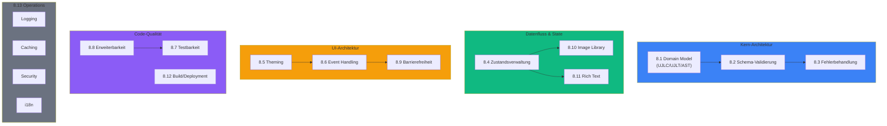
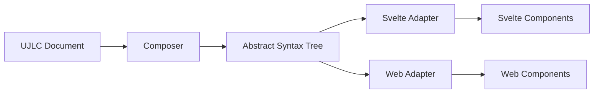
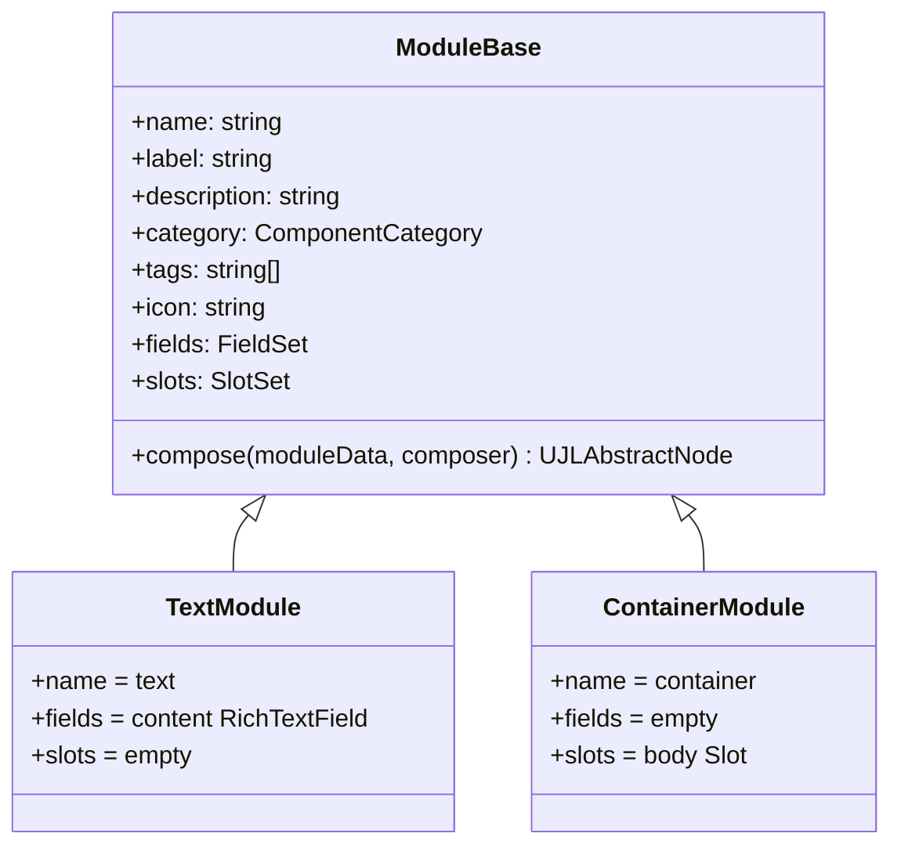
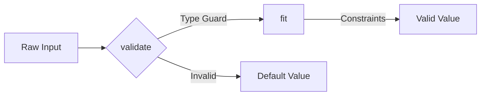
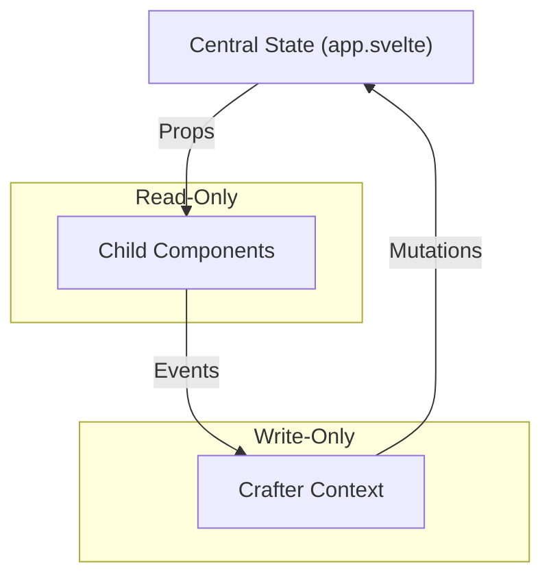
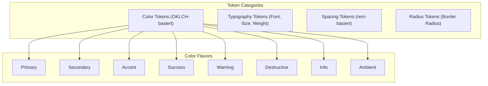
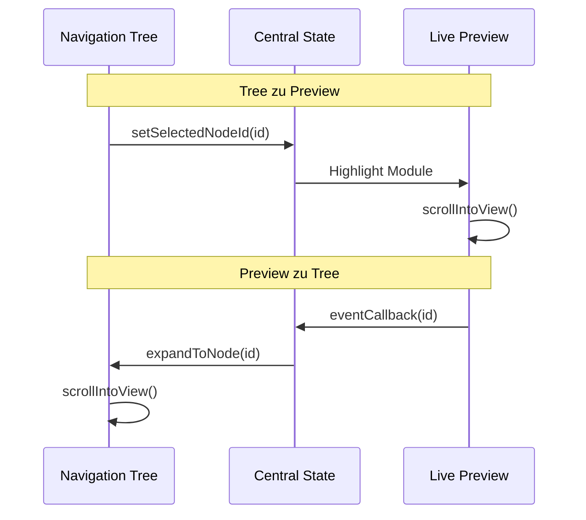
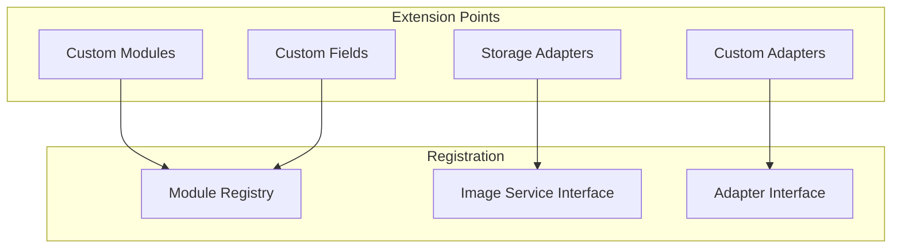
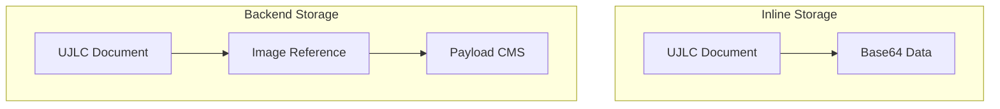
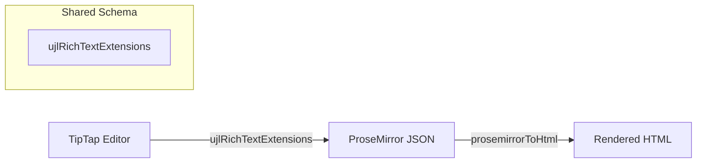

# Querschnittliche Konzepte

## Übersicht der Konzepte

Die folgenden querschnittlichen Konzepte betreffen mehrere Bausteine des UJL-Systems und sind architekturrelevant. Operative Aspekte (Logging, Caching, Security, i18n) werden in Abschnitt 8.13 kompakt behandelt.



## 8.1 Domain Model

### 8.1.1 UJL Document Formats

Das UJL-Framework definiert zwei Dokumentformate, die als JSON-Dateien gespeichert werden:

**UJLC (Content Document)** - Beschreibt die Struktur und Inhalte einer Seite:

```typescript
interface UJLCDocument {
	ujlc: {
		meta: UJLCMeta;
		images: Record<string, ImageEntry>;
		root: UJLCModuleObject[];
	};
}
```

**UJLT (Theme Document)** - Definiert das visuelle Erscheinungsbild:

```typescript
interface UJLTDocument {
	ujlt: {
		meta: UJLTMeta;
		tokens: UJLTTokenSet;
	};
}
```

### 8.1.2 AST-basierte Composition

Das Architekturprinzip ist die Trennung von Dokumentstruktur (UJLC) und Rendering (AST):



**Vorteile:**

- **Entkopplung**: Content-Struktur unabhängig vom Rendering-Framework
- **Erweiterbarkeit**: Neue Adapter ohne Änderung der Core-Logik
- **Testbarkeit**: AST-Generierung isoliert testbar
- **ID-Propagation**: Modul-IDs werden vom UJLC durch den AST bis zum DOM durchgereicht

**AST Node Struktur:**

```typescript
type UJLAbstractNode = {
	type: string;
	id: string;
	props: Record<string, unknown>;
	meta?: {
		moduleId?: string; // Modul-ID aus UJLC-Dokument (für Editor-Integration)
		isModuleRoot?: boolean; // true = editierbares Modul, false = Layout-Wrapper
	};
};
```

**Metadaten-Felder:**

- `meta.moduleId`: Referenz zur ursprünglichen Modul-ID im UJLC-Dokument. Wird verwendet für Click-to-Select im Editor und `data-ujl-module-id` Attribute.
- `meta.isModuleRoot`: Kennzeichnet, ob dieser Node das Root-Element eines editierbaren Moduls ist. Layout-Wrapper und Kinder-Nodes haben `isModuleRoot=false`.

### 8.1.3 Modulares System

Module sind die Grundbausteine des UJL-Systems. Jedes Modul definiert:

- **Fields**: Eingabefelder mit Validierung und Default-Werten
- **Slots**: Container für verschachtelte Module
- **Compose-Methode**: Transformation zu AST-Nodes



**Module Registry Pattern:**

```typescript
// Registrierung
const composer = new Composer();
composer.registerModule(new CustomModule());

// Lookup
const module = composer.getRegistry().getModule("text");

// Composition (async)
const ast = await composer.compose(ujlcDocument);
```

## 8.2 Schema-basierte Validierung

### 8.2.1 Zod als Single Source of Truth

Das UJL-Framework verwendet [Zod](https://zod.dev/) für Schema-Definition und Validierung. Typen werden automatisch aus Schemas inferiert (DRY-Prinzip):

```typescript
// Schema-Definition
export const UJLCModuleObjectSchema = z.object({
	type: z.string(),
	meta: UJLCModuleMetaSchema,
	fields: z.record(z.string(), UJLCFieldObjectSchema),
	slots: z.record(z.string(), z.array(z.lazy(() => UJLCModuleObjectSchema))),
});

// Type-Inference (automatisch)
export type UJLCModuleObject = z.infer<typeof UJLCModuleObjectSchema>;
```

**Wichtige Zod-Patterns:**

| Pattern                  | Verwendung                 | Beispiel                 |
| ------------------------ | -------------------------- | ------------------------ |
| `z.lazy()`               | Rekursive Strukturen       | Verschachtelte Module    |
| `z.discriminatedUnion()` | Varianten-Typen            | Inline vs. Backend Image |
| `.default()`             | Default-Werte              | Fields ohne Pflichtwert  |
| `.safeParse()`           | Nicht-werfende Validierung | CLI-Tools                |

### 8.2.2 Validierungs-API

Das `@ujl-framework/types` Package exportiert zwei Validierungs-Varianten:

**Throwing Validation (für vertrauenswürdige Quellen):**

```typescript
import { validateUJLCDocument, validateUJLTDocument } from "@ujl-framework/types";

// Wirft Error bei ungültigem Input
const validatedDoc = validateUJLCDocument(rawData);
```

**Safe Validation (für nicht-vertrauenswürdige Quellen):**

```typescript
import { validateUJLCDocumentSafe } from "@ujl-framework/types";

const result = validateUJLCDocumentSafe(rawData);

if (result.success) {
	console.log("Valid:", result.data);
} else {
	console.error("Invalid:", result.error.issues);
}
```

### 8.2.3 Field-Level Validierung

Fields implementieren ein zweistufiges Validierungsmodell:



**Template Method Pattern:**

```typescript
abstract class FieldBase<ValueT, ConfigT> {
	// Type Guard - prüft Typ
	abstract validate(raw: UJLCFieldObject): raw is ValueT;

	// Constraint Application - wendet Regeln an
	abstract fit(value: ValueT): ValueT;

	// Combined Pipeline
	parse(raw: UJLCFieldObject): ValueT {
		if (!this.validate(raw)) {
			return this.config.default;
		}
		return this.fit(raw);
	}
}
```

**Beispiel NumberField:**

```typescript
class NumberField extends FieldBase<number, NumberFieldConfig> {
	validate(raw: UJLCFieldObject): raw is number {
		return typeof raw === "number" && !isNaN(raw);
	}

	fit(value: number): number {
		const { min, max } = this.config;
		if (min !== undefined && value < min) return min;
		if (max !== undefined && value > max) return max;
		return value;
	}
}
```

## 8.3 Fehlerbehandlung

### 8.3.1 Error-Strategie

Das UJL-Framework verfolgt eine **graceful degradation**-Strategie:

| Kontext       | Strategie   | Verhalten                                               |
| ------------- | ----------- | ------------------------------------------------------- |
| Validierung   | Safe Parse  | Rückgabe von Result-Objekten                            |
| Composition   | Error Nodes | Unbekannte Module werden als Error-Komponente gerendert |
| Image Loading | Fallback    | Placeholder bei fehlenden Bildern                       |
| API Calls     | Try-Catch   | Benutzerfreundliche Fehlermeldungen                     |

### 8.3.2 Error Node Pattern

Bei unbekannten Modultypen erzeugt der Composer einen Error-Node anstelle eines Absturzes:

```typescript
// In Composer.composeModule()
if (!module) {
	return {
		type: "error",
		id: moduleData.meta.id,
		props: {
			message: `Unknown module type: ${moduleData.type}`,
		},
	};
}
```

### 8.3.3 Zod Error Reporting

Validierungsfehler werden mit vollständigem Pfad ausgegeben:

```typescript
const result = validateUJLCDocumentSafe(data);

if (!result.success) {
	for (const issue of result.error.issues) {
		console.error(`${issue.path.join(" → ")}: ${issue.message}`);
	}
}

// Ausgabe:
// ujlc → root → 0 → fields → content: Expected string, received number
```

### 8.3.4 Error-Kategorien

UJL unterscheidet zwischen verschiedenen Fehlerkategorien:

| Kategorie            | Schweregrad | Beispiel              | Behandlung                         |
| -------------------- | ----------- | --------------------- | ---------------------------------- |
| **Validation Error** | Mittel      | Schema-Verletzung     | Safe Parse, Fehlermeldung          |
| **Runtime Error**    | Hoch        | Module nicht gefunden | Error Node, Graceful Degradation   |
| **Network Error**    | Mittel      | API nicht erreichbar  | Retry, Fallback, User Notification |
| **User Error**       | Niedrig     | Ungültige Eingabe     | Inline-Validierung, Hilfetext      |
| **System Error**     | Hoch        | Out of Memory         | Logging, Monitoring Alert          |

**Error-Code-Konvention:**

```typescript
enum UJLErrorCode {
	// Validation Errors (1xxx)
	VALIDATION_SCHEMA = 1001,
	VALIDATION_TYPE = 1002,
	VALIDATION_REQUIRED = 1003,

	// Composition Errors (2xxx)
	COMPOSITION_MODULE_NOT_FOUND = 2001,
	COMPOSITION_CIRCULAR_DEPENDENCY = 2002,
	COMPOSITION_INVALID_SLOT = 2003,

	// Image Errors (3xxx)
	MEDIA_NOT_FOUND = 3001,
	MEDIA_UPLOAD_FAILED = 3002,
	MEDIA_INVALID_FORMAT = 3003,

	// System Errors (5xxx)
	SYSTEM_INTERNAL = 5000,
	SYSTEM_TIMEOUT = 5001,
}
```

### 8.3.5 Error-Recovery-Strategien

**Automatische Recovery:**

```typescript
// Retry mit Exponential Backoff
async function fetchWithRetry(url: string, maxRetries = 3) {
	for (let i = 0; i < maxRetries; i++) {
		try {
			return await fetch(url);
		} catch (error) {
			if (i === maxRetries - 1) throw error;
			await new Promise(resolve => setTimeout(resolve, Math.pow(2, i) * 1000));
		}
	}
}
```

**Fallback-Mechanismen:**

```typescript
// Image Fallback Chain
async function resolveImage(id: string): Promise<ImageData> {
	try {
		// 1. Try Backend API
		return await fetchImageFromAPI(id);
	} catch {
		try {
			// 2. Try Local Cache
			return await getImageFromCache(id);
		} catch {
			// 3. Return Placeholder
			return DEFAULT_PLACEHOLDER;
		}
	}
}
```

### 8.3.6 Error-Logging-Konventionen

**Log-Struktur:**

```typescript
interface ErrorLog {
	timestamp: string;
	level: "error" | "warn" | "info";
	code: UJLErrorCode;
	message: string;
	context: {
		component: string;
		action: string;
		userId?: string;
	};
	stack?: string;
	metadata?: Record<string, unknown>;
}
```

**Logging in verschiedenen Kontexten:**

```typescript
// Crafter Editor
console.error("[UJL:Editor]", {
	code: UJLErrorCode.COMPOSITION_MODULE_NOT_FOUND,
	message: 'Module "hero" not found in registry',
	context: { component: "ModulePicker", action: "addModule" },
});

// Core Composer
console.error("[UJL:Composer]", {
	code: UJLErrorCode.VALIDATION_SCHEMA,
	message: "Invalid UJLC document",
	context: { component: "Composer", action: "compose" },
	metadata: { documentId: "abc123" },
});

// Payload CMS
console.error("[UJL:Image]", {
	code: UJLErrorCode.MEDIA_UPLOAD_FAILED,
	message: "Image upload failed",
	context: { component: "ImageUpload", action: "upload" },
	metadata: { fileName: "image.jpg", size: 5242880 },
});
```

**Structured Logging (Production):**

```typescript
import pino from "pino";

const logger = pino({
	level: process.env.LOG_LEVEL || "info",
	formatters: {
		level: label => ({ level: label }),
	},
});

logger.error({
	code: UJLErrorCode.MEDIA_NOT_FOUND,
	message: "Image not found",
	context: { component: "MediaResolver", action: "resolve" },
	imageId: "img_123",
});
```

## 8.4 Zustandsverwaltung (State Management)

### 8.4.1 Svelte 5 Runes

Der Crafter verwendet Svelte 5 Runes für reaktive Zustandsverwaltung:

```typescript
// Mutable State
let ujlcDocument = $state<UJLCDocument>(initialDoc);
let expandedNodeIds = $state<Set<string>>(new Set());

// Derived State (computed, async)
const ast = $derived.by(async () => await composer.compose(ujlcDocument));

// Props (immutable from parent)
let { tokenSet, mode } = $props<{
	tokenSet: UJLTTokenSet;
	mode: "light" | "dark" | "system";
}>();
```

### 8.4.2 Unidirectional Data Flow

Das UJL-Framework folgt dem **Flux-Pattern** mit unidirektionalem Datenfluss:



**Regeln:**

1. **State-Ownership**: Nur `app.svelte` besitzt den globalen State
2. **Props sind Read-Only**: Kinder empfangen Daten als Props
3. **Mutations über Context**: Änderungen nur über Context-API
4. **Functional Updates**: Immutable Update-Pattern

### 8.4.3 Crafter Context API

Die Context-API bündelt alle State-Mutationen:

```typescript
interface CrafterContext {
	// State Updates (Functional)
	updateRootSlot(fn: (root: UJLCModuleObject[]) => UJLCModuleObject[]): void;
	updateTokenSet(fn: (tokens: UJLTTokenSet) => UJLTTokenSet): void;

	// Selection
	setSelectedNodeId(nodeId: string | null): void;
	getSelectedNodeId(): string | null;

	// Tree Operations
	operations: {
		copyNode(nodeId: string): void;
		cutNode(nodeId: string): void;
		pasteNode(targetId: string, position: "before" | "after" | "into"): void;
		deleteNode(nodeId: string): void;
		moveNode(nodeId: string, targetId: string, position: string): void;
		insertNode(moduleType: string, targetId: string, position: string): void;
	};
}
```

**Functional Update Pattern:**

```typescript
// Direkte Mutation (verboten)
// ujlcDocument.ujlc.root.push(newModule);

// Functional Update (empfohlen)
context.updateRootSlot(root => [...root, newModule]);
```

## 8.5 Theming und Styling

### 8.5.1 Design Token System

Das UJL-Framework verwendet ein Token-basiertes Design-System mit OKLCH-Farben:



### 8.5.2 OKLCH Color System

Farben werden im OKLCH-Farbraum gespeichert für perzeptuelle Uniformität:

```typescript
type OklchColor = {
	l: number; // Lightness (0-1)
	c: number; // Chroma (>=0)
	h: number; // Hue (0-360)
};
```

**Shade-System (11 Abstufungen pro Flavor):**

| Shade   | Lightness | Verwendung            |
| ------- | --------- | --------------------- |
| 50      | 97%       | Hintergründe (hell)   |
| 100-400 | 90-70%    | Helle Akzente         |
| 500     | 60%       | Basis-Farbe           |
| 600-900 | 50-25%    | Dunkle Akzente        |
| 950     | 15%       | Hintergründe (dunkel) |

### 8.5.3 CSS Custom Properties

Tokens werden zur Laufzeit als CSS Custom Properties injiziert:

```typescript
function generateThemeCSSVariables(tokens: UJLTTokenSet): Record<string, string> {
	return {
		// Colors
		"--primary-500": "oklch(60% 0.15 260)",
		"--primary-light": "oklch(97% 0.01 260)",
		"--primary-dark": "oklch(20% 0.05 260)",

		// Typography
		"--typography-base-font": '"Inter", sans-serif',
		"--typography-base-size-md": "16px",

		// Spacing and Radius
		"--spacing": "1rem",
		"--radius": "0.5rem",
	};
}
```

**Anwendung in Komponenten:**

```css
.button-primary {
	background-color: var(--primary-500);
	color: var(--primary-light-foreground-primary);
	border-radius: var(--radius);
	padding: var(--spacing);
}
```

### 8.5.4 Dark/Light Mode

Das Theme-System unterstützt drei Modi:

| Mode     | Verhalten                        |
| -------- | -------------------------------- |
| `light`  | Helle Varianten (Shade 50-400)   |
| `dark`   | Dunkle Varianten (Shade 600-950) |
| `system` | Folgt OS-Präferenz               |

## 8.6 Event Handling

### 8.6.1 Event Callback Pattern

Module-Komponenten unterstützen ein einheitliches Event-Callback-Pattern für Editor-Integration:

```typescript
interface NodeComponentProps {
	node: UJLAbstractNode;
	showMetadata?: boolean;
	eventCallback?: (moduleId: string) => void;
}
```

**Factory-Funktion für Click-Handler:**

```typescript
function createModuleClickHandler(
	moduleId: string | undefined,
	eventCallback: ((id: string) => void) | undefined
): ((event: MouseEvent) => void) | undefined {
	if (!eventCallback || !moduleId) return undefined;

	return (event: MouseEvent) => {
		event.preventDefault();
		event.stopPropagation();
		eventCallback(moduleId);
	};
}
```

### 8.6.2 Bidirektionale Synchronisation

Der Crafter implementiert bidirektionale Synchronisation zwischen Tree und Preview:



### 8.6.3 Event-Propagation Control

Um korrekte Modul-Selektion zu gewährleisten:

```typescript
function handleClick(event: MouseEvent) {
	// Verhindert Standard-Aktionen (Links, Buttons)
	event.preventDefault();

	// Verhindert Bubbling zu Parent-Modulen
	event.stopPropagation();

	// Callback mit Modul-ID
	eventCallback(node.id);
}
```

## 8.7 Testbarkeit

### 8.7.1 Test-Strategie

Das UJL-Framework verfolgt eine mehrschichtige Test-Strategie:

| Ebene       | Framework  | Fokus                      | Coverage-Ziel  |
| ----------- | ---------- | -------------------------- | -------------- |
| Unit        | Vitest     | Fields, Modules, Utilities | 80%+           |
| Integration | Vitest     | Composer, Registry         | 70%+           |
| E2E         | Playwright | User Workflows             | Critical Paths |

### 8.7.2 Test Utilities

**Mock Data Factories:**

```typescript
// In tests/mockData.ts
export function createMockTree(): UJLCModuleObject[] {
	/* ... */
}
export function createMockTokenSet(): UJLTTokenSet {
	/* ... */
}
export function createMockNode(type: string): UJLAbstractNode {
	/* ... */
}
```

**Test Attributes (Conditional):**

```typescript
// In test-attrs.ts
export function testId(id: string): Record<string, string> {
	if (import.meta.env.PUBLIC_TEST_MODE !== "true") return {};
	return { "data-testid": id };
}
```

**Vorteile:**

- Zero Runtime-Overhead in Production
- Stabile Selektoren für E2E-Tests
- Kein Aufblähen des DOM ohne Test-Modus

### 8.7.3 Vitest-Konfiguration

```typescript
// vitest.config.ts (Standard für alle Packages)
export default defineConfig({
	test: {
		include: ["**/*.test.ts"],
		environment: "node",
		coverage: {
			provider: "v8",
			reporter: ["text", "lcov"],
		},
	},
});
```

## 8.8 Erweiterbarkeit

### 8.8.1 Plugin-Architecture

Das UJL-Framework ist an mehreren Punkten erweiterbar:



### 8.8.2 Custom Module erstellen

```typescript
// 1. Module-Klasse definieren
class CustomModule extends ModuleBase {
	readonly name = "custom";
	readonly label = "Custom Module";
	readonly description = "A custom module";
	readonly category = "content";
	readonly tags = ["custom"] as const;
	readonly icon = "..."; // SVG path content

	readonly fields = [{ key: "title", field: new TextField({ label: "Title", default: "" }) }];

	readonly slots = [{ key: "content", slot: new Slot({ label: "Content", max: 10 }) }];

	compose(moduleData: UJLCModuleObject, composer: Composer): UJLAbstractNode {
		return {
			type: "custom",
			id: moduleData.meta.id,
			props: {
				title: this.fields[0].field.parse(moduleData.fields.title),
				children: moduleData.slots.content.map(child => composer.composeModule(child)),
			},
		};
	}
}

// 2. Im Composer registrieren
const composer = new Composer();
composer.registerModule(new CustomModule());
```

### 8.8.3 Custom Field erstellen

```typescript
class EmailField extends FieldBase<string, EmailFieldConfig> {
	protected readonly defaultConfig = {
		label: "Email",
		default: "",
		placeholder: "name@example.com",
	};

	validate(raw: UJLCFieldObject): raw is string {
		return typeof raw === "string";
	}

	fit(value: string): string {
		// Normalisierung
		const trimmed = value.toLowerCase().trim();

		// Validierung (Basic)
		if (!trimmed.includes("@")) {
			return this.config.default;
		}

		return trimmed;
	}

	getFieldType(): string {
		return "email";
	}
}
```

### 8.8.4 Image Service erweitern

```typescript
// Custom Storage Backend
class S3ImageService implements ImageService {
	async upload(file: File, metadata: ImageMetadata): Promise<ImageEntry> {
		// S3 Upload Logic
		const key = await this.s3Client.upload(file);
		const url = await this.s3Client.getSignedUrl(key);
		return {
			src: url,
			metadata: metadata,
		};
	}

	async list(): Promise<ImageEntry[]> {
		// S3 List Logic
	}

	// ... weitere Methoden
}
```

## 8.9 Barrierefreiheit (Accessibility)

### 8.9.1 Semantisches HTML

Module erzeugen semantisch korrektes HTML:

| Modul     | HTML-Element | ARIA-Attribute             |
| --------- | ------------ | -------------------------- |
| Text      | p, h1-h6     | -                          |
| Button    | button, a    | role="button" (wenn Link)  |
| Image     | img          | alt (required)             |
| Container | section, div | aria-label (falls gesetzt) |

### 8.9.2 Farbkontrast

Das OKLCH-System gewährleistet WCAG-konforme Kontraste:

```typescript
function resolveForegroundColor(
	background: OklchColor,
	foreground: "primary" | "secondary" | "muted"
): OklchColor {
	// Berechnet kontrastreiches Vordergrund-Farbsystem
	const contrastRatio = calculateContrastRatio(background, candidate);

	// WCAG AA: 4.5:1 für normalen Text
	// WCAG AAA: 7:1 für normalen Text
	if (contrastRatio >= 4.5) return candidate;

	// Fallback zu high-contrast variant
	return getHighContrastVariant(background);
}
```

### 8.9.3 Keyboard Navigation

Der Crafter unterstützt vollständige Keyboard-Navigation:

| Shortcut        | Aktion           |
| --------------- | ---------------- |
| Tab / Shift+Tab | Focus-Navigation |
| Enter / Space   | Aktivierung      |
| Ctrl+C          | Kopieren         |
| Ctrl+X          | Ausschneiden     |
| Ctrl+V          | Einfügen         |
| Delete          | Löschen          |
| Ctrl+I          | Modul einfügen   |
| Arrow Up/Down   | Tree-Navigation  |

## 8.10 Image Library Konzept

### 8.10.1 Duale Storage-Strategie

Das Image Library System unterstützt zwei Storage-Modi:



**Inline Storage:**

```json
{
	"ujlc": {
		"images": {
			"image-001": {
				"src": "data:image/jpeg;base64,/9j/4AAQ...",
				"metadata": {
					"alt": "...",
					"title": "..."
				}
			}
		}
	}
}
```

**Backend Storage:**

```json
{
	"ujlc": {
		"meta": {
			"_library": {
				"storage": "backend",
				"url": "http://localhost:3000"
			}
		},
		"images": {
			"img-001": {
				"src": "http://localhost:3000/api/images/67890abcdef12345",
				"metadata": {
					"filename": "example.jpg",
					"mimeType": "image/jpeg",
					"filesize": 45678,
					"width": 1920,
					"height": 1080
				}
			}
		}
	}
}
```

### 8.10.2 Image Service Interface

```typescript
interface ImageService {
	// Connection
	checkConnection(): Promise<boolean>;

	// CRUD Operations
	upload(file: File, metadata: ImageMetadata): Promise<ImageEntry>;
	get(id: string): Promise<ImageEntry | null>;
	list(): Promise<ImageEntry[]>;
	delete(id: string): Promise<void>;

	// Configuration
	getStorageMode(): "inline" | "backend";
}
```

### 8.10.3 Responsive Images

Der Backend-Storage (Payload CMS) generiert automatisch responsive Varianten basierend auf Tailwind-Breakpoints:

| Size | Width  | Format | Verwendung      |
| ---- | ------ | ------ | --------------- |
| xs   | 320px  | WebP   | Admin Thumbnail |
| sm   | 640px  | WebP   | Mobile          |
| md   | 768px  | WebP   | Tablet          |
| lg   | 1024px | WebP   | Desktop         |
| xl   | 1280px | WebP   | Large Desktop   |
| xxl  | 1536px | WebP   | Extra Large     |
| xxxl | 1920px | WebP   | Full HD         |
| max  | 2560px | WebP   | 2K/Retina       |

### 8.10.4 Migration zwischen Storage-Modi

Der Crafter ist pro Umgebung auf einen Storage-Modus konfiguriert (`inline` oder `backend`). Wenn ein Dokument in einem anderen Modus vorliegt, migriert der Crafter es beim Laden auf den konfigurierten Modus und schreibt das Dokument entsprechend um.

- Dokument ist `backend`, Crafter ist `inline`: Bilder werden aus dem Library Service geladen, komprimiert und in `ujlc.images` eingebettet; `ujlc.meta._library` wird auf Inline umgestellt.
- Dokument ist `inline`, Crafter ist `backend`: eingebettete Bilder werden in den Library Service hochgeladen; `ujlc.images` wird auf Backend-Referenzen umgeschrieben und `ujlc.meta._library` wird gesetzt.

## 8.11 Rich Text System

### 8.11.1 TipTap/ProseMirror Integration

Das UJL-Framework verwendet TipTap (ProseMirror-Wrapper) für Rich Text:

```typescript
// Shared Schema (packages/core)
export const ujlRichTextExtensions = [
	StarterKit.configure({
		heading: { levels: [1, 2, 3, 4, 5, 6] },
		bold: {},
		italic: {},
		code: {},
		blockquote: {},
		bulletList: {},
		orderedList: {},
		listItem: {},
		hardBreak: {},
		horizontalRule: {},

		// Disabled (UI-only)
		dropcursor: false,
		gapcursor: false,
	}),
];
```

### 8.11.2 WYSIWYG-Garantie

Gleiches Schema in Editor und Serializer garantiert WYSIWYG:



### 8.11.3 SSR-Safe Serializer

Der HTML-Serializer ist SSR-kompatibel (keine Browser-APIs):

```typescript
// packages/adapter-svelte
export function prosemirrorToHtml(doc: ProseMirrorDocument): string {
	return serializeNodes(doc.content);
}

function serializeNode(node: ProseMirrorNode): string {
	switch (node.type) {
		case "paragraph":
			return "<p>" + serializeNodes(node.content) + "</p>";
		case "heading":
			const level = node.attrs?.level ?? 1;
			return "<h" + level + ">" + serializeNodes(node.content) + "</h" + level + ">";
		case "text":
			return applyMarks(escapeHtml(node.text), node.marks);
		// ...
	}
}
```

## 8.12 Operational Concerns (Überblick)

Die folgenden operativen Aspekte sind für den Betrieb von UJL relevant, werden aber kurz gehalten, da sie eher zu Operations als zu Architektur gehören.

### 8.12.1 Build-Strategie

UJL verwendet **Vite** als Build-Tool mit optimierter Production-Konfiguration:

- Tree-Shaking für ungenutzte Module
- Code-Splitting für lazy Loading
- Bundle-Größen-Monitoring via `rollup-plugin-visualizer`

Details siehe [Deployment-View (Kapitel 7)](./07-deployment-view).

### 8.12.2 Deployment-Optionen

Drei Hauptszenarien sind dokumentiert:

1. **Local Development**: Vite Dev Server mit HMR
2. **CI/CD Pipeline**: GitLab CI mit Multi-Stage-Build
3. **Production**: Docker Compose (Crafter + Library Service)

Details siehe [Deployment-View (Kapitel 7)](./07-deployment-view).

### 8.12.3 Monorepo-Struktur

Das UJL-Framework ist als pnpm Workspace Monorepo organisiert:

```
ujl/
├── packages/
│   ├── types/           # Foundation Layer
│   ├── core/            # Core Layer
│   ├── ui/              # UI Layer
│   ├── adapter-svelte/  # Adapter Layer
│   ├── adapter-web/     # Adapter Layer
│   ├── crafter/         # Application Layer
│   └── examples/        # Example Documents
├── apps/
│   ├── dev-demo/        # Demo Application
│   └── docs/            # Documentation
└── services/
    └── library/         # Payload CMS Backend
```

### 8.12.4 Dependency Management

Build-Reihenfolge folgt der Dependency-Hierarchie:

```bash
# Korrekte Reihenfolge (automatisch via pnpm)
pnpm run build

# Interne Reihenfolge:
# 1. types - 2. core - 3. ui - 4. adapter-svelte - 5. adapter-web - 6. crafter
```

### 8.12.5 Versionierung mit Changesets

```bash
# Feature Branch: Changeset erstellen
pnpm changeset

# Main Branch: Versionen anwenden
pnpm version-packages

# Release: Packages veröffentlichen
pnpm publish -r --access public
```

## 8.13 Operational Concerns (kompakt)

Die folgenden Abschnitte behandeln operative Aspekte, die für den Betrieb relevant sind, aber kurz gehalten werden, da sie eher zu Operations als zu Architektur gehören.

### 8.13.1 Logging-Strategie (Architektur-Aspekt)

**Architektur-Entscheidung:** UJL nutzt strukturiertes, context-basiertes Logging mit standardisierten Log-Levels (`error`, `warn`, `info`, `debug`). Context-Tags wie `[Composer]`, `[Crafter]`, `[LibraryService]` ermöglichen Filterung und Nachvollziehbarkeit.

**Performance-Monitoring:** Composer-Composition-Zeit und Crafter-Render-Zeit werden getrackt. Zielwert für Composition: <100ms (warn bei >200ms).

Konkrete Implementierung (Pino, Winston, etc.) ist deployment-abhängig.

### 8.13.2 Caching-Strategie (Architektur-Aspekt)

**Architektur-Entscheidung:** UJL nutzt Multi-Level-Caching:

1. **Client-Side**: Browser-Cache (HTTP) + Service Worker (Workbox, falls eingesetzt)
2. **In-Memory**: Module Registry Cache, Composer AST-Cache (LRU, falls eingesetzt)
3. **API-Level**: ETag-basierte Cache-Control Headers für Image API
4. **CDN-Level**: CloudFlare/CDN für Static Assets und Image Files

**Ziel:** Reduktion von Netzwerk-Requests und schnellere Wiederverwendung bereits geladener Ressourcen.

### 8.13.3 Security (Architektur-Aspekt)

**Architektur-Entscheidung:** Security ist in mehreren Schichten integriert:

1. **Input-Validierung**: Zod-Schema-Validierung für alle externen Inputs (UJLC/UJLT)
2. **XSS-Prevention**: DOMPurify für Rich-Text-Sanitization, Svelte automatisches Escaping
3. **CSRF-Protection**: Built-in in Payload CMS und SvelteKit
4. **API-Authentifizierung**: API-Key-basiert für Library Service (mittelfristig OAuth geplant)
5. **Rate Limiting**: Express-Rate-Limiter für Upload-Endpunkte
6. **Secrets Management**: Environment Variables (Development), HashiCorp Vault (Production)

**Referenz:** Siehe [Risiken TD-009](./11-risks-and-technical-debt#_11-2-9-api-key-exposition-im-library-service) für bekannte Security-Schulden.

### 8.13.4 Internationalisierung (i18n) - Status: Geplant

**Architektur-Vorbereitung:** UJL ist vorbereitet auf mehrsprachige Inhalte:

1. **Content-Level**: UJLC-Dokumente können Felder mit Locale-Keys enthalten (`{ "de": "Willkommen", "en": "Welcome" }`)
2. **UI-Level**: Crafter nutzt `svelte-i18n` für UI-Übersetzungen
3. **Formatting**: `date-fns` für lokalisierte Datum-/Zeit-Formatierung

**Status:** UI-Mehrsprachigkeit ist implementiert, Content-Mehrsprachigkeit ist für Phase 3 geplant.
