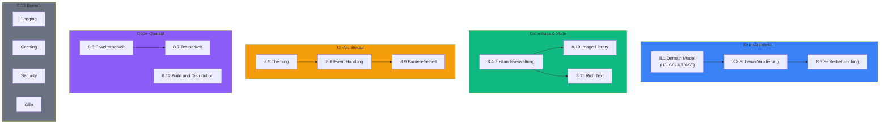
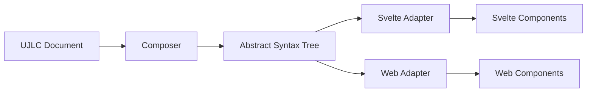
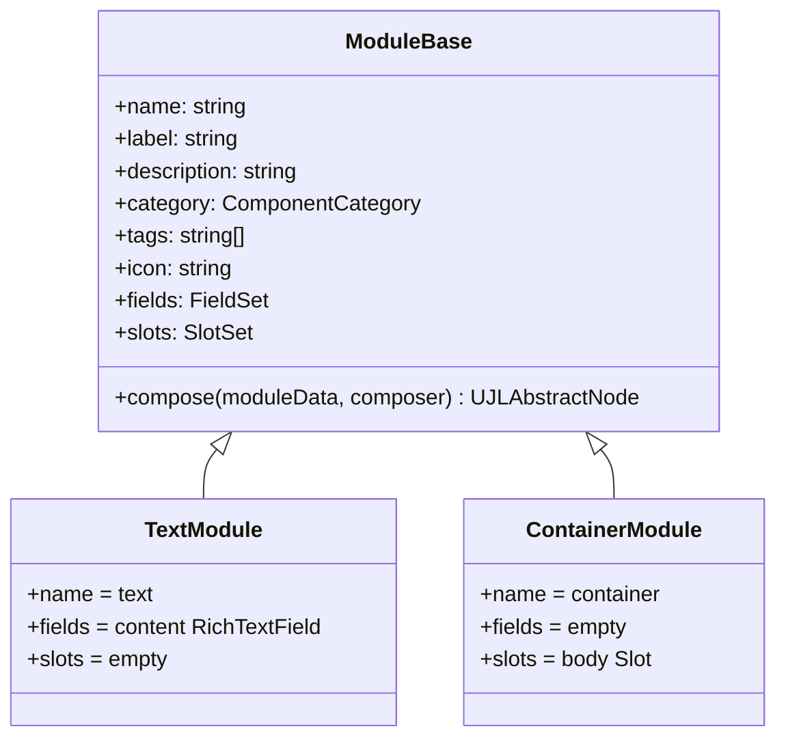
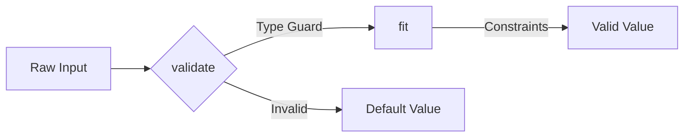
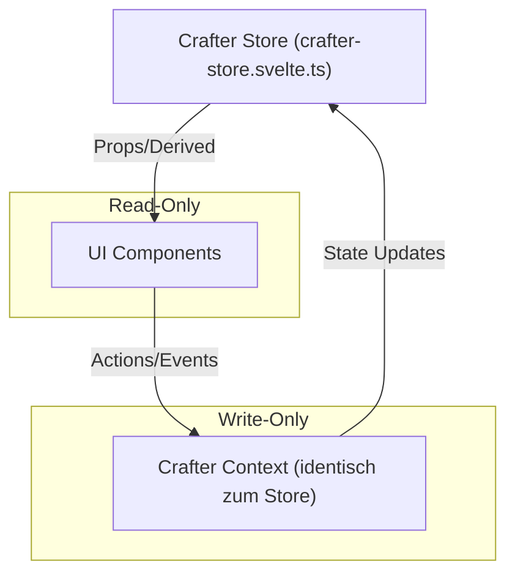
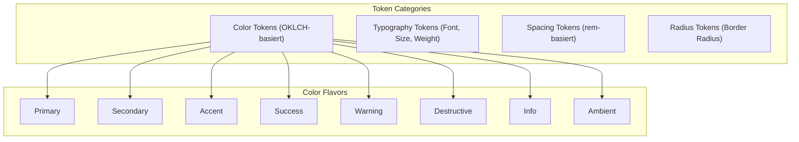
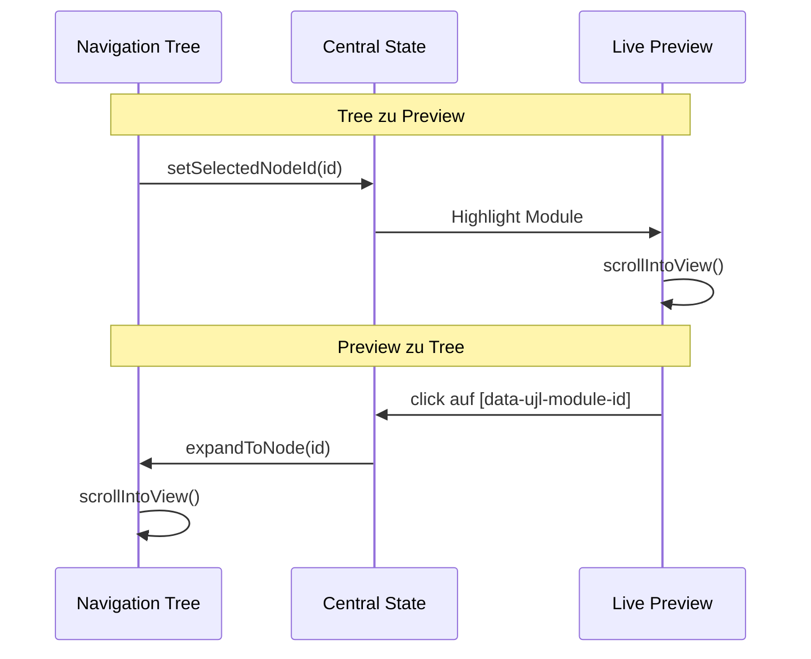
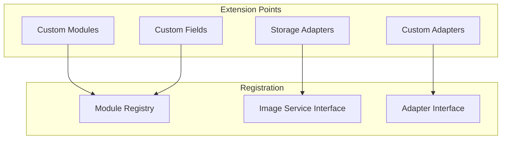
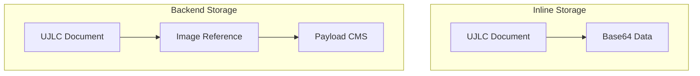
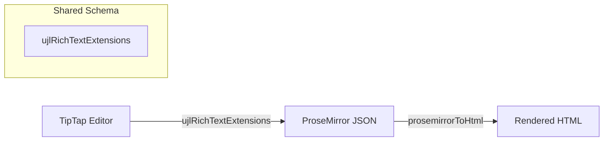

# Querschnittliche Konzepte

UJL ist so aufgebaut, dass sich wenige Prinzipien durch alle Bausteine ziehen: Inhalte und Design liegen in validierbaren JSON-Dokumenten (UJLC/UJLT), der Core komponiert daraus einen AST, und Adapter rendern diesen in DOM. Der Crafter nutzt denselben Datenvertrag und ergänzt Editor-spezifische Mechanik wie Selektion, Tree-Navigation und Bildverwaltung. Wer diese Linie verstanden hat, kann sich im Projekt schnell orientieren.



## 8.1 Domain Model

### 8.1.1 UJL Document Formats

Das UJL-Framework definiert zwei Dokumentformate, die als JSON-Dateien gespeichert werden:

**UJLC (Content Document)** - Beschreibt die Struktur und Inhalte einer Seite:

```typescript
interface UJLCDocument {
	ujlc: {
		meta: UJLCMeta;
		images: Record<string, ImageEntry>;
		root: UJLCModuleObject[];
	};
}
```

**UJLT (Theme Document)** - Definiert das visuelle Erscheinungsbild:

```typescript
interface UJLTDocument {
	ujlt: {
		meta: UJLTMeta;
		tokens: UJLTTokenSet;
	};
}
```

### 8.1.1.1 Embedding-Felder (AI-ready)

UJLC ist so aufgebaut, dass Module zusätzlich zu ihren fachlichen Daten auch maschinenlesbare Signale tragen können. Dafür existieren im Dokument Metadaten, die Embeddings referenzieren, ohne dass UJL eine Embedding-Pipeline mitliefert.

In der Praxis sind zwei Felder vorgesehen: Im Dokument-Meta identifiziert `_embedding_model_hash` das verwendete Embedding-Modell, und jedes Modul trägt in `meta._embedding` ein numerisches Vektor-Embedding (oft anfangs leer). Diese Struktur erlaubt später Use Cases wie semantische Suche, das Erkennen von betroffenen Modulen über Kosinusähnlichkeit und einen Editing-Workflow, der Änderungen gezielt auf Teilbäume begrenzt.

Der Hash ist dabei mehr als nur ein Modellname: In self-hosted Umgebungen kann jede Instanz eine eigene Embedding-Konfiguration nutzen. `_embedding_model_hash` fasst deshalb die Identität der Instanz (z.B. Domain) und den Modellnamen in einem stabilen Fingerprint zusammen. Wenn sich diese Konfiguration ändert oder ein Dokument in einer anderen Instanz weiterverarbeitet wird, sind Embeddings nicht mehr vergleichbar und müssen neu berechnet werden, damit innerhalb einer Instanz alle Dokumente und Medien im selben Vektorraum liegen.

Als frühes Experiment wurde die Additivität von Embeddings getestet: Für kleine Änderungen ließ sich die Repräsentation eines Elternmoduls näherungsweise aus den Embeddings der Kindmodule rekonstruieren (Addition und anschließende Normierung). Das ist kein Beweis für ein allgemeines Verfahren; es ist ein Indiz, dass inkrementelle Updates in einem späteren KI-gestützten Editing-Workflow die Rechen- und Tokenkosten senken könnten. Additive Komposition ist in der Embedding-Literatur kein exotischer Sonderfall. Sie taucht als Vektor-Arithmetik bei Wortembeddings auf (z.B. Analogie-Aufgaben) und wird auch als starke Baseline genutzt, um größere Texte zu repräsentieren (gewichtetes Mitteln von Wortvektoren). Gleichzeitig hängt die „Trennschärfe“ solcher zusammengesetzten Vektoren stark vom gewählten Embedding-Modell ab; bei multimodalen Modellen wie CLIP ist Kompositionalität ein bekanntes Problemfeld und wird aktiv erforscht.

### 8.1.2 AST-basierte Composition

Das Architekturprinzip ist die Trennung von Dokumentstruktur (UJLC) und Rendering (AST):



Diese Trennung entkoppelt die Content-Struktur vom Rendering-Framework, macht Adapter austauschbar, erlaubt isolierte Tests der AST-Erzeugung und sorgt dafür, dass Modul-IDs vom UJLC über den AST bis ins DOM durchgereicht werden können.

**AST Node Struktur:**

```typescript
type UJLAbstractNode = {
	type: string;
	id: string;
	props: Record<string, unknown>;
	meta?: {
		moduleId?: string; // Modul-ID aus UJLC-Dokument (für Editor-Integration)
		isModuleRoot?: boolean; // true = editierbares Modul, false = Layout-Wrapper
	};
};
```

Für die Editor-Integration kann ein Node Metadaten tragen: `meta.moduleId` referenziert die Modul-ID aus dem UJLC-Dokument (u.a. für Click-to-Select und `data-ujl-module-id`). `meta.isModuleRoot` unterscheidet editierbare Modulwurzeln von Layout-Wrappern oder Kindknoten.

### 8.1.3 Modulares System

Module sind die Grundbausteine des UJL-Systems. Ein Modul beschreibt seine Fields (mit Validierung und Default-Werten), seine Slots als Container für verschachtelte Module und eine `compose`-Methode, die die Daten in AST-Nodes übersetzt.



**Module Registry Pattern:**

```typescript
// Registrierung
const composer = new Composer();
composer.registerModule(new CustomModule());

// Lookup
const module = composer.getRegistry().getModule("text");

// Composition (async)
const ast = await composer.compose(ujlcDocument);
```

## 8.2 Schema-basierte Validierung

### 8.2.1 Zod als Single Source of Truth

Das UJL-Framework verwendet [Zod](https://zod.dev/) für Schema-Definition und Validierung. Typen werden automatisch aus Schemas inferiert (DRY-Prinzip):

```typescript
// Schema-Definition
export const UJLCModuleObjectSchema = z.object({
	type: z.string(),
	meta: UJLCModuleMetaSchema,
	fields: z.record(z.string(), UJLCFieldObjectSchema),
	slots: z.record(z.string(), z.array(z.lazy(() => UJLCModuleObjectSchema))),
});

// Type-Inference (automatisch)
export type UJLCModuleObject = z.infer<typeof UJLCModuleObjectSchema>;
```

**Wichtige Zod-Patterns:**

| Pattern                  | Verwendung                 | Beispiel                 |
| ------------------------ | -------------------------- | ------------------------ |
| `z.lazy()`               | Rekursive Strukturen       | Verschachtelte Module    |
| `z.discriminatedUnion()` | Varianten-Typen            | Inline vs. Backend Image |
| `.default()`             | Default-Werte              | Fields ohne Pflichtwert  |
| `.safeParse()`           | Nicht-werfende Validierung | CLI-Tools                |

### 8.2.2 Validierungs-API

Das `@ujl-framework/types` Package exportiert zwei Validierungs-Varianten:

**Throwing Validation (für vertrauenswürdige Quellen):**

```typescript
import { validateUJLCDocument, validateUJLTDocument } from "@ujl-framework/types";

// Wirft Error bei ungültigem Input
const validatedDoc = validateUJLCDocument(rawData);
```

**Safe Validation (für nicht-vertrauenswürdige Quellen):**

```typescript
import { validateUJLCDocumentSafe } from "@ujl-framework/types";

const result = validateUJLCDocumentSafe(rawData);

if (result.success) {
	console.log("Valid:", result.data);
} else {
	console.error("Invalid:", result.error.issues);
}
```

### 8.2.3 Field-Level Validierung

Fields implementieren ein zweistufiges Validierungsmodell:



**Template Method Pattern:**

```typescript
abstract class FieldBase<ValueT, ConfigT> {
	// Type Guard - prüft Typ
	abstract validate(raw: UJLCFieldObject): raw is ValueT;

	// Constraint Application - wendet Regeln an
	abstract fit(value: ValueT): ValueT;

	// Combined Pipeline
	parse(raw: UJLCFieldObject): ValueT {
		if (!this.validate(raw)) {
			return this.config.default;
		}
		return this.fit(raw);
	}
}
```

**Beispiel NumberField:**

```typescript
class NumberField extends FieldBase<number, NumberFieldConfig> {
	validate(raw: UJLCFieldObject): raw is number {
		return typeof raw === "number" && !isNaN(raw);
	}

	fit(value: number): number {
		const { min, max } = this.config;
		if (min !== undefined && value < min) return min;
		if (max !== undefined && value > max) return max;
		return value;
	}
}
```

## 8.3 Fehlerbehandlung

### 8.3.1 Error-Strategie

UJL ist so gebaut, dass Fehler möglichst lokal bleiben. Bei Validierung kann statt Exceptions ein Result-Objekt zurückgegeben werden. In der Composition werden unbekannte Module als Error-Node dargestellt, statt den Renderprozess abzubrechen. Beim Auflösen von Bildern führt ein fehlender Treffer zu `null`, sodass Komponenten einen Placeholder anzeigen können. Im Crafter werden Backend-Probleme (z.B. nicht erreichbare Library-API) abgefangen und als UI-Feedback sichtbar gemacht.

### 8.3.2 Error Node Pattern

Bei unbekannten Modultypen erzeugt der Composer einen Error-Node anstelle eines Absturzes:

```typescript
// packages/core/src/composer.ts (vereinfacht)
if (!module) {
	return {
		type: "error",
		props: { message: `Unknown module type: ${moduleData.type}` },
		id: generateUid(),
		meta: { moduleId: moduleData.meta.id, isModuleRoot: true },
	};
}
```

### 8.3.3 Zod Error Reporting

Validierungsfehler werden mit vollständigem Pfad ausgegeben:

```typescript
const result = validateUJLCDocumentSafe(data);

if (!result.success) {
	for (const issue of result.error.issues) {
		console.error(`${issue.path.join(" → ")}: ${issue.message}`);
	}
}

// Ausgabe:
// ujlc → root → 0 → fields → content: Expected string, received number
```

### 8.3.4 Umsetzung im Repository

Es gibt keine zentrale Error-Code-Taxonomie und kein projektweit einheitliches Structured-Logging. Fehlerbehandlung passiert dort, wo sie gebraucht wird: Validierung liefert Zod-Issues inklusive Pfad (siehe 8.3.3), die Composition rendert unbekannte Module als `type: "error"` (siehe 8.3.2), und `ImageLibrary.resolve()` liefert bei fehlenden Bildern `null`, sodass die UI einen Placeholder zeigen kann.

### 8.3.5 Recovery und Robustheit

Generische Retry-/Backoff-Helfer sind nicht als gemeinsame Utility implementiert. An einzelnen Stellen gibt es kleine, zweckgebundene Retries, z.B. wenn der Crafter nach einer asynchronen Composition ein DOM-Element für Scroll/Selection wiederfinden muss. Für Backend-Storage prüft der Crafter die Erreichbarkeit der Library-API über `checkConnection()` und kann Fehler in der UI anzeigen.

### 8.3.6 Logging

Der Crafter nutzt eine interne Logger-Utility für Warnungen/Fehler (z.B. bei fehlgeschlagenen UI-Aktionen oder Backend-Verbindungsproblemen). In anderen Paketen wird überwiegend mit einfachen Fehlerobjekten/Exceptions gearbeitet. Ein gemeinsames Logging-Konzept für produktiven Betrieb ist damit nicht technisch verankert.

## 8.4 Zustandsverwaltung (State Management)

### 8.4.1 Svelte Runes

Der Crafter verwendet Svelte Runes für reaktive Zustandsverwaltung:

```typescript
// packages/crafter/src/lib/stores/crafter-store.svelte.ts (Auszug)
let _ujlcDocument = $state<UJLCDocument>(initialUjlcDocument);
let _selectedNodeId = $state<string | null>(null);

const rootSlot = $derived(_ujlcDocument.ujlc.root);
const meta = $derived(_ujlcDocument.ujlc.meta);
const images = $derived(_ujlcDocument.ujlc.images);

const imageService = $derived.by(() =>
	createImageService(meta._library, () => images, updateImages)
);
```

### 8.4.2 Unidirectional Data Flow

Das UJL-Framework folgt dem **Flux-Pattern** mit unidirektionalem Datenfluss:



In der Praxis ist vor allem wichtig, wie Änderungen durch das System laufen: UI-Komponenten lesen State und Derived Values aus dem Store. Mutationen passieren über Actions und `operations`, die immutable Updates durchführen. Dadurch bleiben Seiteneffekte begrenzt und Editor-Operationen (Move, Paste, Insert) verhalten sich nachvollziehbar.

### 8.4.3 Crafter Context API

Der Crafter stellt den Store über Svelte Context bereit. Der Context-Typ ist identisch zum Store (`CrafterContext = CrafterStore`), damit Komponenten eine einheitliche API verwenden und keine zweite Schnittstelle gepflegt werden muss.

```typescript
interface CrafterContext {
	// Selection
	readonly selectedNodeId: string | null;
	setSelectedNodeId(nodeId: string | null): void;

	// Functional Updates
	updateRootSlot(fn: (root: UJLCSlotObject) => UJLCSlotObject): void;
	updateTokenSet(fn: (tokens: UJLTTokenSet) => UJLTTokenSet): void;
	updateImages(fn: (images: UJLCImageLibrary) => UJLCImageLibrary): void;

	// Document Operations (Auszug)
	operations: {
		copyNode(nodeId: string): UJLCModuleObject | null;
		cutNode(nodeId: string): UJLCModuleObject | null;
		pasteNode(
			node: UJLCModuleObject,
			targetId: string,
			slotName?: string,
			position?: "before" | "after" | "into"
		): string | null;
		deleteNode(nodeId: string): boolean;
		moveNode(
			nodeId: string,
			targetId: string,
			slotName?: string,
			position?: "before" | "after" | "into"
		): boolean;
		reorderNode(nodeId: string, targetId: string, position: "before" | "after"): boolean;
		insertNode(
			componentType: string,
			targetId: string,
			slotName?: string,
			position?: "before" | "after" | "into"
		): string | null;
	};
}
```

**Functional Update Pattern:**

```typescript
// Direkte Mutation (vermeiden)
// ujlcDocument.ujlc.root.push(newModule);

// Functional Update
context.updateRootSlot(root => [...root, newModule]);
```

## 8.5 Theming und Styling

### 8.5.1 Design Token System

Das UJL-Framework verwendet ein Token-basiertes Design-System mit OKLCH-Farben:



### 8.5.2 OKLCH Color System

Farben werden im OKLCH-Farbraum gespeichert für perzeptuelle Uniformität:

```typescript
type OklchColor = {
	l: number; // Lightness (0-1)
	c: number; // Chroma (>=0)
	h: number; // Hue (0-360)
};
```

Ein Flavor enthält Shades von `"50"` bis `"950"`. `"50"` ist dabei die hellste Abstufung und `"950"` die dunkelste. Welche konkreten OKLCH-Werte ein Theme dafür nutzt, hängt von der Palette ab. Zusätzlich enthält das Theme Referenzen für Light/Dark sowie Foreground-Zuordnungen (als Shade-Referenzen), damit Textfarben ohne separate Laufzeitberechnung konsistent aufgelöst werden können.

### 8.5.3 CSS Custom Properties

Tokens werden zur Laufzeit als CSS Custom Properties injiziert:

```typescript
import { generateThemeCSSVariables } from "@ujl-framework/ui/utils";

const cssVars = generateThemeCSSVariables(tokens);
// Beispielwerte (Format ist für `oklch(var(--...))` gedacht):
// cssVars["--primary-500"] === "54.6% 0.245 262.881"
// cssVars["--radius"] === "0.75rem"
```

**Anwendung in Komponenten:**

```css
.button-primary {
	background-color: oklch(var(--primary-500));
	color: oklch(var(--primary-light-foreground-primary));
	border-radius: var(--radius);
	padding: var(--spacing);
}
```

### 8.5.4 Dark/Light Mode

Das Theme-System unterstützt drei Modi:

| Mode     | Verhalten              |
| -------- | ---------------------- |
| `light`  | Erzwingt hellen Modus  |
| `dark`   | Erzwingt dunklen Modus |
| `system` | Folgt OS-Präferenz     |

## 8.6 Event Handling

### 8.6.1 DOM-Hook für Editor-Integration

Der Svelte-Adapter unterstützt Editor-Integration über DOM-Attribute: Wenn `showMetadata={true}` gesetzt ist, erhalten gerenderte Elemente mit `meta.moduleId` ein `data-ujl-module-id`. Der Crafter setzt darauf auf und nutzt Event-Delegation im Preview, um Klicks einem Modul zuzuordnen. Ob ein Klick wirklich selektierbar ist, entscheidet der Crafter über den AST (`meta.isModuleRoot === true`).

```typescript
// packages/adapter-svelte/... (Schema)
type Props = { node: UJLAbstractNode; showMetadata?: boolean };

// in Node-Komponenten
data-ujl-module-id={showMetadata && node.meta?.moduleId ? node.meta.moduleId : undefined}
```

### 8.6.2 Bidirektionale Synchronisation

Tree und Preview hängen am selben Store. Selektion im Tree führt zu Highlighting und Scroll im Preview. Klicks im Preview werden über `data-ujl-module-id` dem Modulbaum zugeordnet; bevor selektiert wird, prüft der Crafter im AST, ob es sich um eine editierbare Modulwurzel handelt.



### 8.6.3 Event-Propagation Control

Damit der Preview im Editor-Modus nicht „wie eine echte Website“ reagiert, werden Default-Aktionen (z.B. Link-Navigation) unterdrückt und Klicks gezielt in Selektion übersetzt:

```typescript
function handlePreviewClick(event: MouseEvent) {
	const clicked = (event.target as HTMLElement).closest("[data-ujl-module-id]");
	if (!clicked) return;

	// Im Editor-Modus Navigation/Default-Aktionen im Preview unterbinden
	event.preventDefault();
	event.stopPropagation();

	const moduleId = clicked.getAttribute("data-ujl-module-id");
	if (!moduleId || !ast) return;

	// Nur editierbare Modulwurzeln (meta.isModuleRoot === true) sind selektierbar
	const editableNode = findEditableNodeByModuleId(ast, moduleId);
	if (!editableNode) return;

	crafter.expandToNode(editableNode.meta.moduleId);
	crafter.setSelectedNodeId(editableNode.meta.moduleId);
}
```

## 8.7 Testbarkeit

### 8.7.1 Test-Strategie

Tests sind hier nicht nur „nice to have“, weil viele Regeln über Datenverträge, Composition und Editor-Interaktion durchgesetzt werden. Unit- und Integration-Tests sichern Core-Logik (Fields, Modules, Composer) ab, E2E-Tests prüfen Crafter-Workflows, die erst im Browser vollständig sichtbar werden (DOM, Drag & Drop, Clipboard).

| Ebene       | Framework  | Fokus                        |
| ----------- | ---------- | ---------------------------- |
| Unit        | Vitest     | Fields, Module-Logik, Utils  |
| Integration | Vitest     | Composer, Registry, Services |
| E2E         | Playwright | Crafter User Workflows       |

### 8.7.2 Test Utilities

**Mock Data Factories:**

```typescript
// packages/crafter/tests/mockData.ts (Auszug)
export function createMockTree(): UJLCSlotObject {
	/* ... */
}
export function createMockTokenSet(): UJLTTokenSet {
	/* ... */
}
```

Der Crafter bringt ein `testMode`-Flag in der Store-Konfiguration mit. Die E2E-Tests arbeiten vor allem über stabile Attribute wie `data-ujl-module-id`.

### 8.7.3 Vitest-Konfiguration

```typescript
// Beispiel: packages/core/vitest.config.ts
export default defineConfig({
	test: {
		globals: true,
		environment: "node",
		include: ["src/**/*.test.{js,ts}"],
		exclude: ["node_modules/**", "dist/**"],
		coverage: {
			provider: "v8",
			reporter: ["text", "json", "html"],
		},
	},
});
```

### 8.7.4 Agentic Coding als DX-Anforderung

Ein Teil der täglichen Entwicklung wird zunehmend von Tools übernommen, die Code ändern, statt dass Menschen jede Zeile selbst schreiben. Damit solche Änderungen zuverlässig in das Projekt passen, braucht es zwei Dinge: stabile Leitplanken im Repository und verlässliche Qualitätsprüfungen.

UJL nutzt dafür explizite Anweisungen für Agenten (z.B. `AGENTS.md` in relevanten Verzeichnissen) sowie eine Dokumentstruktur mit stabilen Begriffen und Verweisen. Die technische Absicherung passiert über wiederholbare Builds, Linting und Tests in CI, damit automatisierte Änderungen schnell Rückmeldung bekommen und nicht stillschweigend die Architekturregeln unterlaufen.

## 8.8 Erweiterbarkeit

### 8.8.1 Plugin-Architecture

Das UJL-Framework ist an mehreren Punkten erweiterbar:



### 8.8.2 Custom Module erstellen

```typescript
// 1. Module-Klasse definieren
class CustomModule extends ModuleBase {
	readonly name = "custom";
	readonly label = "Custom Module";
	readonly description = "A custom module";
	readonly category = "content";
	readonly tags = ["custom"] as const;
	readonly icon = "..."; // SVG path content

	readonly fields = [{ key: "title", field: new TextField({ label: "Title", default: "" }) }];

	readonly slots = [{ key: "content", slot: new Slot({ label: "Content", max: 10 }) }];

	async compose(moduleData: UJLCModuleObject, composer: Composer): Promise<UJLAbstractNode> {
		const children = await Promise.all(
			(moduleData.slots.content ?? []).map(child => composer.composeModule(child))
		);

		return {
			type: "custom",
			id: generateUid(),
			meta: { moduleId: moduleData.meta.id, isModuleRoot: true },
			props: {
				title: this.fields[0].field.parse(moduleData.fields.title),
				children,
			},
		};
	}
}

// 2. Im Composer registrieren
const composer = new Composer();
composer.registerModule(new CustomModule());
```

### 8.8.3 Custom Field erstellen

```typescript
class EmailField extends FieldBase<string, EmailFieldConfig> {
	protected readonly defaultConfig = {
		label: "Email",
		description: "Email address",
		default: "",
		placeholder: "name@example.com",
	};

	validate(raw: UJLCFieldObject): raw is string {
		return typeof raw === "string";
	}

	fit(value: string): string {
		// Normalisierung
		const trimmed = value.toLowerCase().trim();

		// Validierung (Basic)
		if (!trimmed.includes("@")) {
			return this.config.default;
		}

		return trimmed;
	}

	getFieldType(): FieldType {
		return "text";
	}
}
```

### 8.8.4 Image Service erweitern

```typescript
// Custom Storage Backend
class S3ImageService implements ImageService {
	async checkConnection(): Promise<ConnectionStatus> {
		// ...
	}

	async upload(file: File, metadata: ImageMetadata): Promise<UploadResult> {
		// ...
	}

	async get(imageId: string): Promise<ImageEntry | null> {
		// ...
	}

	async list(): Promise<Array<{ id: string; entry: ImageEntry }>> {
		// ...
	}

	async delete(imageId: string): Promise<boolean> {
		// ...
	}

	async resolve(id: string | number): Promise<ImageSource | null> {
		// ...
	}
}
```

## 8.9 Barrierefreiheit (Accessibility)

### 8.9.1 Semantisches HTML

Module erzeugen semantisch korrektes HTML:

| Modul     | HTML-Element | A11y-Attribute             |
| --------- | ------------ | -------------------------- |
| Text      | p, h1-h6     | -                          |
| Button    | button, a    | role="button" (wenn Link)  |
| Image     | img          | alt                        |
| Container | section, div | aria-label (falls gesetzt) |

### 8.9.2 Farbkontrast

Kontraste werden im UJLT-Token-Set über Referenzen modelliert: Für jeden Hintergrund-Flavor enthält das Theme eine `lightForeground`/`darkForeground`-Map, die pro Vordergrund-Flavor auf einen Shade im jeweiligen Vordergrund-Flavor zeigt. Zur Laufzeit wird daraus eine konkrete OKLCH-Farbe aufgelöst.

```typescript
// packages/types/src/ujl-theme.ts (vereinfacht)
export function resolveForegroundColor(
	palette: UJLTColorPalette,
	backgroundFlavor: UJLTFlavor,
	foregroundFlavor: UJLTFlavor,
	mode: "light" | "dark"
): UJLTOklch {
	const backgroundSet = palette[backgroundFlavor];
	const foregroundSet = palette[foregroundFlavor];
	const shadeRef =
		mode === "light"
			? backgroundSet.lightForeground[foregroundFlavor]
			: backgroundSet.darkForeground[foregroundFlavor];
	return resolveColorFromShades(foregroundSet.shades, shadeRef);
}
```

### 8.9.3 Keyboard Navigation

Der Crafter unterstützt vollständige Keyboard-Navigation:

| Shortcut        | Aktion           |
| --------------- | ---------------- |
| Tab / Shift+Tab | Focus-Navigation |
| Enter / Space   | Aktivierung      |
| Ctrl+C          | Kopieren         |
| Ctrl+X          | Ausschneiden     |
| Ctrl+V          | Einfügen         |
| Delete          | Löschen          |
| Ctrl+I          | Modul einfügen   |
| Arrow Up/Down   | Tree-Navigation  |

## 8.10 Image Library Konzept

### 8.10.1 Duale Storage-Strategie

Das Image Library System unterstützt zwei Storage-Modi:



**Inline Storage:**

```json
{
	"ujlc": {
		"images": {
			"image-001": {
				"src": "data:image/jpeg;base64,/9j/4AAQ...",
				"metadata": {
					"filename": "example.jpg",
					"mimeType": "image/jpeg",
					"filesize": 45678,
					"width": 1920,
					"height": 1080
				}
			}
		}
	}
}
```

**Backend Storage:**

```json
{
	"ujlc": {
		"meta": {
			"_library": {
				"storage": "backend",
				"url": "http://localhost:3000"
			}
		},
		"images": {
			"img-001": {
				"src": "http://localhost:3000/uploads/images/uuid.webp",
				"metadata": {
					"filename": "example.jpg",
					"mimeType": "image/jpeg",
					"filesize": 45678,
					"width": 1920,
					"height": 1080
				}
			}
		}
	}
}
```

### 8.10.2 Image Service Interface

```typescript
// packages/crafter/src/lib/service-adapters/image-service.ts (Auszug)
export type ConnectionStatus = { connected: boolean; error?: string };
export type UploadResult = { imageId: string; entry: ImageEntry };

export interface ImageService extends ImageProvider {
	checkConnection(): Promise<ConnectionStatus>;
	upload(file: File, metadata: ImageMetadata): Promise<UploadResult>;

	get(imageId: string): Promise<ImageEntry | null>;
	list(): Promise<Array<{ id: string; entry: ImageEntry }>>;
	delete(imageId: string): Promise<boolean>;

	resolve(id: string | number): Promise<ImageSource | null>;
}
```

### 8.10.3 Responsive Images

Der Backend-Storage (Payload CMS) generiert automatisch responsive Varianten, die sich an Tailwind-Breakpoints orientieren. Alle Größen werden mit `position: 'center'` als Cropping-Strategie konfiguriert und können durch Focal Points überschrieben werden.

| Size | Width  | Format | Verwendung      |
| ---- | ------ | ------ | --------------- |
| xs   | 320px  | WebP   | Admin Thumbnail |
| sm   | 640px  | WebP   | Mobile          |
| md   | 768px  | WebP   | Tablet          |
| lg   | 1024px | WebP   | Desktop         |
| xl   | 1280px | WebP   | Large Desktop   |
| xxl  | 1536px | WebP   | Extra Large     |
| xxxl | 1920px | WebP   | Full HD         |
| max  | 2560px | WebP   | 2K/Retina       |

**Focal Points:** Payload CMS bietet in der Admin-Oberfläche die Möglichkeit, einen Fokuspunkt pro Bild zu definieren. Dieser Punkt markiert den wichtigsten Bildbereich und wird beim automatischen Zuschneiden responsiver Varianten berücksichtigt. Ohne manuell gesetzten Focal Point greift die Standard-Strategie `position: 'center'`. Dies ist besonders relevant für Bilder mit Off-Center-Motiven wie Porträts oder Produktfotografie, bei denen ein zentriertes Zuschneiden wichtige Bildinhalte abschneiden würde.

### 8.10.4 Migration zwischen Storage-Modi

Der Crafter wird pro Umgebung auf einen Storage-Modus konfiguriert (`inline` oder `backend`). Dabei gilt: Die Dokument-Metadaten `ujlc.meta._library` werden beim Laden nicht als Quelle der Wahrheit verwendet, sondern die Crafter-Konfiguration entscheidet über den genutzten Storage-Modus.

Eine automatische Migration zwischen Storage-Modi ist geplant (inkl. Backend->Backend, Inline->Backend, Backend->Inline), aber nicht implementiert.

## 8.11 Rich Text System

### 8.11.1 TipTap/ProseMirror Integration

Das UJL-Framework verwendet TipTap (ProseMirror-Wrapper) für Rich Text:

```typescript
// packages/core/src/tiptap-schema.ts
export const ujlRichTextExtensions = [
	StarterKit.configure({
		undoRedo: false,
		dropcursor: false,
		gapcursor: false,
	}),
];
```

### 8.11.2 WYSIWYG-Garantie

Gleiches Schema in Editor und Serializer garantiert WYSIWYG:



### 8.11.3 SSR-Safe Serializer

Der HTML-Serializer ist SSR-kompatibel (keine Browser-APIs):

```typescript
// packages/adapter-svelte
export function prosemirrorToHtml(doc: ProseMirrorDocument): string {
	return serializeNodes(doc.content);
}

function serializeNode(node: ProseMirrorNode): string {
	switch (node.type) {
		case "paragraph":
			return "<p>" + serializeNodes(node.content) + "</p>";
		case "heading":
			const level = node.attrs?.level ?? 1;
			return "<h" + level + ">" + serializeNodes(node.content) + "</h" + level + ">";
		case "text":
			return applyMarks(escapeHtml(node.text), node.marks);
		// ...
	}
}
```

## 8.12 Build und Distribution

UJL wird als pnpm-Workspace-Monorepo entwickelt. Die Kernpakete werden als Libraries gebaut und in Host-Anwendungen eingebunden; `dev-demo` und `docs` dienen Entwicklung, Demo und Dokumentation. Der Library Service ist ein separater Service und wird nur für Backend-Storage benötigt. Details zur konkreten Verteilung stehen in Kapitel 7.

### 8.12.1 Build-Strategie

Die Bibliothekspakete (z.B. `types`, `core`) werden als TypeScript-Output nach `dist/` gebaut. Für Svelte- und App-Pakete (z.B. `adapter-svelte`, `crafter`, `docs`) kommt Vite-basiertes Tooling (SvelteKit/VitePress) zum Einsatz. Tree-Shaking und Code-Splitting hängen am Ende vom Bundler der Host-App ab.

### 8.12.2 Deployment-Optionen

Im produktiven Einsatz werden die UJL-Packages in eine Host-Anwendung integriert. Der Library Service kommt nur dann dazu, wenn Bilder nicht inline im Dokument gespeichert werden sollen.

### 8.12.3 Monorepo-Struktur

Das UJL-Framework ist als pnpm Workspace Monorepo organisiert:

```
ujl/
├── packages/
│   ├── types/           # Foundation Layer
│   ├── core/            # Core Layer
│   ├── ui/              # UI Layer
│   ├── adapter-svelte/  # Adapter Layer
│   ├── adapter-web/     # Adapter Layer
│   ├── crafter/         # Application Layer
│   └── examples/        # Example Documents
├── apps/
│   ├── dev-demo/        # Demo Application
│   └── docs/            # Documentation
└── services/
    └── library/         # Payload CMS Backend
```

### 8.12.4 Dependency Management

Build-Reihenfolge folgt der Dependency-Hierarchie:

```bash
# Korrekte Reihenfolge (Root-Skript orchestriert)
pnpm run build

# Interne Reihenfolge:
# 1. types - 2. core - 3. ui - 4. adapter-svelte - 5. adapter-web - 6. crafter
```

### 8.12.5 Versionierung mit Changesets

```bash
# Feature Branch: Changeset erstellen
pnpm changeset

# Main Branch: Versionen anwenden
pnpm version-packages

# Release: Packages veröffentlichen
pnpm publish -r --access public
```

## 8.13 Betrieb

### 8.13.1 Logging-Strategie (Architektur-Aspekt)

Logging ist pragmatisch gelöst: Der Crafter nutzt eine Logger-Utility für Warnungen/Fehler und zeigt bei Bedarf Toasts, der Library Service loggt im Rahmen der Payload/Next-Umgebung. Ein einheitliches Structured-Logging für alle Pakete ist nicht als gemeinsames Infrastruktur-Thema umgesetzt.

### 8.13.2 Caching-Strategie (Architektur-Aspekt)

Es gibt kein eigenes Caching-Konzept (z.B. kein AST-Cache im Composer). Caching-Entscheidungen liegen damit vor allem im Hosting der Host-Applikation und beim Betrieb des Library Service (z.B. Browser-/CDN-Caching für statische Assets und Uploads).

### 8.13.3 Security (Architektur-Aspekt)

Einige Sicherheitsmaßnahmen sind konkret:

1. **Input-Validierung**: UJLC/UJLT werden über Zod-Schemas validiert (`@ujl-framework/types`).
2. **Library Service Zugriffe**: Schreiboperationen in der Images-Collection benötigen Auth; im Crafter wird für Backend-Storage ein API-Key im Header `Authorization: users API-Key <key>` verwendet.
3. **CORS**: Der Library Service ist standardmäßig offen konfiguriert und kann per `CORS_ALLOWED_ORIGINS` eingeschränkt werden.
4. **Datenschutz durch Filename Anonymization**: Beim Upload von Bildern in den Library Service werden Original-Dateinamen automatisch durch UUIDs ersetzt. Dies verhindert, dass sensible Informationen aus Dateinamen (z.B. personenbezogene Daten, interne Projektnamen) in der URL oder in Metadaten exponiert werden. Der Original-Dateiname wird weiterhin in der Datenbank gespeichert und ist über die API abrufbar, aber die öffentlich zugängliche URL enthält nur eine UUID mit der korrekten Dateiendung.

Weitere Themen wie Rate Limiting oder ein OAuth-Flow sind nicht umgesetzt und wären Teil des späteren produktiven Betriebs.

**Referenz:** Siehe [Risiken TD-009](./11-risks-and-technical-debt#_11-2-9-api-key-exposition-im-library-service) für bekannte Security-Schulden.

### 8.13.4 Internationalisierung (i18n)

Mehrsprachigkeit ist vor allem im Library Service vorbereitet: Payload ist mit einer Locale-Liste vorkonfiguriert, und Felder wie `alt`/`description` sind in der Images-Collection lokalisiert. Für den Crafter und für UJLC/UJLT gibt es keine UI- und Content-Mehrsprachigkeit.
