# Qualitätsanforderungen

## 10.1 Quality Tree

Der Quality Tree visualisiert die Hierarchie der Qualitätsziele und ihre Konkretisierungen. Die Nummerierung entspricht den Quality Scenarios in Abschnitt 10.2.

```mermaid
graph TB
    subgraph Qualität["UJL Qualitätsziele"]
        Q["Qualität"]
    end

    subgraph Prio1["Priorität 1"]
        BC["Brand-Compliance<br/>by Design"]
    end

    subgraph Prio2["Priorität 2"]
        ACC["Accessibility<br/>Guaranteed"]
    end

    subgraph Prio3["Priorität 3"]
        VAL["Validierbarkeit<br/>& Robustheit"]
    end

    subgraph Prio4["Priorität 4"]
        INT["Integrationsfähigkeit"]
    end

    subgraph Prio5["Priorität 5"]
        EXT["Erweiterbarkeit"]
    end

    subgraph Weitere["Weitere Ziele"]
        PERF["Performance"]
        DX["Developer<br/>Experience"]
        MAINT["Maintainability"]
    end

    Q --> BC
    Q --> ACC
    Q --> VAL
    Q --> INT
    Q --> EXT
    Q --> PERF
    Q --> DX
    Q --> MAINT

    BC --> BC1["QS-BC-01<br/>Design-Isolation"]
    BC --> BC2["QS-BC-02<br/>Zentrale Theme-Updates"]
    BC --> BC3["QS-BC-03<br/>Schema-Validierung"]

    ACC --> ACC1["QS-ACC-01<br/>Farbkontrast"]
    ACC --> ACC2["QS-ACC-02<br/>Keyboard-Navigation"]
    ACC --> ACC3["QS-ACC-03<br/>Semantisches HTML"]

    VAL --> VAL1["QS-VAL-01<br/>Strukturierte Daten"]
    VAL --> VAL2["QS-VAL-02<br/>Validierbarkeit"]
    VAL --> VAL3["QS-VAL-03<br/>Deterministische Ausgabe"]

    INT --> INT1["QS-INT-01<br/>Web Component Integration"]
    INT --> INT2["QS-INT-02<br/>Style Isolation"]
    INT --> INT3["QS-INT-03<br/>CMS-Integration"]

    EXT --> EXT1["QS-EXT-01<br/>Custom Modules"]
    EXT --> EXT2["QS-EXT-02<br/>Custom Adapters"]
    EXT --> EXT3["QS-EXT-03<br/>Media Storage"]

    PERF --> PERF1["QS-PERF-01<br/>Bundle-Größe"]
    PERF --> PERF2["QS-PERF-02<br/>Crafter-Reaktionszeit"]
    PERF --> PERF3["QS-PERF-03<br/>Rendering-Performance"]

    DX --> DX1["QS-DX-01<br/>Type Safety"]
    DX --> DX2["QS-DX-02<br/>Onboarding-Zeit"]
    DX --> DX3["QS-DX-03<br/>Dokumentation"]

    MAINT --> MAINT1["QS-MAINT-01<br/>Test-Abdeckung"]
    MAINT --> MAINT2["QS-MAINT-02<br/>Modulare Struktur"]
    MAINT --> MAINT3["QS-MAINT-03<br/>Versionierung"]
```

### Qualitätsziel-Übersicht

| ID    | Qualitätsziel                    | Priorität | Primäre Stakeholder                    | Referenz                                                                                                          |
| ----- | -------------------------------- | --------- | -------------------------------------- | ----------------------------------------------------------------------------------------------------------------- |
| BC    | Brand-Compliance by Design       | 1         | Designer:innen, Marketing, Compliance  | [ADR-001](./09-architecture-decisions#_9-1-adr-001-strikte-trennung-von-content-ujlc-und-design-ujlt)             |
| ACC   | Accessibility als Standard       | 2         | Nutzer:innen, Compliance-Beauftragte   | [ADR-009](./09-architecture-decisions#_9-9-adr-009-oklch-farbraum-für-design-tokens)                              |
| VAL   | Validierbarkeit & Robustheit     | 3         | Entwickler:innen, KI-Systeme           | [ADR-005](./09-architecture-decisions#_9-5-adr-005-zod-basierte-runtime-validation-mit-typescript-type-inference) |
| INT   | Integrationsfähigkeit            | 4         | Entwickler:innen, Integrator:innen     | [ADR-003](./09-architecture-decisions#_9-3-adr-003-adapter-pattern-für-framework-agnostisches-rendering)          |
| EXT   | Erweiterbarkeit ohne Core-Brüche | 5         | Entwickler:innen, Community            | [ADR-002](./09-architecture-decisions#_9-2-adr-002-modulares-plugin-system-mit-registry-pattern)                  |
| PERF  | Performance                      | -         | Nutzer:innen, Entwickler:innen         | [ADR-006](./09-architecture-decisions#_9-6-adr-006-svelte-5-als-primäres-ui-framework)                            |
| DX    | Developer Experience             | -         | Entwickler:innen, Community Developers | [Lösungsstrategie](./04-solution-strategy)                                                                        |
| MAINT | Maintainability                  | -         | Core Team, DevOps                      | [ADR-010](./09-architecture-decisions#_9-10-adr-010-pnpm-workspaces-changesets-für-monorepo)                      |

## 10.2 Quality Scenarios

Die folgenden Szenarien konkretisieren die Qualitätsziele durch messbare Akzeptanzkriterien. Jedes Szenario folgt dem Format: **Stimulus → Systemreaktion → Messbare Antwort**.

### 10.2.1 Brand-Compliance by Design (BC)

#### QS-BC-01: Design-Isolation

| Aspekt                | Beschreibung                                                                                                                                      |
| --------------------- | ------------------------------------------------------------------------------------------------------------------------------------------------- |
| **Qualitätsziel**     | Brand-Compliance by Design                                                                                                                        |
| **Stimulus**          | Redakteur:in erstellt oder bearbeitet Inhalte im Crafter                                                                                          |
| **Systemreaktion**    | Das System bietet ausschließlich Eingabefelder für Content-Daten (Text, Bilder, Struktur), keine Styling-Optionen                                 |
| **Messbare Antwort**  | - 0 CSS-Eigenschaften in UJLC-Dokumenten - 0 Inline-Styles in exportierten Dokumenten - 100% der visuellen Eigenschaften stammen aus UJLT |
| **Architektur-Bezug** | Strikte Trennung UJLC/UJLT ([ADR-001](./09-architecture-decisions#_9-1-adr-001-strikte-trennung-von-content-ujlc-und-design-ujlt))                |

**Testbarkeit:** Automatisierte Schema-Validierung prüft, dass UJLC-Dokumente keine Design-Felder enthalten.

#### QS-BC-02: Zentrale Theme-Updates

| Aspekt                | Beschreibung                                                                                                                                       |
| --------------------- | -------------------------------------------------------------------------------------------------------------------------------------------------- |
| **Qualitätsziel**     | Brand-Compliance by Design                                                                                                                         |
| **Stimulus**          | Designer:in ändert einen Farbwert im Theme-Editor                                                                                                  |
| **Systemreaktion**    | Die Änderung propagiert automatisch zu allen gerenderten Komponenten                                                                               |
| **Messbare Antwort**  | - Änderung sichtbar in <100ms (Live-Preview) - Keine manuellen Updates an Einzelkomponenten nötig - Konsistenz über alle Module garantiert |
| **Architektur-Bezug** | Design Token System ([Querschnittliche Konzepte 8.5](./08-crosscutting-concepts#_8-5-theming-und-styling))                                         |

**Testbarkeit:** E2E-Test verändert Token und prüft sofortige Auswirkung auf alle Komponenten.

#### QS-BC-03: Schema-Validierung

| Aspekt                | Beschreibung                                                                                                                                                       |
| --------------------- | ------------------------------------------------------------------------------------------------------------------------------------------------------------------ |
| **Qualitätsziel**     | Brand-Compliance by Design                                                                                                                                         |
| **Stimulus**          | System erhält ein UJLC-Dokument (Import, API, AI-generiert)                                                                                                        |
| **Systemreaktion**    | Zod-Schema validiert das Dokument gegen die definierten Strukturen                                                                                                 |
| **Messbare Antwort**  | - Ungültige Dokumente werden abgelehnt mit JSON-Path-Fehlern - Validierung erfolgt in <50ms für typische Dokumente - 100% der Pflichtfelder werden geprüft |
| **Architektur-Bezug** | Zod-basierte Validierung ([ADR-005](./09-architecture-decisions#_9-5-adr-005-zod-basierte-runtime-validation-mit-typescript-type-inference))                       |

**Testbarkeit:** Unit-Tests mit ungültigen Dokumenten prüfen Ablehnungsverhalten und Fehlermeldungen.

### 10.2.2 Accessibility als Standard (ACC)

#### QS-ACC-01: Farbkontrast-Garantie

| Aspekt                | Beschreibung                                                                                                                                                           |
| --------------------- | ---------------------------------------------------------------------------------------------------------------------------------------------------------------------- |
| **Qualitätsziel**     | Accessibility als Standard                                                                                                                                             |
| **Stimulus**          | Designer:in definiert eine Farbpalette im Theme-Editor                                                                                                                 |
| **Systemreaktion**    | System berechnet automatisch kontrastierende Vordergrundfarben für Text                                                                                                |
| **Messbare Antwort**  | - Mindestkontrast 4.5:1 für normalen Text (WCAG AA) - Mindestkontrast 3:1 für große Texte und UI-Elemente - Automatische Anpassung bei unzureichendem Kontrast |
| **Architektur-Bezug** | OKLCH-Farbraum ([ADR-009](./09-architecture-decisions#_9-9-adr-009-oklch-farbraum-für-design-tokens))                                                                  |

**Testbarkeit:** Automatisierte Kontrast-Berechnung für alle Farbkombinationen bei Theme-Generierung.

#### QS-ACC-02: Keyboard-Navigation

| Aspekt                | Beschreibung                                                                                                                                                                           |
| --------------------- | -------------------------------------------------------------------------------------------------------------------------------------------------------------------------------------- |
| **Qualitätsziel**     | Accessibility als Standard                                                                                                                                                             |
| **Stimulus**          | Nutzer:in navigiert ausschließlich mit Tastatur durch den Crafter                                                                                                                      |
| **Systemreaktion**    | Alle interaktiven Elemente sind erreichbar und bedienbar                                                                                                                               |
| **Messbare Antwort**  | - 100% der Funktionen über Tastatur erreichbar - Sichtbare Fokuszustände für alle Elemente - Logische Tab-Reihenfolge - Shortcuts: Ctrl+C/X/V, Delete, Ctrl+I, Pfeiltasten |
| **Architektur-Bezug** | Keyboard-First Workflows ([Randbedingungen 2.4.1](./02-constraints#_2-4-1-accessibility-anforderungen))                                                                                |

**Testbarkeit:** E2E-Tests mit ausschließlicher Keyboard-Interaktion (`page-setup.test.ts`, `editor.test.ts`).

#### QS-ACC-03: Semantisches HTML

| Aspekt                | Beschreibung                                                                                                                                                                         |
| --------------------- | ------------------------------------------------------------------------------------------------------------------------------------------------------------------------------------ |
| **Qualitätsziel**     | Accessibility als Standard                                                                                                                                                           |
| **Stimulus**          | Module werden zu HTML gerendert                                                                                                                                                      |
| **Systemreaktion**    | Adapter erzeugen semantisch korrektes HTML mit passenden ARIA-Attributen                                                                                                             |
| **Messbare Antwort**  | - Korrekte HTML-Elemente (button, nav, article, etc.) - Alt-Texte für alle Bilder (required im Schema) - Heading-Hierarchie ohne Sprünge - Passende ARIA-Rollen wo nötig |
| **Architektur-Bezug** | Modulares System ([Querschnittliche Konzepte 8.9](./08-crosscutting-concepts#_8-9-barrierefreiheit-accessibility))                                                                   |

**Testbarkeit:** Automatisierte HTML-Validierung der gerenderten Ausgabe.

### 10.2.3 Validierbarkeit & Robustheit (VAL)

#### QS-VAL-01: Strukturierte Daten

| Aspekt                | Beschreibung                                                                                                                 |
| --------------------- | ---------------------------------------------------------------------------------------------------------------------------- |
| **Qualitätsziel**     | Validierbarkeit & Robustheit                                                                                                 |
| **Stimulus**          | System erhält ein UJLC-Dokument (Import, API, AI-generiert)                                                                  |
| **Systemreaktion**    | Dokument wird gegen Zod-Schema validiert                                                                                     |
| **Messbare Antwort**  | - Dokumente folgen definiertem Schema - Keine Interpretation von Styling nötig - Strukturierte Fields statt Freitext |
| **Architektur-Bezug** | JSON-basierte Dokumente ([Lösungsstrategie 4.1](./04-solution-strategy#_4-1-kernstrategien-zur-zielerreichung))              |

**Testbarkeit:** Dokumente werden gegen Zod-Schema validiert.

#### QS-VAL-02: Validierbarkeit von externen Daten

| Aspekt                | Beschreibung                                                                                                                                                                 |
| --------------------- | ---------------------------------------------------------------------------------------------------------------------------------------------------------------------------- |
| **Qualitätsziel**     | Validierbarkeit & Robustheit                                                                                                                                                 |
| **Stimulus**          | System empfängt externes UJLC-Dokument (CMS, Import, AI-generiert)                                                                                                           |
| **Systemreaktion**    | Automatische Validierung vor dem Rendern                                                                                                                                     |
| **Messbare Antwort**  | - >99% Validierungsrate bei korrekt strukturierten Dokumenten - Detaillierte Fehlermeldungen bei ungültigen Strukturen - Keine ungültigen Dokumente werden gerendert |
| **Architektur-Bezug** | Runtime Validation ([ADR-005](./09-architecture-decisions#_9-5-adr-005-zod-basierte-runtime-validation-mit-typescript-type-inference))                                       |

**Testbarkeit:** Validierungstests mit synthetisch generierten Dokumenten.

#### QS-VAL-03: Deterministische Ausgabe

| Aspekt                | Beschreibung                                                                                                               |
| --------------------- | -------------------------------------------------------------------------------------------------------------------------- |
| **Qualitätsziel**     | Validierbarkeit & Robustheit                                                                                               |
| **Stimulus**          | Gleiches valides UJLC-Dokument wird mehrfach gerendert                                                                     |
| **Systemreaktion**    | Identische visuelle Ausgabe bei jedem Rendering                                                                            |
| **Messbare Antwort**  | - 100% identische DOM-Struktur - Konsistentes Styling über Renderings - Keine Zufallselemente oder Race Conditions |
| **Architektur-Bezug** | AST-basierte Composition ([Querschnittliche Konzepte 8.1](./08-crosscutting-concepts#_8-1-domain-model))                   |

**Testbarkeit:** Snapshot-Tests für gerenderte Ausgaben.

### 10.2.4 Integrationsfähigkeit (INT)

#### QS-INT-01: Web Component Integration

| Aspekt                | Beschreibung                                                                                                                                                |
| --------------------- | ----------------------------------------------------------------------------------------------------------------------------------------------------------- |
| **Qualitätsziel**     | Integrationsfähigkeit                                                                                                                                       |
| **Stimulus**          | Entwickler:in integriert UJL in eine bestehende React/Vue/Angular-Anwendung                                                                                 |
| **Systemreaktion**    | Web Adapter stellt framework-agnostisches Custom Element bereit                                                                                             |
| **Messbare Antwort**  | - Custom Element `<ujl-content>` funktioniert in allen modernen Frameworks - Keine Framework-Konflikte - Props können als Properties gesetzt werden |
| **Architektur-Bezug** | Adapter Pattern ([ADR-003](./09-architecture-decisions#_9-3-adr-003-adapter-pattern-für-framework-agnostisches-rendering))                                  |

**Testbarkeit:** Integration-Tests mit verschiedenen Frontend-Frameworks.

#### QS-INT-02: Style Isolation

| Aspekt                | Beschreibung                                                                                                                             |
| --------------------- | ---------------------------------------------------------------------------------------------------------------------------------------- |
| **Qualitätsziel**     | Integrationsfähigkeit                                                                                                                    |
| **Stimulus**          | UJL-Content wird in Host-Anwendung mit eigenem CSS eingebettet                                                                           |
| **Systemreaktion**    | Shadow DOM isoliert UJL-Styles von Host-Styles                                                                                           |
| **Messbare Antwort**  | - 0 Style-Konflikte mit Host-Anwendung - UJL-Styles wirken nur innerhalb Shadow DOM - Host-Styles beeinflussen UJL-Content nicht |
| **Architektur-Bezug** | Web Components mit Shadow DOM ([Randbedingungen 2.1.2](./02-constraints#_2-1-2-browser-plattform-support))                               |

**Testbarkeit:** E2E-Tests mit simulierten Style-Konflikten.

#### QS-INT-03: CMS-Integration

| Aspekt                | Beschreibung                                                                                                                            |
| --------------------- | --------------------------------------------------------------------------------------------------------------------------------------- |
| **Qualitätsziel**     | Integrationsfähigkeit                                                                                                                   |
| **Stimulus**          | CMS-System speichert und liefert UJLC/UJLT-Dokumente                                                                                    |
| **Systemreaktion**    | UJL konsumiert Dokumente über definierte Schnittstelle                                                                                  |
| **Messbare Antwort**  | - JSON-basierte Schnittstelle dokumentiert - Schema-Validierung beim Import - Fehlerbehandlung bei ungültigen Dokumenten        |
| **Architektur-Bezug** | Schema-First Ansatz ([ADR-005](./09-architecture-decisions#_9-5-adr-005-zod-basierte-runtime-validation-mit-typescript-type-inference)) |

**Testbarkeit:** Integration-Tests mit Mock-CMS.

### 10.2.5 Erweiterbarkeit (EXT)

#### QS-EXT-01: Custom Module erstellen

| Aspekt                | Beschreibung                                                                                                                                                                     |
| --------------------- | -------------------------------------------------------------------------------------------------------------------------------------------------------------------------------- |
| **Qualitätsziel**     | Erweiterbarkeit                                                                                                                                                                  |
| **Stimulus**          | Entwickler:in möchte ein neues Modul hinzufügen                                                                                                                                  |
| **Systemreaktion**    | Module Registry Pattern ermöglicht Registration ohne Core-Änderungen                                                                                                             |
| **Messbare Antwort**  | - <100 LOC für ein typisches Custom Module - Template-Datei vorhanden (`_template.ts`) - Vollständige Typsicherheit - Automatische UI-Integration (Component Picker) |
| **Architektur-Bezug** | Module Registry ([ADR-002](./09-architecture-decisions#_9-2-adr-002-modulares-plugin-system-mit-registry-pattern))                                                               |

**Testbarkeit:** Dokumentierte Schritte für Custom Module in README.

#### QS-EXT-02: Custom Adapter erstellen

| Aspekt                | Beschreibung                                                                                                                   |
| --------------------- | ------------------------------------------------------------------------------------------------------------------------------ |
| **Qualitätsziel**     | Erweiterbarkeit                                                                                                                |
| **Stimulus**          | Entwickler:in möchte Rendering für ein neues Framework implementieren                                                          |
| **Systemreaktion**    | Adapter-Interface ermöglicht neue Implementierungen                                                                            |
| **Messbare Antwort**  | - <200 LOC für einen minimalen Adapter - Automatische Unterstützung aller AST-Node-Typen - Dokumentierte Schnittstelle |
| **Architektur-Bezug** | Adapter Pattern ([ADR-003](./09-architecture-decisions#_9-3-adr-003-adapter-pattern-für-framework-agnostisches-rendering))     |

**Testbarkeit:** Adapter-Svelte und Adapter-Web als Referenzimplementierungen.

#### QS-EXT-03: Media Storage erweiterbar

| Aspekt                | Beschreibung                                                                                                                      |
| --------------------- | --------------------------------------------------------------------------------------------------------------------------------- |
| **Qualitätsziel**     | Erweiterbarkeit                                                                                                                   |
| **Stimulus**          | Organisation möchte eigenen Storage-Backend verwenden (z.B. S3, Azure Blob)                                                       |
| **Systemreaktion**    | Media Service Interface ermöglicht neue Storage-Implementierungen                                                                 |
| **Messbare Antwort**  | - Definiertes Interface für Storage-Backends - Inline und Backend Storage als Referenz - Seamless switching zwischen Modi |
| **Architektur-Bezug** | Dual Storage Strategy ([ADR-004](./09-architecture-decisions#_9-4-adr-004-dual-media-storage-strategy-inline-vs-backend))         |

**Testbarkeit:** Media Service Interface dokumentiert in `@ujl-framework/crafter`.

### 10.2.5 Performance (PERF)

#### QS-PERF-01: Bundle-Größe

| Aspekt                | Beschreibung                                                                                                                  |
| --------------------- | ----------------------------------------------------------------------------------------------------------------------------- |
| **Qualitätsziel**     | Performance                                                                                                                   |
| **Stimulus**          | Produktion-Bundle wird erstellt                                                                                               |
| **Systemreaktion**    | Vite/SvelteKit optimiert Bundle mit Tree-Shaking                                                                              |
| **Messbare Antwort**  | - adapter-web: <100KB (gzip) - adapter-svelte: <80KB (gzip, ohne Svelte Runtime) - Keine unbenutzten Module im Bundle |
| **Architektur-Bezug** | Svelte 5 Compilation ([ADR-006](./09-architecture-decisions#_9-6-adr-006-svelte-5-als-primäres-ui-framework))                 |

**Testbarkeit:** Bundle-Size-Analyse im Build-Prozess.

#### QS-PERF-02: Crafter-Reaktionszeit

| Aspekt                | Beschreibung                                                                                                                    |
| --------------------- | ------------------------------------------------------------------------------------------------------------------------------- |
| **Qualitätsziel**     | Performance                                                                                                                     |
| **Stimulus**          | Nutzer:in interagiert mit dem Crafter (Klick, Drag, Eingabe)                                                                    |
| **Systemreaktion**    | UI reagiert ohne spürbare Verzögerung                                                                                           |
| **Messbare Antwort**  | - <200ms Reaktionszeit bei bis zu 200 Modulen - Kein UI-Freezing bei Drag & Drop - Flüssige Live-Preview-Aktualisierung |
| **Architektur-Bezug** | Svelte 5 Runes, Fine-grained Reactivity ([Lösungsstrategie 4.2](./04-solution-strategy#_4-2-technologie-entscheidungen))        |

**Testbarkeit:** Performance-Profiling mit großen Dokumenten.

#### QS-PERF-03: Rendering-Performance

| Aspekt                | Beschreibung                                                                                                                   |
| --------------------- | ------------------------------------------------------------------------------------------------------------------------------ |
| **Qualitätsziel**     | Performance                                                                                                                    |
| **Stimulus**          | AST wird an Adapter übergeben                                                                                                  |
| **Systemreaktion**    | Adapter rendert Komponenten effizient                                                                                          |
| **Messbare Antwort**  | - Initial Render: <100ms für typische Dokumente - Re-Render bei Änderungen: <50ms - Kein Virtual DOM Overhead (Svelte) |
| **Architektur-Bezug** | Compiled Components ([ADR-006](./09-architecture-decisions#_9-6-adr-006-svelte-5-als-primäres-ui-framework))                   |

**Testbarkeit:** Rendering-Benchmarks für verschiedene Dokumentgrößen.

### 10.2.6 Developer Experience (DX)

#### QS-DX-01: Type Safety

| Aspekt                | Beschreibung                                                                                                                                              |
| --------------------- | --------------------------------------------------------------------------------------------------------------------------------------------------------- |
| **Qualitätsziel**     | Developer Experience                                                                                                                                      |
| **Stimulus**          | Entwickler:in arbeitet mit UJL-Packages in IDE                                                                                                            |
| **Systemreaktion**    | IDE bietet vollständige Autovervollständigung und Typprüfung                                                                                              |
| **Messbare Antwort**  | - 100% TypeScript Strict Mode - Zod Type Inference für alle Schemas - Exportierte Declaration Files (.d.ts) - Keine `any` Types in Public API |
| **Architektur-Bezug** | TypeScript + Zod ([Lösungsstrategie 4.2](./04-solution-strategy#_4-2-technologie-entscheidungen))                                                         |

**Testbarkeit:** TypeScript Compiler mit `strict: true`, keine Fehler im Build.

#### QS-DX-02: Onboarding-Zeit

| Aspekt               | Beschreibung                                                                                                                                          |
| -------------------- | ----------------------------------------------------------------------------------------------------------------------------------------------------- |
| **Qualitätsziel**    | Developer Experience                                                                                                                                  |
| **Stimulus**         | Entwickler:in möchte ein erstes Custom Module erstellen                                                                                               |
| **Systemreaktion**   | Template-Dateien und Dokumentation leiten an                                                                                                          |
| **Messbare Antwort** | - <1 Stunde für erstes funktionierendes Custom Module - Template-Dateien in `fields/` und `modules/` - Beispiele in `@ujl-framework/examples` |

**Testbarkeit:** Nutzer-Feedback und Time-to-First-Module-Messungen.

#### QS-DX-03: Dokumentationsqualität

| Aspekt                | Beschreibung                                                                                                                                                       |
| --------------------- | ------------------------------------------------------------------------------------------------------------------------------------------------------------------ |
| **Qualitätsziel**     | Developer Experience                                                                                                                                               |
| **Stimulus**          | Entwickler:in sucht Informationen zu einer API                                                                                                                     |
| **Systemreaktion**    | Dokumentation liefert vollständige und korrekte Informationen                                                                                                      |
| **Messbare Antwort**  | - Jedes Package hat README mit Quick Start - API-Referenz für alle Public Exports - arc42-Dokumentation für Architektur - Beispiele für jeden Use Case |
| **Architektur-Bezug** | VitePress-Dokumentation, Package READMEs                                                                                                                           |

**Testbarkeit:** Dokumentations-Review, Vollständigkeits-Checklist.

### 10.2.7 Maintainability (MAINT)

#### QS-MAINT-01: Test-Abdeckung

| Aspekt                | Beschreibung                                                                                                                               |
| --------------------- | ------------------------------------------------------------------------------------------------------------------------------------------ |
| **Qualitätsziel**     | Maintainability                                                                                                                            |
| **Stimulus**          | Codeänderung wird durchgeführt                                                                                                             |
| **Systemreaktion**    | Automatisierte Tests erkennen Regressionen                                                                                                 |
| **Messbare Antwort**  | - >80% Line Coverage für wichtige Pfade (Core, Validation) - E2E-Tests für alle User Flows - CI-Pipeline bricht bei Testfehlern ab |
| **Architektur-Bezug** | Vitest + Playwright ([ADR-011](./09-architecture-decisions#_9-11-adr-011-playwright-für-e2e-testing-des-crafters))                         |

**Testbarkeit:** Coverage-Reports in CI-Pipeline.

#### QS-MAINT-02: Modulare Struktur

| Aspekt                | Beschreibung                                                                                                                                                                       |
| --------------------- | ---------------------------------------------------------------------------------------------------------------------------------------------------------------------------------- |
| **Qualitätsziel**     | Maintainability                                                                                                                                                                    |
| **Stimulus**          | Bug-Fix oder Feature-Entwicklung                                                                                                                                                   |
| **Systemreaktion**    | Änderungen sind auf einzelne Packages beschränkt                                                                                                                                   |
| **Messbare Antwort**  | - Definierte Package-Grenzen (types → core → ui → adapters → crafter) - Keine zirkulären Dependencies - Änderungen in einem Package erfordern selten Änderungen in anderen |
| **Architektur-Bezug** | Monorepo-Struktur ([Baustein-Sicht](./05-building-block-view))                                                                                                                     |

**Testbarkeit:** Dependency-Graph-Analyse, Changeset-Tracking.

#### QS-MAINT-03: Versionierung

| Aspekt                | Beschreibung                                                                                                                        |
| --------------------- | ----------------------------------------------------------------------------------------------------------------------------------- |
| **Qualitätsziel**     | Maintainability                                                                                                                     |
| **Stimulus**          | Neue Version wird released                                                                                                          |
| **Systemreaktion**    | Changesets koordiniert Versionierung aller Packages                                                                                 |
| **Messbare Antwort**  | - Alle Packages synchron versioniert (Fixed Versioning) - Automatische CHANGELOG-Generierung - Semantic Versioning (SemVer) |
| **Architektur-Bezug** | pnpm + Changesets ([ADR-010](./09-architecture-decisions#_9-10-adr-010-pnpm-workspaces-changesets-für-monorepo))                    |

**Testbarkeit:** Changeset-Workflow dokumentiert, CI-Checks für Versionskonsistenz.

## 10.3 Qualitätsszenarien-Übersicht

Die folgende Tabelle fasst alle Quality Scenarios mit ihren Metriken zusammen:

| ID          | Qualitätsziel         | Szenario                  | Schlüsselmetrik               | Status        |
| ----------- | --------------------- | ------------------------- | ----------------------------- | ------------- |
| QS-BC-01    | Brand-Compliance      | Design-Isolation          | 0 CSS in UJLC                 | Implementiert |
| QS-BC-02    | Brand-Compliance      | Zentrale Theme-Updates    | <100ms Propagation            | Implementiert |
| QS-BC-03    | Brand-Compliance      | Schema-Validierung        | <50ms Validierung             | Implementiert |
| QS-ACC-01   | Accessibility         | Farbkontrast              | ≥4.5:1 WCAG AA                | Implementiert |
| QS-ACC-02   | Accessibility         | Keyboard-Navigation       | 100% Funktionen erreichbar    | Implementiert |
| QS-ACC-03   | Accessibility         | Semantisches HTML         | Korrekte HTML-Elemente        | Implementiert |
| QS-VAL-01   | Validierbarkeit       | Strukturierte Daten       | JSON-Schema-konform           | Implementiert |
| QS-VAL-02   | Validierbarkeit       | Validierbarkeit           | >99% Validierungsrate         | Messbar       |
| QS-VAL-03   | Validierbarkeit       | Deterministische Ausgabe  | 100% identischer Output       | Implementiert |
| QS-INT-01   | Integrationsfähigkeit | Web Component Integration | Framework-agnostisch          | Implementiert |
| QS-INT-02   | Integrationsfähigkeit | Style Isolation           | 0 Style-Konflikte             | Implementiert |
| QS-INT-03   | Integrationsfähigkeit | CMS-Integration           | JSON-Schnittstelle            | Implementiert |
| QS-EXT-01   | Erweiterbarkeit       | Custom Module             | <100 LOC                      | Implementiert |
| QS-EXT-02   | Erweiterbarkeit       | Custom Adapter            | <200 LOC                      | Implementiert |
| QS-EXT-03   | Erweiterbarkeit       | Media Storage             | Interface dokumentiert        | Implementiert |
| QS-PERF-01  | Performance           | Bundle-Größe              | <100KB (adapter-web)          | Implementiert |
| QS-PERF-02  | Performance           | Crafter-Reaktionszeit     | <200ms bei 200 Modulen        | Implementiert |
| QS-PERF-03  | Performance           | Rendering-Performance     | <100ms Initial Render         | Implementiert |
| QS-DX-01    | Developer Exp.        | Type Safety               | 100% TypeScript Strict        | Implementiert |
| QS-DX-02    | Developer Exp.        | Onboarding-Zeit           | <1h für Custom Module         | Messbar       |
| QS-DX-03    | Developer Exp.        | Dokumentations-qualität   | README pro Package            | Implementiert |
| QS-MAINT-01 | Maintainability       | Test-Abdeckung            | >80% wichtige Pfade           | In Arbeit     |
| QS-MAINT-02 | Maintainability       | Modulare Struktur         | Keine zirkulären Dependencies | Implementiert |
| QS-MAINT-03 | Maintainability       | Versionierung             | Synchrone Versionierung       | Implementiert |

**Legende:**

- **Implementiert**: Szenario ist vollständig umgesetzt und testbar
- **Messbar**: Szenario ist implementiert, Metriken werden noch erhoben
- **In Arbeit**: Implementierung läuft

## 10.4 Qualitätsanforderungen und Architektur-Mapping

Diese Tabelle zeigt, wie architektonische Entscheidungen die Qualitätsszenarien unterstützen:

| Architekturentscheidung           | Unterstützte Szenarien                              |
| --------------------------------- | --------------------------------------------------- |
| UJLC/UJLT Trennung (ADR-001)      | QS-BC-01, QS-BC-02, QS-BC-03                        |
| Module Registry Pattern (ADR-002) | QS-EXT-01, QS-MAINT-02                              |
| Adapter Pattern (ADR-003)         | QS-EXT-02, QS-INT-01, QS-INT-02                     |
| Dual Media Storage (ADR-004)      | QS-EXT-03, QS-INT-03                                |
| Zod Runtime Validation (ADR-005)  | QS-BC-03, QS-VAL-01, QS-VAL-02, QS-DX-01, QS-INT-03 |
| Svelte 5 (ADR-006)                | QS-PERF-01, QS-PERF-02, QS-PERF-03                  |
| Payload CMS (ADR-007)             | QS-EXT-03                                           |
| TipTap/ProseMirror (ADR-008)      | QS-VAL-01, QS-VAL-03, QS-ACC-03                     |
| OKLCH Farbraum (ADR-009)          | QS-ACC-01                                           |
| pnpm + Changesets (ADR-010)       | QS-MAINT-02, QS-MAINT-03                            |
| Playwright E2E (ADR-011)          | QS-ACC-02, QS-MAINT-01                              |
