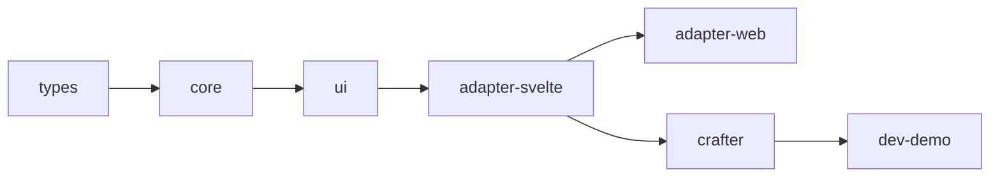

# Risiken und technische Schulden

UJL ist ein junges Framework, das auf modernen Technologieentscheidungen wie Svelte 5, Runes, pnpm Workspaces und dem OKLCH-Farbraum basiert. Diese Entscheidungen bringen technische und organisatorische Risiken mit sich. Durch die Priorisierung der Kernarchitektur und des Content-/Design-Separationsansatzes entstehen technische Schulden. Features wie Undo/Redo, vollständige Internationalisierung oder Bundle-Optimierung wurden zunächst zurückgestellt.

## Risiko-Übersicht

| Risiko-ID | Titel                              | Kategorie            | Priorität | Wahrscheinlichkeit | Auswirkung | Status         |
| --------- | ---------------------------------- | -------------------- | --------- | ------------------ | ---------- | -------------- |
| R-001     | Svelte 5 Runes Ecosystem Maturity  | Technologie          | Hoch      | Mittel             | Hoch       | Überwacht      |
| R-002     | Monorepo Build-Komplexität         | Build-System         | Hoch      | Hoch               | Mittel     | Mitigiert      |
| R-003     | Bundle Size Management             | Performance          | Hoch      | Mittel             | Hoch       | Überwacht      |
| R-007     | Small-Team-Risiko (1-3 Entwickler) | Organisation         | Mittel    | Hoch               | Hoch       | Akzeptiert     |
| R-006     | Test Coverage Gaps                 | Qualität             | Mittel    | Mittel             | Mittel     | In Bearbeitung |
| R-004     | Payload CMS Backend-Abhängigkeit   | Externe Abhängigkeit | Mittel    | Niedrig            | Mittel     | Akzeptiert     |
| R-005     | OKLCH Browser-Kompatibilität       | Browser-Support      | Mittel    | Niedrig            | Mittel     | Akzeptiert     |
| R-008     | ProseMirror/TipTap Komplexität     | Technologie          | Niedrig   | Niedrig            | Mittel     | Mitigiert      |

## Tech-Debt-Übersicht

| Schulden-ID | Titel                                         | Kategorie          | Priorität | Aufwand | Status     |
| ----------- | --------------------------------------------- | ------------------ | --------- | ------- | ---------- |
| TD-009      | API-Key-Exposition im Library Service         | Sicherheit         | Hoch      | Mittel  | Offen      |
| TD-013      | Crafter-Registry-API für Custom Modules fehlt | Erweiterbarkeit    | Hoch      | Mittel  | Offen      |
| TD-001      | Unvollständige Type Assertions                | Code-Qualität      | Mittel    | Mittel  | Offen      |
| TD-003      | Fehlende Error Boundaries                     | Fehlerbehandlung   | Mittel    | Mittel  | Offen      |
| TD-006      | Unvollständige JSDoc Dokumentation            | Dokumentation      | Mittel    | Mittel  | Offen      |
| TD-008      | Fehlende Undo/Redo Funktionalität             | Feature-Lücke      | Mittel    | Hoch    | Offen      |
| TD-010      | Testing-Utilities für Custom Modules fehlen   | Entwickler-API     | Mittel    | Mittel  | Offen      |
| TD-011      | Validator-Registry-Integration fehlt          | KI-Integration     | Mittel    | Mittel  | Offen      |
| TD-002      | Hardcoded Configuration Values                | Konfigurierbarkeit | Niedrig   | Niedrig | Offen      |
| TD-004      | Inkonsistente Naming Conventions              | Code-Konsistenz    | Niedrig   | Niedrig | Akzeptiert |
| TD-005      | Fehlende Internationalisierung (i18n)         | Feature-Lücke      | Niedrig   | Hoch    | Offen      |
| TD-007      | Manuelle CSS Custom Property Generation       | Code-Duplizierung  | Niedrig   | Mittel  | Offen      |
| TD-012      | Manuelle Theme-Umschaltung im Crafter fehlt   | Usability          | Niedrig   | Niedrig | Offen      |

## 11.1 Technische Risiken

### 11.1.1 Svelte 5 Runes - Ecosystem Maturity

| Attribut               | Wert                     |
| ---------------------- | ------------------------ |
| **Risiko-ID**          | R-001                    |
| **Kategorie**          | Technologie-Abhängigkeit |
| **Priorität**          | Hoch                     |
| **Wahrscheinlichkeit** | Mittel                   |
| **Auswirkung**         | Hoch                     |

**Beschreibung:**

Das UJL Framework basiert auf Svelte 5 mit dem neuen Runes-System (`$state`, `$derived`, `$props`). Svelte 5 wurde im Oktober 2024 veröffentlicht und ist damit noch relativ neu. Das Ecosystem aus Libraries, Tools und Community-Wissen ist noch nicht vollständig ausgereift, was zu Unsicherheiten bei der langfristigen Stabilität führt.

**Potenzielle Auswirkungen:**

Breaking Changes könnten bereits in Minor-Releases von Svelte auftreten, da das Runes-System noch aktiv weiterentwickelt wird. Inkompatibilitäten mit Drittanbieter-Libraries sind wahrscheinlich, da viele noch auf Svelte 4 Patterns basieren und nicht mit Runes kompatibel sind. Die Community-Ressourcen für Troubleshooting sind begrenzt, da weniger Entwickler Erfahrung mit dem neuen System haben. Die Migration existierender Svelte 4 Code-Beispiele aus Tutorials oder Foren ist nicht direkt übertragbar, was den Lernaufwand erhöht.

**Betroffene Pakete:**

Das Risiko betrifft primär `@ujl-framework/adapter-svelte`, das Svelte 5 Runes für Reaktivität verwendet, `@ujl-framework/crafter` mit intensiver Nutzung von `$state`, `$derived` und `$props` sowie `@ujl-framework/ui` mit Svelte 5 Komponenten die auf Runes basieren.

**Mitigationsmaßnahmen:**

Svelte-Versionen werden explizit ohne Caret in der `package.json` gepinnt, um unerwartete Breaking Changes zu vermeiden. Ein regelmäßiges Changelog-Monitoring stellt sicher, dass Svelte Release Notes vor Updates geprüft werden. Die Context API dient als Abstraktionsschicht und Puffer zwischen Svelte-Interna und Business-Logik. Eine Fallback-Dokumentation zur Migration von Svelte 4 zu 5 hilft bei zukünftigen Anpassungen.

**Status:** Aktiv überwacht

### 11.1.2 Monorepo Build-Komplexität

| Attribut               | Wert         |
| ---------------------- | ------------ |
| **Risiko-ID**          | R-002        |
| **Kategorie**          | Build-System |
| **Priorität**          | Hoch         |
| **Wahrscheinlichkeit** | Hoch         |
| **Auswirkung**         | Mittel       |

**Beschreibung:**

Das UJL Framework ist als pnpm Workspace Monorepo mit mehr als 10 Paketen organisiert. Die Build-Reihenfolge ist entscheidend, da Pakete voneinander abhängen. Ein fehlerhafter Build eines Foundation-Pakets (z. B. `types`) führt zu Kaskadenfehlern in allen abhängigen Paketen.

**Build-Dependency-Chain:**



**Potenzielle Auswirkungen:**

Längere CI/CD-Zeiten entstehen durch den sequenziellen Build-Prozess, da Pakete nacheinander gebaut werden müssen. Debugging wird komplex, wenn Fehler in der Dependency-Chain auftreten und sich auf nachgelagerte Pakete auswirken. Das Workspace-Protocol (`workspace:*`) erfordert korrektes Linking zwischen den Paketen, was bei Fehlkonfiguration zu Problemen führt. Die Changeset-Versionierung kann bei falscher Konfiguration inkonsistente Versionen über Pakete hinweg erzeugen.

**Betroffene Pakete:**

Alle Pakete im Monorepo sind von diesem Risiko betroffen. Besonders kritisch ist `@ujl-framework/types` als Foundation-Layer, da Fehler hier alle abhängigen Pakete blockieren.

**Mitigationsmaßnahmen:**

Eine strikte Build-Reihenfolge wird durch explizite Sequenzen in der Root `package.json` sichergestellt. Fixed Versioning sorgt dafür, dass alle Pakete synchron versioniert werden durch das Changesets `fixed` Array. Aggressive Caching-Strategien für `node_modules` und `.pnpm-store` beschleunigen CI/CD-Durchläufe. Die Lockfile-Validierung mit `pnpm install --frozen-lockfile` in CI verhindert unerwartete Dependency-Updates.

**Status:** Mitigiert durch Build-Scripts

### 11.1.3 Bundle Size Management

| Attribut               | Wert        |
| ---------------------- | ----------- |
| **Risiko-ID**          | R-003       |
| **Kategorie**          | Performance |
| **Priorität**          | Hoch        |
| **Wahrscheinlichkeit** | Mittel      |
| **Auswirkung**         | Hoch        |

**Beschreibung:**

Das `@ujl-framework/adapter-web` Paket bundelt Svelte und alle Abhängigkeiten in ein standalone Web Component. Dies ermöglicht Framework-Agnostizität, führt aber zu erhöhten Bundle-Größen.

**Aktuelle Bundle-Größen (geschätzt):**

| Paket            | Gzipped Size | Enthält                          |
| ---------------- | ------------ | -------------------------------- |
| `adapter-svelte` | ~15 KB       | Svelte Components (ohne Runtime) |
| `adapter-web`    | ~80 KB       | Svelte Runtime + Components      |
| `ui`             | ~25 KB       | UI Components + Styles           |

**Potenzielle Auswirkungen:**

Längere Ladezeiten beim Erstaufruf beeinträchtigen die User Experience, insbesondere bei langsamen Verbindungen. Core Web Vitals wie Largest Contentful Paint (LCP) und First Input Delay (FID) werden negativ beeinflusst, was SEO-Rankings verschlechtert. Mobile-First-Anwendungen sind besonders betroffen durch große Bundle-Größen bei limitierten Datenvolumen. Der erhöhte Bandbreitenverbrauch belastet sowohl Nutzer als auch Hosting-Infrastruktur.

**Betroffene Pakete:**

`@ujl-framework/adapter-web` hat hohe Priorität, da es die komplette Svelte Runtime bundelt. `@ujl-framework/ui` ist mittelmäßig betroffen durch Tailwind CSS Styles.

**Mitigationsmaßnahmen:**

Tree-Shaking stellt sicher, dass nur tatsächlich genutzte Module gebundelt werden. Code-Splitting für Module-Komponenten mit Lazy Loading wird zukünftig die initiale Bundle-Größe reduzieren. Tailwind CSS Purging entfernt ungenutzte Styles in Production-Builds automatisch. Regelmäßige Bundle-Analysen mit `rollup-plugin-visualizer` identifizieren Optimierungspotenziale. Die Dokumentation empfiehlt CDN-basiertes Laden für optimale Caching-Strategien.

**Status:** Überwacht, Optimierung geplant

### 11.1.4 Payload CMS Backend-Abhängigkeit

| Attribut               | Wert                 |
| ---------------------- | -------------------- |
| **Risiko-ID**          | R-004                |
| **Kategorie**          | Externe Abhängigkeit |
| **Priorität**          | Mittel               |
| **Wahrscheinlichkeit** | Niedrig              |
| **Auswirkung**         | Mittel               |

**Beschreibung:**

Der Backend-Storage-Modus der Image Library nutzt den Library Service (Payload CMS) als Backend. Dies schafft eine externe Abhängigkeit für Enterprise-Features wie responsive Images, Metadaten-Verwaltung und Lokalisierung.

**Potenzielle Auswirkungen:**

Breaking Changes in Payload CMS Major-Releases könnten umfangreiche Anpassungen im Library Service erfordern. Lizenzänderungen bei Payload würden die Nutzbarkeit für kommerzielle Projekte beeinflussen, auch wenn die aktuelle MIT-Lizenz liberal ist. Die Performance-Abhängigkeit von der Payload-API bedeutet, dass Latenzen oder Ausfälle direkt spürbar sind. Das komplexere Setup mit Docker und PostgreSQL erhöht die Einstiegshürde für End-User.

**Betroffene Pakete:**

Der `services/library` Service integriert Payload CMS direkt und ist vollständig davon abhängig. `@ujl-framework/crafter` implementiert den Backend Image Service und nutzt die Library Service API.

**Mitigationsmaßnahmen:**

Inline-Storage dient als Default-Option, wodurch Backend-Storage opt-in und nicht zwingend erforderlich ist. Ein abstraktes Image Service Interface ermöglicht die Integration alternativer Backends wie S3-kompatible Storage-Lösungen. Version-Pinning fixiert die Payload-Version explizit in der `package.json`, um unerwartete Breaking Changes zu vermeiden. Die Dokumentation weist auf alternative Storage-Adapter hin und bietet Migrationspfade.

**Status:** Akzeptiertes Risiko (Inline-Storage als Fallback)

### 11.1.5 OKLCH Browser-Kompatibilität

| Attribut               | Wert                   |
| ---------------------- | ---------------------- |
| **Risiko-ID**          | R-005                  |
| **Kategorie**          | Browser-Kompatibilität |
| **Priorität**          | Mittel                 |
| **Wahrscheinlichkeit** | Niedrig                |
| **Auswirkung**         | Mittel                 |

**Beschreibung:**

Das Design-Token-System verwendet den OKLCH-Farbraum für perzeptuell uniforme Farbpaletten. OKLCH wird von modernen Browsern unterstützt (Chrome 111+, Firefox 113+, Safari 15.4+), aber ältere Browser könnten Probleme haben.

**Browser-Support (Stand 2026):**

| Browser        | OKLCH Support | Marktanteil |
| -------------- | ------------- | ----------- |
| Chrome 111+    | Ja            | ~65%        |
| Firefox 113+   | Ja            | ~3%         |
| Safari 15.4+   | Ja            | ~18%        |
| Edge 111+      | Ja            | ~5%         |
| Ältere Browser | Nein          | ~9%         |

**Potenzielle Auswirkungen:**

Farben werden in älteren Browsern nicht korrekt dargestellt und fallen auf transparente oder schwarze Werte zurück. Dies führt zu inkonsistenter UI-Darstellung für ungefähr 9% der Nutzer, die ältere Browser-Versionen verwenden. Die Brand-Identität und visuelle Konsistenz leiden unter diesen Darstellungsfehlern.

**Betroffene Pakete:**

`@ujl-framework/adapter-svelte` injiziert CSS Variables mit OKLCH-Werten. `@ujl-framework/ui` nutzt diese Werte in der Tailwind CSS Konfiguration. `@ujl-framework/crafter` bietet den Theme Designer an, der OKLCH-Farben generiert.

**Mitigationsmaßnahmen:**

CSS Fallbacks stellen HEX/RGB-Alternativen via `@supports` Queries bereit. Ein PostCSS Plugin soll zukünftig automatisch Fallbacks generieren. Die Dokumentation weist explizit auf Browser-Anforderungen hin. Progressive Enhancement sorgt dafür, dass Core-Funktionalität auch ohne OKLCH-Support nutzbar bleibt.

**Status:** Akzeptiertes Risiko (hohe Browser-Abdeckung)

### 11.1.6 Test Coverage Gaps

| Attribut               | Wert               |
| ---------------------- | ------------------ |
| **Risiko-ID**          | R-006              |
| **Kategorie**          | Qualitätssicherung |
| **Priorität**          | Mittel             |
| **Wahrscheinlichkeit** | Mittel             |
| **Auswirkung**         | Mittel             |

**Beschreibung:**

Die Test-Abdeckung variiert zwischen Paketen. Während `types` und `core` gut getestet sind, haben UI-Komponenten und der Crafter-Editor Lücken in der Unit-Test-Abdeckung.

**Aktuelle Abdeckung (geschätzt):**

| Paket            | Unit Tests | Integration | E2E |
| ---------------- | ---------- | ----------- | --- |
| `types`          | 80%+       | Ja          | N/A |
| `core`           | 75%+       | Ja          | N/A |
| `ui`             | 40%        | Nein        | N/A |
| `adapter-svelte` | 50%        | Nein        | N/A |
| `adapter-web`    | 30%        | Nein        | N/A |
| `crafter`        | 45%        | Teilweise   | Ja  |

**Potenzielle Auswirkungen:**

Unentdeckte Regressionen treten bei Code-Änderungen häufiger auf, da automatisierte Tests fehlen. Der manuelle Test-Aufwand steigt dadurch erheblich und verzögert Release-Zyklen. Reduziertes Vertrauen bei Refactoring führt dazu, dass technische Schulden sich akkumulieren, weil Entwickler zögern größere Umstrukturierungen vorzunehmen.

**Betroffene Pakete:**

`@ujl-framework/ui` fehlen teilweise Tests für Svelte Components. `@ujl-framework/adapter-svelte` hat unvollständige Serializer-Tests. `@ujl-framework/crafter` lässt komplexes State Management weitgehend ungetestet.

**Mitigationsmaßnahmen:**

Coverage-Ziele von mindestens 70% für wichtige Code-Pfade werden angestrebt. Playwright E2E-Tests dienen als Fallback für Crafter-Workflows und kritische User-Journeys. Test-Driven Development wird für neue Features etabliert, um Coverage schrittweise zu erhöhen. CI-Integration mit Coverage-Reporting in GitLab CI macht Fortschritte transparent.

**Status:** Aktiv in Bearbeitung

### 11.1.7 Small-Team-Risiko (1-3 Entwickler)

| Attribut               | Wert               |
| ---------------------- | ------------------ |
| **Risiko-ID**          | R-007              |
| **Kategorie**          | Projekt-Management |
| **Priorität**          | Hoch               |
| **Wahrscheinlichkeit** | Hoch               |
| **Auswirkung**         | Hoch               |

**Beschreibung:**

Als Masterprojekt wird UJL primär von einem kleinen Team von 1-3 Entwicklern entwickelt. Dies schafft ein "Bus-Faktor"-Risiko und limitiert die Entwicklungsgeschwindigkeit.

**Potenzielle Auswirkungen:**

Verzögerungen bei der Feature-Entwicklung entstehen durch begrenzte Entwicklungskapazität. Engpässe bei der Issue-Bearbeitung führen zu längeren Response-Zeiten für Bug-Reports und Feature-Requests. Wissenskonzentration ohne Redundanz bedeutet, dass kritisches Know-how nur bei wenigen Personen liegt. Das Risiko bei Ausfall eines Teammitglieds ist hoch, da das Projekt stark von individuellen Beiträgen abhängt.

**Mitigationsmaßnahmen:**

Umfassende Dokumentation in Form von arc42-Architektur, README-Dateien und Inline-Kommentaren reduziert die Wissensbarriere. Nachvollziehbare Architekturentscheidungen durch ADRs machen Design-Rationale transparent. Open-Source-Vorbereitung bereitet Community-Aufbau nach Phase 3 vor (siehe Roadmap). Contributor Guidelines werden vorbereitet, um externe Beiträge zu ermöglichen und die Abhängigkeit vom Kern-Team zu reduzieren.

**Status:** Akzeptiertes Risiko (Masterarbeit-Kontext)

### 11.1.8 ProseMirror/TipTap Komplexität

| Attribut               | Wert                    |
| ---------------------- | ----------------------- |
| **Risiko-ID**          | R-008                   |
| **Kategorie**          | Technologie-Komplexität |
| **Priorität**          | Niedrig                 |
| **Wahrscheinlichkeit** | Niedrig                 |
| **Auswirkung**         | Mittel                  |

**Beschreibung:**

Das Rich-Text-System basiert auf TipTap/ProseMirror, einem leistungsstarken aber komplexen Editor-Framework. Die Lernkurve ist steil und Custom Extensions erfordern tiefes Verständnis der ProseMirror-Architektur.

**Potenzielle Auswirkungen:**

Die Erweiterung des Rich-Text-Schemas ist schwierig, da ProseMirror eine steile Lernkurve hat. Debugging von Editor-Problemen wird komplex durch die verschachtelte Architektur von ProseMirror und TipTap. Synchronisations-Probleme zwischen Editor-State und Serializer können zu Datenverlust oder inkonsistenten Darstellungen führen.

**Betroffene Pakete:**

`@ujl-framework/core` definiert das TipTap Schema mit `ujlRichTextExtensions`. `@ujl-framework/adapter-svelte` implementiert den ProseMirror Serializer für SSR. `@ujl-framework/crafter` integriert die Rich Text Editor Component in die Crafter-Oberfläche.

**Mitigationsmaßnahmen:**

Ein Shared Schema mit `ujlRichTextExtensions` als Single Source of Truth verhindert Schema-Divergenz. Ein eingeschränkter Feature-Set aktiviert nur serialisierbare Extensions, um Kompatibilität zu garantieren. Der SSR-Safe Serializer ist ein Custom-Serializer ohne Browser-Abhängigkeit für Node.js-Umgebungen. Schema-Dokumentation im `@ujl-framework/core` README erklärt Extension-Struktur und Erweiterungsmöglichkeiten.

**Status:** Mitigiert durch Abstraktion

## 11.2 Technische Schulden

### 11.2.1 Unvollständige Type Assertions

| Attribut        | Wert              |
| --------------- | ----------------- |
| **Schulden-ID** | TD-001            |
| **Kategorie**   | Code-Qualität     |
| **Aufwand**     | Mittel (2-3 Tage) |
| **Priorität**   | Mittel            |

**Beschreibung:**

An einigen Stellen im Code werden `as` Type Assertions verwendet, anstatt Type Guards oder Zod-Validierung. Dies kann zu Runtime-Fehlern führen, wenn die Annahmen nicht zutreffen.

**Betroffene Stellen:**

```typescript
// Beispiel in compose-Methoden
const content = moduleData.fields.content as ProseMirrorDocument;

// Sollte sein:
const content = this.fields[0].field.parse(moduleData.fields.content);
```

**Betroffene Pakete:**

Das Problem betrifft primär `@ujl-framework/core` in einigen Module-Implementierungen sowie `@ujl-framework/crafter` bei Context-Operationen.

**Behebungsplan:**

Zunächst wird ein vollständiger Audit aller `as` Assertions im Codebase durchgeführt. Anschließend erfolgt die Ersetzung durch Type Guards oder Zod-Validierung. Abschließend werden Unit-Tests für Edge Cases hinzugefügt, um die Robustheit der Typprüfung zu gewährleisten.

**Status:** Offen

### 11.2.2 Hardcoded Configuration Values

| Attribut        | Wert               |
| --------------- | ------------------ |
| **Schulden-ID** | TD-002             |
| **Kategorie**   | Konfigurierbarkeit |
| **Aufwand**     | Niedrig (1 Tag)    |
| **Priorität**   | Niedrig            |

**Beschreibung:**

Einige Konfigurationswerte sind direkt im Code hardcoded, anstatt über Umgebungsvariablen oder Konfigurationsdateien gesteuert zu werden.

**Beispiele:**

```typescript
// In services/library
const DEFAULT_IMAGE_SIZES = [400, 500, 750, 1000, 1920]; // Hardcoded

// In packages/crafter
const MAX_TREE_DEPTH = 10; // Hardcoded
```

**Betroffene Pakete:**

Das Problem zeigt sich in `services/library` bei der Image Size Konfiguration, in `@ujl-framework/crafter` bei Editor-Limits sowie in `@ujl-framework/core` bei Default Field Constraints.

**Behebungsplan:**

Zunächst erfolgt die Identifikation aller hardcoded Values im Codebase. Diese werden anschließend in zentrale Konfigurationsobjekte extrahiert. Abschließend werden die Konfigurationsoptionen umfassend dokumentiert, um Entwicklern die Anpassung zu erleichtern.

**Status:** Offen

### 11.2.3 Fehlende Error Boundaries

| Attribut        | Wert             |
| --------------- | ---------------- |
| **Schulden-ID** | TD-003           |
| **Kategorie**   | Fehlerbehandlung |
| **Aufwand**     | Mittel (2 Tage)  |
| **Priorität**   | Mittel           |

**Beschreibung:**

Der Crafter-Editor hat keine systematischen Error Boundaries. Ein Fehler in einer Komponente kann die gesamte Anwendung zum Absturz bringen, anstatt isoliert behandelt zu werden.

**Potenzielle Auswirkungen:**

Datenverlust bei Absturz während der Bearbeitung ist möglich, da keine isolierte Fehlerbehandlung existiert. Die User Experience leidet erheblich, wenn Fehler die gesamte Anwendung unbrauchbar machen. Das Debugging wird ohne Fehlerisolierung unnötig komplex, da die Fehlerquelle schwer zu lokalisieren ist.

**Betroffene Pakete:**

Das Risiko betrifft primär `@ujl-framework/crafter` in den Editor-Komponenten sowie `@ujl-framework/adapter-svelte` in der Rendering-Pipeline.

**Behebungsplan:**

Zunächst werden Svelte Error Boundaries via `$effect` und `try-catch` implementiert. Anschließend wird eine Fallback-UI für fehlerhafte Komponenten entwickelt, die dem Nutzer eine graceful Degradation ermöglicht. Abschließend erfolgt die Integration von Error Logging und Reporting, um Fehler systematisch zu erfassen und analysieren zu können.

**Status:** Offen

### 11.2.4 Inkonsistente Naming Conventions

| Attribut        | Wert               |
| --------------- | ------------------ |
| **Schulden-ID** | TD-004             |
| **Kategorie**   | Code-Konsistenz    |
| **Aufwand**     | Niedrig (0.5 Tage) |
| **Priorität**   | Niedrig            |

**Beschreibung:**

Die Naming Conventions sind zwischen Paketen nicht vollständig konsistent. Einige verwenden camelCase für Dateinamen, andere kebab-case.

**Beispiele:**

```
packages/crafter/src/lib/components/ujl-crafter/
├── ujl-crafter.svelte                # kebab-case
├── header/header.svelte              # kebab-case
└── sidebar/nav-tree/nav-tree.svelte  # kebab-case

packages/adapter-svelte/src/lib/components/
├── AdapterRoot.svelte      # PascalCase
├── ASTNode.svelte          # PascalCase
└── nodes/Button.svelte     # PascalCase
```

**Betroffene Pakete:**

Alle Pakete mit Svelte-Komponenten sind von dieser Inkonsistenz betroffen.

**Behebungsplan:**

Zunächst wird ein einheitlicher Naming-Standard definiert, der für alle Pakete gilt. Anschließend erfolgt das Refactoring mit IDE-Support durch rename refactoring, um bestehende Dateien umzubenennen. Abschließend werden die etablierten Conventions dokumentiert, um zukünftige Inkonsistenzen zu vermeiden.

**Status:** Akzeptiert (unterschiedliche Konventionen pro Layer)

### 11.2.5 Fehlende Internationalisierung (i18n)

| Attribut        | Wert           |
| --------------- | -------------- |
| **Schulden-ID** | TD-005         |
| **Kategorie**   | Feature-Lücke  |
| **Aufwand**     | Hoch (5+ Tage) |
| **Priorität**   | Niedrig        |

**Beschreibung:**

Der Crafter-Editor und die UI-Texte sind aktuell nur auf Deutsch/Englisch verfügbar. Eine systematische i18n-Lösung fehlt.

**Betroffene Bereiche:**

Die Limitierung betrifft Crafter UI-Labels und Fehlermeldungen, Modul-Labels und Descriptions sowie Validierungsfehlermeldungen. Auch die Dokumentation ist derzeit nur in begrenzten Sprachen verfügbar.

**Betroffene Pakete:**

Das Problem zeigt sich in `@ujl-framework/crafter` bei der Editor UI, in `@ujl-framework/core` bei Modul-Metadaten sowie in `@ujl-framework/types` bei Validierungsmeldungen.

**Behebungsplan:**

Zunächst werden verschiedene i18n-Libraries wie svelte-i18n und paraglide evaluiert. Anschließend erfolgt die Extraktion aller UI-Strings in zentrale Sprachdateien. Abschließend wird eine Sprachauswahl im Crafter implementiert, die es Nutzern ermöglicht, ihre bevorzugte Sprache zu wählen.

**Status:** Offen (Post-MVP)

### 11.2.6 Unvollständige JSDoc Dokumentation

| Attribut        | Wert            |
| --------------- | --------------- |
| **Schulden-ID** | TD-006          |
| **Kategorie**   | Dokumentation   |
| **Aufwand**     | Mittel (3 Tage) |
| **Priorität**   | Mittel          |

**Beschreibung:**

Nicht alle öffentlichen APIs haben vollständige JSDoc-Kommentare. Dies erschwert die Nutzung ohne Dokumentations-Website.

**Betroffene Bereiche:**

Die Lücken zeigen sich bei einigen Funktionen in `@ujl-framework/core`, bei Svelte-Komponenten Props sowie bei diversen Utility-Funktionen.

**Behebungsplan:**

Zunächst wird ein vollständiger Audit aller öffentlichen Exports durchgeführt. Anschließend erfolgt das Hinzufügen von JSDoc-Kommentaren mit `@param`, `@returns` und `@example` Annotationen. Abschließend wird TypeDoc für die automatische Generierung der API-Dokumentation integriert, um eine konsistente und wartbare Dokumentation zu gewährleisten.

**Status:** Offen

### 11.2.7 Manuelle CSS Custom Property Generation

| Attribut        | Wert              |
| --------------- | ----------------- |
| **Schulden-ID** | TD-007            |
| **Kategorie**   | Code-Duplizierung |
| **Aufwand**     | Mittel (2 Tage)   |
| **Priorität**   | Niedrig           |

**Beschreibung:**

Die Generierung von CSS Custom Properties aus TokenSet erfolgt manuell in mehreren Komponenten. Eine gemeinsame Utility fehlt.

**Betroffene Stellen:**

Die Code-Duplizierung zeigt sich in `AdapterRoot.svelte` bei der Token Injection, in `preview.svelte` für die Theme Preview sowie in den CSS Variable Definitions in der Tailwind Config.

**Behebungsplan:**

Zunächst wird eine zentrale `generateCSSVariables(tokenSet)` Utility erstellt, die die Logik kapselt. Anschließend erfolgt die Migration aller betroffenen Stellen zur Nutzung dieser gemeinsamen Utility. Abschließend werden umfassende Tests für die CSS Variable Generation implementiert, um die Korrektheit sicherzustellen.

**Status:** Offen

### 11.2.8 Fehlende Undo/Redo Funktionalität im Crafter

| Attribut        | Wert           |
| --------------- | -------------- |
| **Schulden-ID** | TD-008         |
| **Kategorie**   | Feature-Lücke  |
| **Aufwand**     | Hoch (5+ Tage) |
| **Priorität**   | Mittel         |

**Beschreibung:**

Der Crafter-Editor unterstützt keine Undo/Redo-Funktionalität für Dokumentänderungen. Nutzer können versehentliche Änderungen nicht rückgängig machen.

**Potenzielle Auswirkungen:**

Datenverlust bei versehentlichen Änderungen ist ein erhebliches Risiko, da Nutzer keine Möglichkeit haben, fehlerhafte Operationen rückgängig zu machen. Dies führt zu Frustration bei den Nutzern und beeinträchtigt die Usability erheblich. Für produktive Arbeit ist die fehlende Undo/Redo-Funktionalität eine kritische Einschränkung.

**Betroffene Pakete:**

Das Problem betrifft primär `@ujl-framework/crafter` im Bereich des State Managements.

**Behebungsplan:**

Zunächst wird ein Command-Pattern für State-Änderungen implementiert, das alle Operationen als rückgängig machbare Commands modelliert. Anschließend wird ein History-Stack für Undo/Redo aufgebaut, der die Command-Historie verwaltet. Danach werden Keyboard Shortcuts für Ctrl+Z und Ctrl+Y integriert, um eine vertraute Bedienung zu ermöglichen. Abschließend wird UI-Feedback für den Undo/Redo-Status hinzugefügt, damit Nutzer den aktuellen Zustand der Historie nachvollziehen können.

**Status:** Offen (Phase 2 Roadmap)

### 11.2.9 API-Key-Exposition im Library Service

| Attribut        | Wert              |
| --------------- | ----------------- |
| **Schulden-ID** | TD-009            |
| **Kategorie**   | Sicherheit        |
| **Aufwand**     | Mittel (2-3 Tage) |
| **Priorität**   | Hoch              |

**Beschreibung:**

Der Library Service überträgt den API-Key direkt an das Frontend bzw. den Client. Dies stellt ein Sicherheitsrisiko dar, da API-Keys im Client-Code oder Netzwerk-Requests sichtbar und somit kompromittierbar sind.

**Potenzielle Auswirkungen:**

API-Keys können von Dritten abgefangen und missbraucht werden, was zu unbefugtem Zugriff auf Ressourcen des Library Service führt. Eine mögliche Kostenexplosion bei externen Services wie CDN oder Storage ist die Folge. Zusätzlich entstehen Sicherheitsaudit-Probleme bei Enterprise-Kunden, die strenge Sicherheitsanforderungen haben.

**Betroffene Pakete:**

Das Problem betrifft `services/library` beim API-Key-Handling sowie `@ujl-framework/crafter` bei der Image Service Integration.

**Behebungsplan:**

Zunächst wird der API-Key ausschließlich serverseitig verwendet, um die Exposition im Client zu vermeiden. Anschließend wird ein Proxy-Endpoint im Backend für Image-Anfragen implementiert, der als sicherer Vermittler fungiert. Danach wird eine Token-basierte Authentifizierung für Client-Requests eingeführt, die sichere und nachvollziehbare Zugriffe ermöglicht. Abschließend werden kurzzeitige, scope-limitierte Tokens für Upload-Operationen generiert, um das Risiko bei kompromittierten Tokens zu minimieren.

**Status:** Offen

### 11.2.10 Testing-Utilities für Custom Modules

| Attribut        | Wert            |
| --------------- | --------------- |
| **Schulden-ID** | TD-010          |
| **Kategorie**   | Entwickler-API  |
| **Aufwand**     | Mittel (3 Tage) |
| **Priorität**   | Mittel          |

**Beschreibung:**

Entwickler, die eigene Custom Modules erstellen möchten, haben aktuell keine Test-Utilities oder Best-Practice-Guidelines. Die Module-Registry-API ist zwar vorhanden, aber Test-Infrastruktur (z.B. Mock-Composer, Test-Fixtures) fehlt.

**Potenzielle Auswirkungen:**

Die höhere Einstiegshürde für externe Entwickler erschwert die Adoption des Frameworks erheblich. Inkonsistente Modul-Qualität ist die Folge fehlender Standards und Testing-Unterstützung. Die Fehlersuche bei Custom Modules wird ohne geeignete Test-Tools unnötig komplex. Fehlende Best-Practice-Dokumentation führt dazu, dass Entwickler eigene, möglicherweise suboptimale Lösungen entwickeln.

**Betroffene Pakete:**

Das Problem zeigt sich in `@ujl-framework/core` durch fehlende Test-Utilities sowie in `@ujl-framework/docs` durch eine fehlende Developer-Guide-Sektion.

**Behebungsplan:**

Zunächst werden Test-Utilities wie `createTestComposer()` und `mockImageLibrary()` entwickelt, die das Testen von Custom Modules vereinfachen. Anschließend werden Beispiel-Tests für Custom Modules in die Dokumentation integriert, die als Referenz dienen. Danach werden Template-Dateien mit integrierten Test-Cases bereitgestellt, die Entwicklern einen schnellen Einstieg ermöglichen. Abschließend wird eine Developer Guide Sektion "Testing Custom Modules" erstellt, die Best Practices und Patterns vermittelt.

**Status:** Offen (abhängig von Crafter-Registry-API, siehe TD-013)

### 11.2.11 Validator-Registry-Integration fehlt

| Attribut        | Wert              |
| --------------- | ----------------- |
| **Schulden-ID** | TD-011            |
| **Kategorie**   | KI-Integration    |
| **Aufwand**     | Mittel (2-3 Tage) |
| **Priorität**   | Mittel            |

**Beschreibung:**

Das Field-System bietet `validate()` und `fit()` Methoden, aber der Validator im `types`-Package ist noch nicht an die Module Registry angebunden. Aktuell erfolgt nur Schema-Validierung (Zod), aber keine Registry-basierte Validierung (z.B. "Ist Modul-Type `xyz` registriert?").

Zusätzlich existieren im UJLC-Datenmodell bereits Felder für Embeddings (z.B. `meta._embedding`, `_embedding_model_hash`), sie werden aber derzeit nicht automatisch erzeugt oder konsistent aktualisiert. Ohne Registry-Validierung und ohne verlässliche Update-Strategie bleiben embedding-basierte Workflows schwer überprüfbar.

**Potenzielle Auswirkungen:**

Kein fundiertes Feedback für LLM-generierte Dokumente ist möglich, da die Validierung Custom Modules ignoriert. Der Validator kann nicht prüfen, ob verwendete Module tatsächlich existieren, was zu Runtime-Fehlern führen kann. Die KI-Integration wird dadurch weniger robust und fehleranfällig. Embedding-basierte Funktionen wie semantische Suche oder gezielte Editor-Hinweise sind schwer reproduzierbar, solange Embeddings nicht konsistent geprüft und aktualisiert werden.

**Betroffene Pakete:**

Das Problem betrifft `@ujl-framework/types` bei der Validator-Implementierung sowie `@ujl-framework/core` bei der Module Registry.

**Behebungsplan:**

Zunächst wird die Validator-Schnittstelle um einen optionalen Registry-Parameter erweitert: `validate(document, registry?)`. Anschließend werden Registry-basierte Checks implementiert, die prüfen, ob Modul-Types existieren, ob Fields/Slots den Modul-Definitionen entsprechen und ob Slot-Inhalte valide für die definierten Slot-Constraints sind. Danach werden detaillierte Fehlermeldungen für KI-Feedback entwickelt, die präzise Hinweise zur Problembehebung geben. Abschließend erfolgt die Integration in das CLI-Tool `ujl-validate`, um die Validierung auch außerhalb des Editors nutzbar zu machen.

**Status:** Offen (mittelfristig geplant für LLM-Integration)

### 11.2.12 Manuelle Theme-Umschaltung im Crafter fehlt

| Attribut        | Wert            |
| --------------- | --------------- |
| **Schulden-ID** | TD-012          |
| **Kategorie**   | Usability       |
| **Aufwand**     | Niedrig (1 Tag) |
| **Priorität**   | Niedrig         |

**Beschreibung:**

Der Crafter erkennt automatisch den System-Theme-Modus (Light/Dark via `prefers-color-scheme`), aber Nutzer können nicht manuell zwischen Light- und Dark-Mode wechseln. Dies ist besonders relevant für Designer, die Theme-Designs in beiden Modi testen möchten.

**Potenzielle Auswirkungen:**

Eingeschränkte Testmöglichkeiten für Designer erschweren die Theme-Entwicklung, da beide Modi nicht einfach verglichen werden können. Nutzer können das Theme nicht unabhängig vom System-Setting wählen, was die Flexibilität einschränkt. Dies führt insgesamt zu einer schlechteren User Experience.

**Betroffene Pakete:**

Das Problem betrifft `@ujl-framework/crafter` bei der Theme-Mode-Switching UI sowie `@ujl-framework/adapter-svelte` bei der Theme-Mode-Propagierung.

**Behebungsplan:**

Zunächst wird ein UI-Toggle für den Theme-Mode im Crafter-Header hinzugefügt, der eine intuitive Umschaltung ermöglicht. Anschließend wird localStorage-basiertes Persistence für die User-Präferenz implementiert, damit die Auswahl über Sessions hinweg erhalten bleibt. Danach wird sichergestellt, dass die manuelle Umschaltung das System-Setting überschreibt. Abschließend wird visuelles Feedback durch Icons wie Sonne und Mond hinzugefügt, um den aktuellen Modus klar zu kommunizieren.

**Status:** Offen (Nice-to-Have für Phase 2)

### 11.2.13 Crafter-Registry-API für Entwickler fehlt

| Attribut        | Wert              |
| --------------- | ----------------- |
| **Schulden-ID** | TD-013            |
| **Kategorie**   | Erweiterbarkeit   |
| **Aufwand**     | Mittel (3-4 Tage) |
| **Priorität**   | Hoch              |

**Beschreibung:**

Die Crafter-Klasse (exportiert aus `@ujl-framework/crafter`) unterstützt aktuell noch nicht die Möglichkeit, Custom Modules zur Laufzeit zu registrieren. Entwickler können zwar eigene `ModuleRegistry`-Instanzen für den `Composer` erstellen, aber der Crafter-Editor zeigt nur Built-in-Module an.

**Potenzielle Auswirkungen:**

Entwickler können Custom Modules nicht im Crafter nutzen, was die Erweiterbarkeit stark einschränkt. Multi-Tenancy-Szenarien mit verschiedenen Modulsets pro Kunde sind nicht realisierbar. Die eingeschränkte Erweiterbarkeit behindert die Anpassung an spezifische Use Cases. White-Label-Szenarien sind schwierig umzusetzen, da keine kundenspezifischen Module integriert werden können.

**Betroffene Pakete:**

Das Problem betrifft `@ujl-framework/crafter` bei der Registry-Integration sowie `@ujl-framework/core` bei der Module Registry.

**Behebungsplan:**

Zunächst wird der Crafter-Konstruktor um einen optionalen Registry-Parameter erweitert: `new Crafter({ registry?: ModuleRegistry })`. Anschließend wird der Component-Picker angepasst, sodass er registrierte Module aus der übergebenen Registry anzeigt. Danach wird ein Fallback auf die Default Registry implementiert, wenn keine explizite Registry übergeben wird. Der Property Inspector wird so erweitert, dass er die Registry für Field-Rendering nutzt. Abschließend wird ein umfassender Dokumentations-Guide "Custom Modules im Crafter" erstellt, der Entwicklern die Integration eigener Module erklärt.

**Status:** Offen (mittelfristig geplant, hohe Priorität)

## 11.3 Risiko-Matrix

| Risiko-ID | Beschreibung                       | Wahrscheinlichkeit | Auswirkung | Priorität | Status         |
| --------- | ---------------------------------- | ------------------ | ---------- | --------- | -------------- |
| R-001     | Svelte 5 Ecosystem Maturity        | Mittel             | Hoch       | Hoch      | Überwacht      |
| R-002     | Monorepo Build-Komplexität         | Hoch               | Mittel     | Hoch      | Mitigiert      |
| R-003     | Bundle Size Management             | Mittel             | Hoch       | Hoch      | Überwacht      |
| R-004     | Payload CMS Abhängigkeit           | Niedrig            | Mittel     | Mittel    | Akzeptiert     |
| R-005     | OKLCH Browser-Kompatibilität       | Niedrig            | Mittel     | Mittel    | Akzeptiert     |
| R-006     | Test Coverage Gaps                 | Mittel             | Mittel     | Mittel    | In Bearbeitung |
| R-007     | Small-Team-Risiko (1-3 Entwickler) | Hoch               | Hoch       | Mittel    | Akzeptiert     |
| R-008     | ProseMirror/TipTap Komplexität     | Niedrig            | Mittel     | Niedrig   | Mitigiert      |

## 11.4 Technical Debt Übersicht

| Schulden-ID | Beschreibung                                | Aufwand | Priorität | Status     |
| ----------- | ------------------------------------------- | ------- | --------- | ---------- |
| TD-009      | API-Key-Exposition im Library Service       | Mittel  | Hoch      | Offen      |
| TD-013      | Crafter-Registry-API für Custom Modules     | Mittel  | Hoch      | Offen      |
| TD-001      | Unvollständige Type Assertions              | Mittel  | Mittel    | Offen      |
| TD-003      | Fehlende Error Boundaries                   | Mittel  | Mittel    | Offen      |
| TD-006      | Unvollständige JSDoc Dokumentation          | Mittel  | Mittel    | Offen      |
| TD-008      | Fehlende Undo/Redo Funktionalität           | Hoch    | Mittel    | Offen      |
| TD-010      | Testing-Utilities für Custom Modules        | Mittel  | Mittel    | Offen      |
| TD-011      | Validator-Registry-Integration fehlt        | Mittel  | Mittel    | Offen      |
| TD-002      | Hardcoded Configuration Values              | Niedrig | Niedrig   | Offen      |
| TD-004      | Inkonsistente Naming Conventions            | Niedrig | Niedrig   | Akzeptiert |
| TD-005      | Fehlende Internationalisierung (i18n)       | Hoch    | Niedrig   | Offen      |
| TD-007      | Manuelle CSS Custom Property Generation     | Mittel  | Niedrig   | Offen      |
| TD-012      | Manuelle Theme-Umschaltung im Crafter fehlt | Niedrig | Niedrig   | Offen      |

## 11.5 Maßnahmenplan

Der Maßnahmenplan strukturiert die Behebung von Risiken und technischen Schulden in drei zeitliche Phasen, die sich am aktuellen Entwicklungsstand und den verfügbaren Ressourcen orientieren. Die Priorisierung berücksichtigt sowohl die technische Dringlichkeit als auch die strategische Bedeutung für die Weiterentwicklung des Frameworks.

### Kurzfristig (Phase 1 - MVP Stabilisierung)

In der ersten Phase liegt der Fokus auf Stabilität, Sicherheit und Grundfunktionalität. Die Test Coverage wird erhöht (R-006) durch Unit Tests für wichtige Core-Funktionen und den Ausbau der E2E Tests für Crafter-Workflows. Type Assertions werden refaktoriert (TD-001) durch ein systematisches Audit und die Migration zu Type Guards. Error Boundaries werden implementiert (TD-003) um Graceful Degradation bei Fehlern zu ermöglichen. Die API-Key-Exposition wird behoben (TD-009) durch die Implementierung eines Proxy-Endpoints und die Einführung token-basierter Client-Authentifizierung. Die Crafter-Registry-API wird implementiert (TD-013) mit einem Registry-Parameter im Crafter-Konstruktor und der Anzeige von Custom Modules im Component Picker.

### Mittelfristig (Phase 2 - Pilotierung)

Die zweite Phase konzentriert sich auf Performance, Entwickler-Experience und Erweiterbarkeit. Die Bundle Size wird optimiert (R-003) durch Evaluation von Code-Splitting und Verbesserung des Tree-Shakings. Undo/Redo-Funktionalität wird implementiert (TD-008) basierend auf einem Command Pattern für State Management. Die JSDoc-Dokumentation wird vervollständigt (TD-006) und API-Dokumentation automatisch generiert. Die Validator-Registry-Integration erfolgt (TD-011) mit registry-basierter Validierung für LLM-Feedback und Erweiterung des CLI-Tools. Testing-Utilities für Custom Modules werden entwickelt (TD-010) inklusive Test-Helper und Developer Guide.

### Langfristig (Phase 3+ - Community)

Die dritte Phase bereitet das Framework für Community-Nutzung und internationale Verbreitung vor. Ein i18n-System wird eingeführt (TD-005) für mehrsprachige UI-Unterstützung. Die CSS Property Generation wird gebündelt (TD-007) in einer dedizierten Utility-Library. Contributor Guidelines werden erstellt (R-007) um externe Beiträge zu ermöglichen und das Small-Team-Risiko durch Community-Engagement zu mitigieren.
