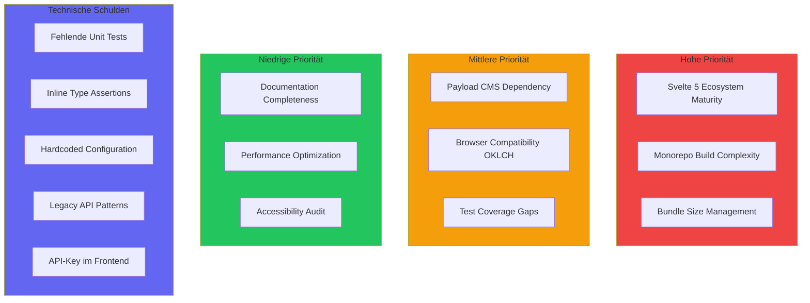

# Risiken und technische Schulden

Dieses Kapitel dokumentiert die identifizierten technischen Risiken und bekannten technischen Schulden des UJL Frameworks. Die Auflistung dient der Transparenz und ermöglicht eine proaktive Risikominderung.

## Übersicht



## 11.1 Technische Risiken

### 11.1.1 Svelte 5 Runes - Ecosystem Maturity

| Attribut               | Wert                     |
| ---------------------- | ------------------------ |
| **Risiko-ID**          | R-001                    |
| **Kategorie**          | Technologie-Abhängigkeit |
| **Priorität**          | Hoch                     |
| **Wahrscheinlichkeit** | Mittel                   |
| **Auswirkung**         | Hoch                     |

**Beschreibung:**

Das UJL Framework basiert auf Svelte 5 mit dem neuen Runes-System (`$state`, `$derived`, `$props`). Svelte 5 wurde im Oktober 2024 veröffentlicht und ist damit noch relativ neu. Das Ecosystem (Libraries, Tools, Community-Wissen) ist noch nicht vollständig ausgereift.

**Potenzielle Auswirkungen:**

- Breaking Changes in Minor-Releases von Svelte
- Inkompatibilitäten mit Drittanbieter-Libraries, die noch Svelte 4 Patterns nutzen
- Begrenzte Community-Ressourcen für Troubleshooting
- Migration existierender Svelte 4 Code-Beispiele nicht direkt übertragbar

**Betroffene Pakete:**

- `@ujl-framework/adapter-svelte` - Verwendet Svelte 5 Runes für Reaktivität
- `@ujl-framework/crafter` - Intensive Nutzung von `$state`, `$derived`, `$props`
- `@ujl-framework/ui` - Svelte 5 Komponenten mit Runes

**Mitigationsmaßnahmen:**

1. **Pinning von Svelte-Versionen**: Explizite Versionierung in `package.json` ohne Caret (`^`)
2. **Changelog-Monitoring**: Regelmäßige Überprüfung von Svelte Release Notes
3. **Abstraktionsschicht**: Context API als Puffer zwischen Svelte-Interna und Business-Logik
4. **Fallback-Dokumentation**: Dokumentation der Migration von Svelte 4 zu 5

**Status:** Aktiv überwacht

### 11.1.2 Monorepo Build-Komplexität

| Attribut               | Wert         |
| ---------------------- | ------------ |
| **Risiko-ID**          | R-002        |
| **Kategorie**          | Build-System |
| **Priorität**          | Hoch         |
| **Wahrscheinlichkeit** | Hoch         |
| **Auswirkung**         | Mittel       |

**Beschreibung:**

Das UJL Framework ist als pnpm Workspace Monorepo mit 10+ Paketen organisiert. Die Build-Reihenfolge ist kritisch, da Pakete voneinander abhängen. Ein fehlerhafter Build eines Foundation-Pakets (z.B. `types`) führt zu Kaskadenfehlern in allen abhängigen Paketen.

**Build-Dependency-Chain:**

```
types → core → ui → adapter-svelte → adapter-web → crafter/demo
                ↘ examples ↗
```

**Potenzielle Auswirkungen:**

- Längere CI/CD-Zeiten durch sequenziellen Build
- Komplexes Debugging bei Fehlern in der Dependency-Chain
- Workspace-Protocol (`workspace:*`) erfordert korrektes Linking
- Changeset-Versionierung kann bei Fehlkonfiguration inkonsistente Versionen erzeugen

**Betroffene Pakete:**

- Alle Pakete im Monorepo
- Besonders kritisch: `@ujl-framework/types` als Foundation-Layer

**Mitigationsmaßnahmen:**

1. **Strikte Build-Reihenfolge**: Explizite Sequenz in Root `package.json`
   ```json
   "build": "pnpm run types:build && pnpm run core:build && ..."
   ```
2. **Fixed Versioning**: Alle Pakete werden synchron versioniert (Changesets `fixed` Array)
3. **CI/CD Caching**: Aggressive Caching-Strategie für `node_modules` und `.pnpm-store`
4. **Lockfile-Validierung**: `pnpm install --frozen-lockfile` in CI

**Status:** Mitigiert durch Build-Scripts

### 11.1.3 Bundle Size Management

| Attribut               | Wert        |
| ---------------------- | ----------- |
| **Risiko-ID**          | R-003       |
| **Kategorie**          | Performance |
| **Priorität**          | Hoch        |
| **Wahrscheinlichkeit** | Mittel      |
| **Auswirkung**         | Hoch        |

**Beschreibung:**

Das `@ujl-framework/adapter-web` Paket bundelt Svelte und alle Abhängigkeiten in ein standalone Web Component. Dies ermöglicht Framework-Agnostizität, führt aber zu erhöhten Bundle-Größen.

**Aktuelle Bundle-Größen (geschätzt):**

| Paket            | Gzipped Size | Enthält                          |
| ---------------- | ------------ | -------------------------------- |
| `adapter-svelte` | ~15 KB       | Svelte Components (ohne Runtime) |
| `adapter-web`    | ~80 KB       | Svelte Runtime + Components      |
| `ui`             | ~25 KB       | UI Components + Styles           |

**Potenzielle Auswirkungen:**

- Längere Ladezeiten bei Erstaufruf
- Negative Auswirkungen auf Core Web Vitals (LCP, FID)
- Einschränkungen für Mobile-First-Anwendungen
- Erhöhter Bandbreitenverbrauch

**Betroffene Pakete:**

- `@ujl-framework/adapter-web` - Kritisch (bundled Svelte)
- `@ujl-framework/ui` - Mittelmäßig (Tailwind CSS)

**Mitigationsmaßnahmen:**

1. **Tree-Shaking**: Sicherstellen, dass nur genutzte Module gebundelt werden
2. **Code-Splitting**: Lazy Loading von Module-Komponenten (zukünftig)
3. **CSS Purging**: Tailwind CSS Purging für Production-Builds
4. **Bundle-Analyse**: Regelmäßige Analyse mit `rollup-plugin-visualizer`
5. **CDN-Empfehlung**: Dokumentation für CDN-basiertes Laden

**Status:** Überwacht, Optimierung geplant

### 11.1.4 Payload CMS Backend-Abhängigkeit

| Attribut               | Wert                 |
| ---------------------- | -------------------- |
| **Risiko-ID**          | R-004                |
| **Kategorie**          | Externe Abhängigkeit |
| **Priorität**          | Mittel               |
| **Wahrscheinlichkeit** | Niedrig              |
| **Auswirkung**         | Mittel               |

**Beschreibung:**

Der Backend-Storage-Modus der Media Library nutzt Payload CMS 3.x als Backend-Service. Dies schafft eine externe Abhängigkeit für Enterprise-Features wie responsive Images, Metadaten-Verwaltung und Lokalisierung.

**Potenzielle Auswirkungen:**

- Breaking Changes in Payload CMS Major-Releases
- Lizenzänderungen bei Payload (aktuell MIT)
- Performance-Abhängigkeit von Payload-API
- Komplexeres Setup für End-User (Docker, PostgreSQL)

**Betroffene Pakete:**

- `services/library` - Direkte Payload-Integration
- `@ujl-framework/crafter` - Backend Image Service Implementation

**Mitigationsmaßnahmen:**

1. **Inline-Storage als Default**: Backend-Storage ist opt-in, nicht erforderlich
2. **Media Service Interface**: Abstrakte Schnittstelle ermöglicht Alternative Backends
3. **Version-Pinning**: Explizite Payload-Version in `package.json`
4. **Alternative Dokumentation**: Hinweise auf S3-kompatible Storage-Adapter

**Status:** Akzeptiertes Risiko (Inline-Storage als Fallback)

### 11.1.5 OKLCH Browser-Kompatibilität

| Attribut               | Wert                   |
| ---------------------- | ---------------------- |
| **Risiko-ID**          | R-005                  |
| **Kategorie**          | Browser-Kompatibilität |
| **Priorität**          | Mittel                 |
| **Wahrscheinlichkeit** | Niedrig                |
| **Auswirkung**         | Mittel                 |

**Beschreibung:**

Das Design-Token-System verwendet den OKLCH-Farbraum für perzeptuell uniforme Farbpaletten. OKLCH wird von modernen Browsern unterstützt (Chrome 111+, Firefox 113+, Safari 15.4+), aber ältere Browser könnten Probleme haben.

**Browser-Support (Stand 2026):**

| Browser        | OKLCH Support | Marktanteil |
| -------------- | ------------- | ----------- |
| Chrome 111+    | Ja            | ~65%        |
| Firefox 113+   | Ja            | ~3%         |
| Safari 15.4+   | Ja            | ~18%        |
| Edge 111+      | Ja            | ~5%         |
| Ältere Browser | Nein          | ~9%         |

**Potenzielle Auswirkungen:**

- Farben werden in älteren Browsern nicht korrekt dargestellt
- Fallback zu transparenten oder schwarzen Farben
- Inkonsistente UI-Darstellung für ~9% der Nutzer

**Betroffene Pakete:**

- `@ujl-framework/adapter-svelte` - CSS Variable Injection
- `@ujl-framework/ui` - Tailwind CSS Konfiguration
- `@ujl-framework/crafter` - Theme Designer

**Mitigationsmaßnahmen:**

1. **CSS Fallbacks**: Bereitstellung von HEX/RGB-Fallbacks via `@supports`
2. **PostCSS Plugin**: Automatische Fallback-Generierung (zukünftig)
3. **Dokumentation**: Klare Browser-Anforderungen in der Dokumentation
4. **Progressive Enhancement**: Core-Funktionalität auch ohne OKLCH nutzbar

**Status:** Akzeptiertes Risiko (hohe Browser-Abdeckung)

<!-- TOdo -->

### 11.1.6 Test Coverage Gaps

| Attribut               | Wert               |
| ---------------------- | ------------------ |
| **Risiko-ID**          | R-006              |
| **Kategorie**          | Qualitätssicherung |
| **Priorität**          | Mittel             |
| **Wahrscheinlichkeit** | Mittel             |
| **Auswirkung**         | Mittel             |

**Beschreibung:**

Die Test-Abdeckung variiert zwischen Paketen. Während `types` und `core` gut getestet sind, haben UI-Komponenten und der Crafter-Editor Lücken in der Unit-Test-Abdeckung.

**Aktuelle Abdeckung (geschätzt):**

| Paket            | Unit Tests | Integration | E2E |
| ---------------- | ---------- | ----------- | --- |
| `types`          | 80%+       | Ja          | N/A |
| `core`           | 75%+       | Ja          | N/A |
| `ui`             | 40%        | Nein        | N/A |
| `adapter-svelte` | 50%        | Nein        | N/A |
| `adapter-web`    | 30%        | Nein        | N/A |
| `crafter`        | 45%        | Teilweise   | Ja  |

**Potenzielle Auswirkungen:**

- Unentdeckte Regressionen bei Änderungen
- Höherer manueller Test-Aufwand
- Reduziertes Vertrauen bei Refactoring

**Betroffene Pakete:**

- `@ujl-framework/ui` - Svelte Component Tests fehlen teilweise
- `@ujl-framework/adapter-svelte` - Serializer-Tests unvollständig
- `@ujl-framework/crafter` - Complex State Management ungetestet

**Mitigationsmaßnahmen:**

1. **Coverage-Ziele**: Mindestens 70% für kritische Pfade
2. **E2E als Fallback**: Playwright-Tests für Crafter-Workflows
3. **Test-Driven Development**: Neue Features mit Tests entwickeln
4. **CI-Integration**: Coverage-Reporting in GitLab CI

**Status:** Aktiv in Bearbeitung

### 11.1.7 Single-Maintainer-Risiko

| Attribut               | Wert               |
| ---------------------- | ------------------ |
| **Risiko-ID**          | R-007              |
| **Kategorie**          | Projekt-Management |
| **Priorität**          | Mittel             |
| **Wahrscheinlichkeit** | Hoch               |
| **Auswirkung**         | Hoch               |

**Beschreibung:**

Als Masterprojekt wird UJL primär von zwei Personen entwickelt. Dies schafft ein "Bus-Faktor"-Risiko und limitiert die Entwicklungsgeschwindigkeit.

**Potenzielle Auswirkungen:**

- Verzögerungen bei Feature-Entwicklung
- Engpässe bei Issue-Bearbeitung
- Wissenskonzentration ohne Redundanz
- Risiko bei Ausfall des Maintainers

**Mitigationsmaßnahmen:**

1. **Umfassende Dokumentation**: arc42, README-Dateien, Inline-Kommentare
2. **Klare Architektur**: Nachvollziehbare Entscheidungen (ADRs)
3. **Open-Source-Vorbereitung**: Community-Aufbau nach Phase 3 (siehe [Roadmap](/about/04-roadmap))
4. **Contributor Guidelines**: Vorbereitung für externe Beiträge

**Status:** Akzeptiertes Risiko (Masterarbeit-Kontext)

### 11.1.8 ProseMirror/TipTap Komplexität

| Attribut               | Wert                    |
| ---------------------- | ----------------------- |
| **Risiko-ID**          | R-008                   |
| **Kategorie**          | Technologie-Komplexität |
| **Priorität**          | Niedrig                 |
| **Wahrscheinlichkeit** | Niedrig                 |
| **Auswirkung**         | Mittel                  |

**Beschreibung:**

Das Rich-Text-System basiert auf TipTap/ProseMirror, einem leistungsstarken aber komplexen Editor-Framework. Die Lernkurve ist steil und Custom Extensions erfordern tiefes Verständnis der ProseMirror-Architektur.

**Potenzielle Auswirkungen:**

- Schwierige Erweiterung des Rich-Text-Schemas
- Komplexes Debugging von Editor-Problemen
- Synchronisations-Probleme zwischen Editor und Serializer

**Betroffene Pakete:**

- `@ujl-framework/core` - TipTap Schema Definition
- `@ujl-framework/adapter-svelte` - ProseMirror Serializer
- `@ujl-framework/crafter` - Rich Text Editor Component

**Mitigationsmaßnahmen:**

1. **Shared Schema**: `ujlRichTextExtensions` als Single Source of Truth
2. **Eingeschränkter Feature-Set**: Nur serialisierbare Extensions aktiviert
3. **SSR-Safe Serializer**: Custom Serializer ohne Browser-Abhängigkeit
4. **Dokumentation**: Schema-Dokumentation in `@ujl-framework/core` README

**Status:** Mitigiert durch klare Abstraktion

## 11.2 Technische Schulden

### 11.2.1 Unvollständige Type Assertions

| Attribut        | Wert              |
| --------------- | ----------------- |
| **Schulden-ID** | TD-001            |
| **Kategorie**   | Code-Qualität     |
| **Aufwand**     | Mittel (2-3 Tage) |
| **Priorität**   | Mittel            |

**Beschreibung:**

An einigen Stellen im Code werden `as` Type Assertions verwendet, anstatt Type Guards oder Zod-Validierung. Dies kann zu Runtime-Fehlern führen, wenn die Annahmen nicht zutreffen.

**Betroffene Stellen:**

```typescript
// Beispiel in compose-Methoden
const content = moduleData.fields.content as ProseMirrorDocument;

// Sollte sein:
const content = this.fields[0].field.parse(moduleData.fields.content);
```

**Betroffene Pakete:**

- `@ujl-framework/core` - Einige Module-Implementierungen
- `@ujl-framework/crafter` - Context-Operationen

**Behebungsplan:**

1. Audit aller `as` Assertions im Codebase
2. Ersetzung durch Type Guards oder Zod-Validierung
3. Hinzufügen von Unit-Tests für Edge Cases

**Status:** Offen

### 11.2.2 Hardcoded Configuration Values

| Attribut        | Wert               |
| --------------- | ------------------ |
| **Schulden-ID** | TD-002             |
| **Kategorie**   | Konfigurierbarkeit |
| **Aufwand**     | Niedrig (1 Tag)    |
| **Priorität**   | Niedrig            |

**Beschreibung:**

Einige Konfigurationswerte sind direkt im Code hardcoded, anstatt über Umgebungsvariablen oder Konfigurationsdateien gesteuert zu werden.

**Beispiele:**

```typescript
// In services/library
const DEFAULT_IMAGE_SIZES = [400, 500, 750, 1000, 1920]; // Hardcoded

// In packages/crafter
const MAX_TREE_DEPTH = 10; // Hardcoded
```

**Betroffene Pakete:**

- `services/library` - Image Size Konfiguration
- `@ujl-framework/crafter` - Editor-Limits
- `@ujl-framework/core` - Default Field Constraints

**Behebungsplan:**

1. Identifikation aller hardcoded Values
2. Extraktion in Konfigurationsobjekte
3. Dokumentation der Konfigurationsoptionen

**Status:** Offen

### 11.2.3 Fehlende Error Boundaries

| Attribut        | Wert             |
| --------------- | ---------------- |
| **Schulden-ID** | TD-003           |
| **Kategorie**   | Fehlerbehandlung |
| **Aufwand**     | Mittel (2 Tage)  |
| **Priorität**   | Mittel           |

**Beschreibung:**

Der Crafter-Editor hat keine systematischen Error Boundaries. Ein Fehler in einer Komponente kann die gesamte Anwendung zum Absturz bringen, anstatt isoliert behandelt zu werden.

**Potenzielle Auswirkungen:**

- Datenverlust bei Absturz während der Bearbeitung
- Schlechte User Experience bei Fehlern
- Schwieriges Debugging ohne Fehlerisolierung

**Betroffene Pakete:**

- `@ujl-framework/crafter` - Editor-Komponenten
- `@ujl-framework/adapter-svelte` - Rendering-Pipeline

**Behebungsplan:**

1. Implementation von Svelte Error Boundaries (via `$effect` und `try-catch`)
2. Fallback-UI für fehlerhafte Komponenten
3. Error Logging und Reporting Integration

**Status:** Offen

### 11.2.4 Inkonsistente Naming Conventions

| Attribut        | Wert               |
| --------------- | ------------------ |
| **Schulden-ID** | TD-004             |
| **Kategorie**   | Code-Konsistenz    |
| **Aufwand**     | Niedrig (0.5 Tage) |
| **Priorität**   | Niedrig            |

**Beschreibung:**

Die Naming Conventions sind zwischen Paketen nicht vollständig konsistent. Einige verwenden camelCase für Dateinamen, andere kebab-case.

**Beispiele:**

```
packages/crafter/src/lib/components/
├── app.svelte              # kebab-case
├── sidebar-left.svelte     # kebab-case
└── nav-tree.svelte         # kebab-case

packages/adapter-svelte/src/lib/components/
├── AdapterRoot.svelte      # PascalCase
├── ASTNode.svelte          # PascalCase
└── nodes/Button.svelte     # PascalCase
```

**Betroffene Pakete:**

- Alle Pakete mit Svelte-Komponenten

**Behebungsplan:**

1. Definition eines einheitlichen Naming-Standards
2. Refactoring mit IDE-Support (rename refactoring)
3. Dokumentation der Conventions

**Status:** Akzeptiert (unterschiedliche Konventionen pro Layer)

### 11.2.5 Fehlende Internationalisierung (i18n)

| Attribut        | Wert           |
| --------------- | -------------- |
| **Schulden-ID** | TD-005         |
| **Kategorie**   | Feature-Lücke  |
| **Aufwand**     | Hoch (5+ Tage) |
| **Priorität**   | Niedrig        |

**Beschreibung:**

Der Crafter-Editor und die UI-Texte sind aktuell nur auf Deutsch/Englisch verfügbar. Eine systematische i18n-Lösung fehlt.

**Betroffene Bereiche:**

- Crafter UI-Labels und Fehlermeldungen
- Modul-Labels und Descriptions
- Validierungsfehlermeldungen
- Dokumentation

**Betroffene Pakete:**

- `@ujl-framework/crafter` - Editor UI
- `@ujl-framework/core` - Modul-Metadaten
- `@ujl-framework/types` - Validierungsmeldungen

**Behebungsplan:**

1. Evaluation von i18n-Libraries (svelte-i18n, paraglide)
2. Extraktion aller UI-Strings in Sprachdateien
3. Implementierung von Sprachauswahl im Crafter

**Status:** Offen (Post-MVP)

### 11.2.6 Unvollständige JSDoc Dokumentation

| Attribut        | Wert            |
| --------------- | --------------- |
| **Schulden-ID** | TD-006          |
| **Kategorie**   | Dokumentation   |
| **Aufwand**     | Mittel (3 Tage) |
| **Priorität**   | Mittel          |

**Beschreibung:**

Nicht alle öffentlichen APIs haben vollständige JSDoc-Kommentare. Dies erschwert die Nutzung ohne Dokumentations-Website.

**Betroffene Bereiche:**

- Einige Funktionen in `@ujl-framework/core`
- Svelte-Komponenten Props
- Utility-Funktionen

**Behebungsplan:**

1. Audit aller öffentlichen Exports
2. Hinzufügen von JSDoc mit `@param`, `@returns`, `@example`
3. Integration von TypeDoc für API-Dokumentation

**Status:** Offen

### 11.2.7 Manuelle CSS Custom Property Generation

| Attribut        | Wert              |
| --------------- | ----------------- |
| **Schulden-ID** | TD-007            |
| **Kategorie**   | Code-Duplizierung |
| **Aufwand**     | Mittel (2 Tage)   |
| **Priorität**   | Niedrig           |

**Beschreibung:**

Die Generierung von CSS Custom Properties aus TokenSet erfolgt manuell in mehreren Komponenten. Eine zentralisierte Utility fehlt.

**Betroffene Stellen:**

- `AdapterRoot.svelte` - Token Injection
- `preview.svelte` - Theme Preview
- CSS Variable Definitions in Tailwind Config

**Behebungsplan:**

1. Erstellung einer zentralen `generateCSSVariables(tokenSet)` Utility
2. Migration aller Stellen zur Nutzung dieser Utility
3. Tests für CSS Variable Generation

**Status:** Offen

### 11.2.8 Fehlende Undo/Redo Funktionalität im Crafter

| Attribut        | Wert           |
| --------------- | -------------- |
| **Schulden-ID** | TD-008         |
| **Kategorie**   | Feature-Lücke  |
| **Aufwand**     | Hoch (5+ Tage) |
| **Priorität**   | Mittel         |

**Beschreibung:**

Der Crafter-Editor unterstützt keine Undo/Redo-Funktionalität für Dokumentänderungen. Nutzer können versehentliche Änderungen nicht rückgängig machen.

**Potenzielle Auswirkungen:**

- Datenverlust bei versehentlichen Änderungen
- Frustration bei Nutzern
- Eingeschränkte Usability für produktive Arbeit

**Betroffene Pakete:**

- `@ujl-framework/crafter` - State Management

**Behebungsplan:**

1. Implementation eines Command-Patterns für State-Änderungen
2. History-Stack für Undo/Redo
3. Keyboard Shortcuts (Ctrl+Z, Ctrl+Y)
4. UI-Feedback für Undo/Redo-Status

**Status:** Offen (Phase 2 Roadmap)

### 11.2.9 API-Key-Exposition im Media Service

| Attribut        | Wert              |
| --------------- | ----------------- |
| **Schulden-ID** | TD-009            |
| **Kategorie**   | Sicherheit        |
| **Aufwand**     | Mittel (2-3 Tage) |
| **Priorität**   | Hoch              |

**Beschreibung:**

Der Media Service überträgt den API-Key direkt an das Frontend bzw. den Client. Dies stellt ein Sicherheitsrisiko dar, da API-Keys im Client-Code oder Netzwerk-Requests sichtbar und somit kompromittierbar sind.

**Potenzielle Auswirkungen:**

- API-Keys können von Dritten abgefangen und missbraucht werden
- Unbefugter Zugriff auf Media-Service-Ressourcen
- Mögliche Kostenexplosion bei externen Services (z.B. CDN, Storage)
- Sicherheitsaudit-Probleme bei Enterprise-Kunden

**Betroffene Pakete:**

- `services/library` - API-Key-Handling
- `@ujl-framework/crafter` - Image Service Integration

**Behebungsplan:**

1. API-Key ausschließlich serverseitig verwenden
2. Proxy-Endpoint im Backend für Media-Anfragen implementieren
3. Token-basierte Authentifizierung für Client-Requests einführen
4. Kurzzeitige, scope-limitierte Tokens für Upload-Operationen generieren

**Status:** Offen

## 11.3 Risiko-Matrix

| Risiko-ID | Beschreibung                   | Wahrscheinlichkeit | Auswirkung | Priorität | Status         |
| --------- | ------------------------------ | ------------------ | ---------- | --------- | -------------- |
| R-001     | Svelte 5 Ecosystem Maturity    | Mittel             | Hoch       | Hoch      | Überwacht      |
| R-002     | Monorepo Build-Komplexität     | Hoch               | Mittel     | Hoch      | Mitigiert      |
| R-003     | Bundle Size Management         | Mittel             | Hoch       | Hoch      | Überwacht      |
| R-004     | Payload CMS Abhängigkeit       | Niedrig            | Mittel     | Mittel    | Akzeptiert     |
| R-005     | OKLCH Browser-Kompatibilität   | Niedrig            | Mittel     | Mittel    | Akzeptiert     |
| R-006     | Test Coverage Gaps             | Mittel             | Mittel     | Mittel    | In Bearbeitung |
| R-007     | Single-Maintainer-Risiko       | Hoch               | Hoch       | Mittel    | Akzeptiert     |
| R-008     | ProseMirror/TipTap Komplexität | Niedrig            | Mittel     | Niedrig   | Mitigiert      |

## 11.4 Technical Debt Übersicht

| Schulden-ID | Beschreibung                        | Aufwand | Priorität | Status     |
| ----------- | ----------------------------------- | ------- | --------- | ---------- |
| TD-001      | Unvollständige Type Assertions      | Mittel  | Mittel    | Offen      |
| TD-002      | Hardcoded Configuration Values      | Niedrig | Niedrig   | Offen      |
| TD-003      | Fehlende Error Boundaries           | Mittel  | Mittel    | Offen      |
| TD-004      | Inkonsistente Naming Conventions    | Niedrig | Niedrig   | Akzeptiert |
| TD-005      | Fehlende Internationalisierung      | Hoch    | Niedrig   | Offen      |
| TD-006      | Unvollständige JSDoc Dokumentation  | Mittel  | Mittel    | Offen      |
| TD-007      | Manuelle CSS Property Generation    | Mittel  | Niedrig   | Offen      |
| TD-008      | Fehlende Undo/Redo Funktionalität   | Hoch    | Mittel    | Offen      |
| TD-009      | API-Key-Exposition im Media Service | Mittel  | Hoch      | Offen      |

## 11.5 Maßnahmenplan

### Kurzfristig (Phase 1 - MVP Stabilisierung)

1. **Test Coverage erhöhen** (R-006)
   - Unit Tests für kritische Core-Funktionen
   - E2E Tests für Crafter-Workflows ausbauen

2. **Type Assertions refactoren** (TD-001)
   - Audit und Migration zu Type Guards

3. **Error Boundaries implementieren** (TD-003)
   - Graceful Degradation bei Fehlern

4. **API-Key-Exposition beheben** (TD-009)
   - Proxy-Endpoint implementieren
   - Token-basierte Client-Authentifizierung einführen

### Mittelfristig (Phase 2 - Pilotierung)

1. **Bundle Size optimieren** (R-003)
   - Code-Splitting evaluieren
   - Tree-Shaking verbessern

2. **Undo/Redo implementieren** (TD-008)
   - Command Pattern für State Management

3. **JSDoc vervollständigen** (TD-006)
   - API-Dokumentation generieren

### Langfristig (Phase 3+ - Community)

1. **i18n-System einführen** (TD-005)
   - Mehrsprachige UI-Unterstützung

2. **CSS Property Generation zentralisieren** (TD-007)
   - Utility-Library erstellen

3. **Contributor Guidelines** (R-007)
   - Externe Beiträge ermöglichen

## Nächste Kapitel

- **[Glossar (Kapitel 12)](./12-glossary)** - Begriffsdefinitionen
- **[Architekturentscheidungen (Kapitel 9)](./09-architecture-decisions)** - Detaillierte ADRs

_Letzte Aktualisierung: 2026-01-21_
