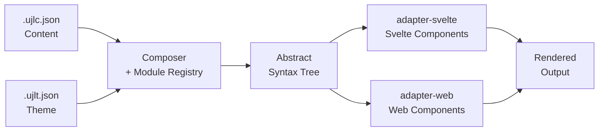

# How to Understand UJL

UJL is built around a small number of concepts that, once understood, make everything else click. This page explains the "why" and the "what" before you integrate.

## The Problem UJL Solves

In most web projects, there's a structural conflict: editors want to create content quickly and independently, designers need to ensure brand guidelines hold, and developers get caught in the middle. Classical solutions, approval workflows, page builders, style guides, shift the problem without solving it.

UJL moves enforcement into the architecture. Content and design rules are described in a way that the system can only produce valid, compliant results. Not by convention, not by process, by construction.

## Content and Design are Separate Data

The foundational idea: **content lives in one file, design rules in another**.

```
.ujlc.json   ← what (content, structure, images)
.ujlt.json   ← how it looks (colors, typography, spacing)
```

**UJLC** (UJL Content Document) describes structured content using modules, fields, and slots. It has no color values, no font names, no spacing numbers.

**UJLT** (UJL Theme Document) describes design tokens, the palette, typography scale, spacing unit, border radius. It has no content.

This isn't just file organization. It's an architectural constraint: because design rules aren't embedded in content, a theme update propagates everywhere instantly. Because editors only touch UJLC, they literally cannot change colors or typography, the data model doesn't allow it.

## Modules, Fields, and Slots

Content is composed from **modules**, reusable building blocks like a text block, image, button, or card.

Each module has:

- **Fields**, typed data inputs (text, number, image, rich text). Fields validate and normalize their values, applying defaults and constraints automatically.
- **Slots**, named areas that can contain other modules. Slots define what can go where and how many children are allowed.

Modules are registered in a **ModuleRegistry**. You can add your own custom modules without modifying the framework core.

## The Composer

The **Composer** is the engine that takes a UJLC document and a UJLT theme, runs all modules through their `compose()` method, and produces an **Abstract Syntax Tree (AST)**.

```typescript
const ast = await composer.compose(ujlcDocument, ujltDocument);
```

The AST is a framework-agnostic tree of `UJLAbstractNode` objects. It knows nothing about Svelte, React, or the DOM, it's pure structured data describing what to render and with what properties.

## Adapters

**Adapters** transform the AST into a concrete output format.

UJL ships with two:

| Adapter          | Output                           | Use case                    |
| ---------------- | -------------------------------- | --------------------------- |
| `adapter-svelte` | Svelte 5 components              | SvelteKit applications      |
| `adapter-web`    | Web Components (Custom Elements) | Any framework or vanilla JS |

Because the Composer outputs a standard AST, new adapters (React, Vue, static HTML, PDF) can be added without changing any core code.

## The Full Data Flow



## UJL is Not a CMS

UJL is a **visual layout layer**, not a content management system. It doesn't handle routing, user accounts, publishing workflows, or content storage. It integrates with existing CMS and frontend stacks, it doesn't replace them.

Use UJL to add structured, brand-safe, accessible visual authoring on top of whatever system you already have.

## Next Steps

- [Architecture Overview](/reference/overview), the package structure and how everything connects
- [ADR-001: Content/Design Separation](/reference/decisions/0001-content-design-separation), the decision in depth
- [ADR-003: AST Adapter Pattern](/reference/decisions/0003-ast-adapter-pattern), why the AST exists
