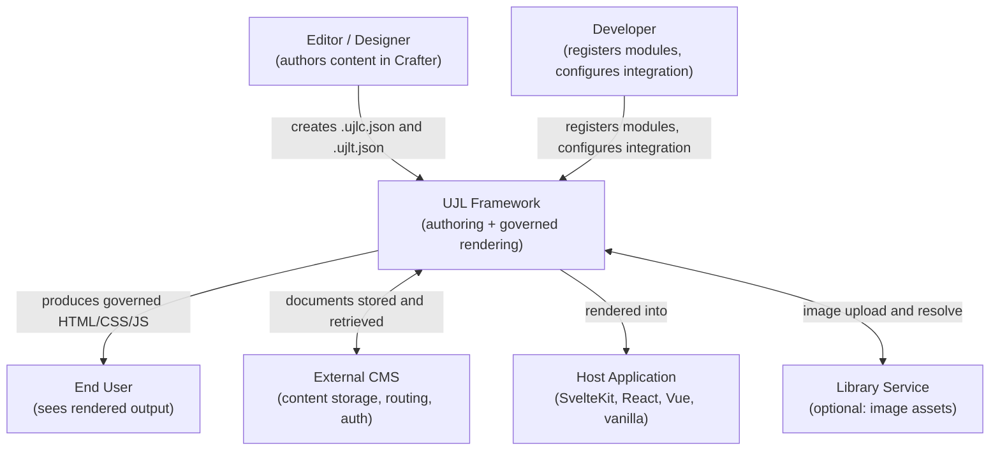
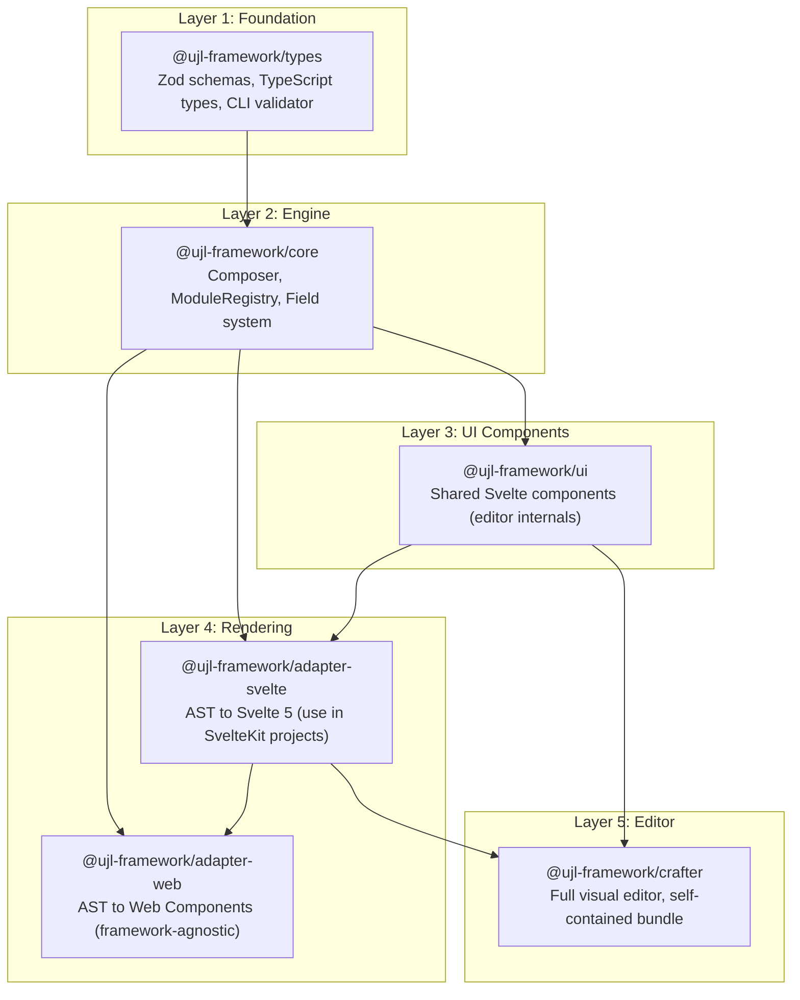

# Architecture Overview

UJL is organized as a monorepo with a strict layered package structure. This page explains where UJL fits within a typical project and how its packages build on each other.

## Where UJL Fits

UJL is a **visual layout layer**, not a CMS and not a platform. It integrates with existing systems rather than replacing them.

**The three roles that interact with UJL:**

Editors create and maintain content visually in the Crafter without touching design parameters. Designers define brand tokens in `.ujlt.json` and changes propagate everywhere instantly. Developers integrate UJL, register custom modules, and configure rendering targets.

## Package Structure

UJL is a monorepo with six npm packages and one optional service. The packages are organized in strict bottom-up layers with no circular dependencies.

**Which package do I install?** Most integrators install `@ujl-framework/crafter` only. SvelteKit projects can install `@ujl-framework/adapter-svelte` for a lighter bundle. The other packages are pulled in as dependencies automatically.

## Key Design Principles

**Content and design are separate.** UJLC documents hold content; UJLT documents hold design tokens. Editors cannot touch design; design changes propagate to all content automatically. This separation is enforced by the data model, not by convention. See [ADR-001](/reference/decisions/0001-content-design-separation).

**Schema-first validation.** Zod schemas are the single source of truth for both runtime validation and TypeScript types. External content from CMS systems, file uploads, or AI-generated output is always validated before entering the system. See [ADR-005](/reference/decisions/0005-zod-schema-validation).

**Framework-agnostic rendering.** The Composer produces an intermediate representation (an AST) that adapters transform into specific output targets: Svelte 5 components, Web Components, and future targets. Adding a new render target does not touch the core. See [ADR-003](/reference/decisions/0003-ast-adapter-pattern).

**Accessibility by construction.** OKLCH color tokens enable precise WCAG contrast calculations. Foreground mappings enforce compliant text colors per background. Accessibility guarantees are part of the architecture, not a post-hoc checklist. See [ADR-009](/reference/decisions/0009-oklch-color-space) and [ADR-020](/reference/decisions/0020-foreground-mapping-wcag).

## Architecture Decisions

The significant decisions behind this architecture are documented individually:

- [ADR-001: Content/Design Separation](/reference/decisions/0001-content-design-separation)
- [ADR-002: Registry & Plugin System](/reference/decisions/0002-registry-plugin-system)
- [ADR-003: AST Adapter Pattern](/reference/decisions/0003-ast-adapter-pattern)
- [ADR-004: Dual Image Storage](/reference/decisions/0004-dual-image-storage)
- [ADR-005: Zod Schema Validation](/reference/decisions/0005-zod-schema-validation)
- [ADR-009: OKLCH Color Space](/reference/decisions/0009-oklch-color-space)
- [ADR-019: Structured Content over HTML](/reference/decisions/0019-structured-content-over-html)
- [ADR-020: Foreground Mapping for WCAG](/reference/decisions/0020-foreground-mapping-wcag)
