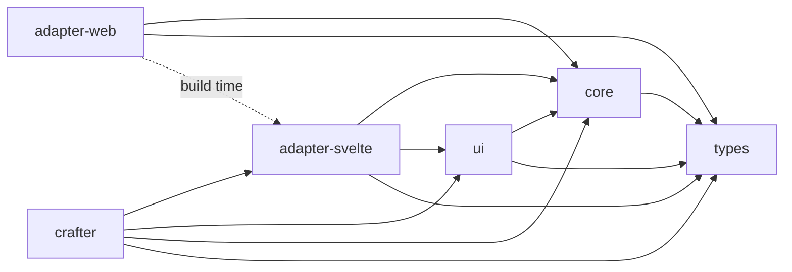

# Packages

UJL is organized as a monorepo. Each package has a focused responsibility and a README with detailed API documentation. This page is the map; the READMEs are the territory.

## Package Overview

The npm version badges below are live and pull the current version from the npm registry automatically.

| Package                         | npm                                                                                                                               | Purpose                                       |
| ------------------------------- | --------------------------------------------------------------------------------------------------------------------------------- | --------------------------------------------- |
| `@ujl-framework/types`          |                    | TypeScript types, Zod schemas, CLI validator  |
| `@ujl-framework/core`           |                      | Composer, ModuleRegistry, Field system        |
| `@ujl-framework/adapter-svelte` |  | AST → Svelte 5 components                     |
| `@ujl-framework/adapter-web`    |        | AST → Web Components (Custom Elements)        |
| `@ujl-framework/ui`             |                          | shadcn-svelte base components                 |
| `@ujl-framework/crafter`        |                | Full visual editor (bundles all dependencies) |

## Package Details

### `@ujl-framework/types`

The foundation. Contains all TypeScript type definitions and Zod schemas for UJLC and UJLT documents, plus a CLI validator (`ujl-validate`) for validating documents from the command line.

→ [README](https://github.com/mainzcript/ujl/tree/main/packages/types)

### `@ujl-framework/core`

The engine. Contains the `Composer` (which transforms UJLC + UJLT into an AST), the `ModuleRegistry` (which manages available modules), and the `FieldBase` and `ModuleBase` classes for building custom modules.

→ [README](https://github.com/mainzcript/ujl/tree/main/packages/core)

### `@ujl-framework/adapter-svelte`

Transforms the AST into Svelte 5 components. Declares `svelte` as a peer dependency, use this in SvelteKit projects for the smallest possible bundle. The `adapter-web` package uses this internally at build time.

→ [README](https://github.com/mainzcript/ujl/tree/main/packages/adapter-svelte)

### `@ujl-framework/adapter-web`

Transforms the AST into Web Components (Custom Elements). Framework-agnostic, works in any environment that supports custom elements. Uses Shadow DOM for style isolation.

→ [README](https://github.com/mainzcript/ujl/tree/main/packages/adapter-web)

### `@ujl-framework/ui`

The shared shadcn-svelte component library used internally by the Crafter editor. You typically don't install this directly unless you're building editor extensions.

→ [README](https://github.com/mainzcript/ujl/tree/main/packages/ui)

### `@ujl-framework/crafter`

The full visual editor, bundled with all dependencies including the Svelte runtime. Framework-agnostic: works in any HTML page or application. This is what most integrators install.

→ [README](https://github.com/mainzcript/ujl/tree/main/packages/crafter)

## Services

### `services/library`

The UJL Library Service, an optional Payload CMS-based backend for image asset management. Provides upload, responsive variant generation (WebP), metadata, i18n alt text, and a REST API. Required only when using `imageStorage: "backend"`.

→ [README](https://github.com/mainzcript/ujl/tree/main/services/library)

## Dependency Layers

Packages depend on each other in a strict bottom-up hierarchy with no circular dependencies. Arrows point from each package to its dependencies.

Build order follows these layers automatically. `types` has no internal dependencies and is always built first; `crafter` sits at the top and depends on everything below it.
